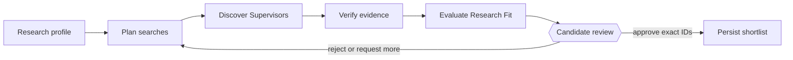

# AI Builder Playground

This public repository is a playground for independently runnable experiments in
AI-assisted software building, architecture, analytics, and developer tooling.

## Project organization

Each experiment lives under `projects/` and owns its source code, dependencies,
tests, sample data, configuration, and documentation. Projects do not depend on
one another unless a genuinely reusable shared capability is introduced later.

## Featured project: ScholarPath

[ScholarPath](projects/scholar-path/README.md) is a human-controlled, multi-agent system that
helps a Candidate pursuing postgraduate research discover, verify, evaluate, and shortlist
research-aligned Supervisors. It uses LangGraph for durable orchestration, Streamlit for the
Candidate interface, typed model boundaries, bounded You.com-to-Tavily search fallback, source-
backed evidence, independent Nebius review, Mem0 preferences, and optional LangSmith tracing and
evaluation.

Reviewer links:

- [Project README](projects/scholar-path/README.md)
- [Submission write-up](projects/scholar-path/docs/project-submission.md)
- [Five-minute recording script](projects/scholar-path/docs/five-minute-demo.md)
- [Architecture and reliability review](projects/scholar-path/docs/reliability-review.md)

## All projects

| Project | Description |
|---|---|
| [ScholarPath](projects/scholar-path/README.md) | Multi-agent postgraduate Supervisor discovery, source-backed verification, Research Fit evaluation, and Candidate-controlled shortlisting. |
| [Project & Product Performance Dashboard](projects/project-product-performance-dashboard/README.md) | Fictional-data Streamlit dashboard connecting engineering delivery and quality to product adoption, revenue, break-even, and profitability. |
| [Cricket RAG Engine](projects/cricket-rag-engine/README.md) | End-to-end RAG learning prototype restricted to selected cricket-law clauses in `data/sample/laws.txt`. |
