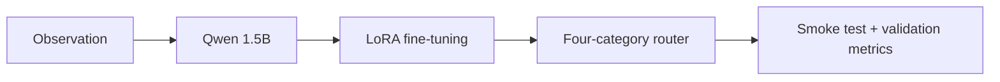

# Submission Summary

## Project

**Backyard Crop Router — Week 5, Mastering Agentic AI**

Submission link:
[github.com/shanly-rajan/ai-builder/tree/main/projects/backyard-crop-router](https://github.com/shanly-rajan/ai-builder/tree/main/projects/backyard-crop-router)

## What we tried to do

We tested whether a small instruction model could become a fast classification
router for backyard farming support. Given a short crop observation, the model
must return exactly one of four categories: nutrient, pest, watering, or
fungal/disease action.



## What we implemented

1. Generated 160 balanced synthetic farming tickets.
2. Measured the frozen model on a fixed 20% validation split.
3. Fine-tuned Qwen with TRL and a PEFT LoRA adapter.
4. Merged the adapter and verified five unseen smoke-test tickets.
5. Evaluated all 32 held-out tickets and generated a confusion matrix.

## Result

| Metric | Baseline | Fine-tuned | Improvement |
|---|---:|---:|---:|
| Accuracy | 65.62% | 100.00% | +34.38 points |
| Macro F1 | 0.5814 | 1.0000 | +0.4186 |
| Fungal/disease recall | 0.0000 | 1.0000 | +1.0000 |

Training changed only 2,179,072 parameters, or 0.141% of the full model. The
final adapter training loss was 0.013273, and the merged model passed all five
smoke-test assertions.

## Evidence and assets

- [Project README](../README.md)
- [System architecture](system-architecture.md)
- [Synthetic dataset](../data/farming_tickets.csv)
- [Training implementation](../src/stage3_train_lora.py)
- [Smoke test](../src/stage4_merge_smoke_test.py)
- [Final evaluation](../src/stage5_val_eval_matrix.py)
- [Confusion matrix](../artifacts/confusion_matrix.png)

## Reproduce it

```bash
cd projects/backyard-crop-router
source .venv/bin/activate
python run_pipeline.py --device mps
```

The full pipeline regenerates the dataset and adapter, so it takes longer than
running only the smoke test or final evaluation.

## Honest limitation

The perfect validation score is not a production claim. Training and validation
share synthetic symptom-template families. A stronger next evaluation would
use independently written tickets, grouped template splits, ambiguous symptoms,
and real user observations.
