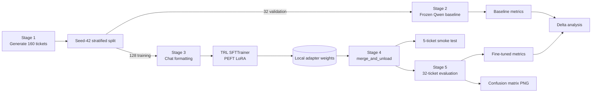
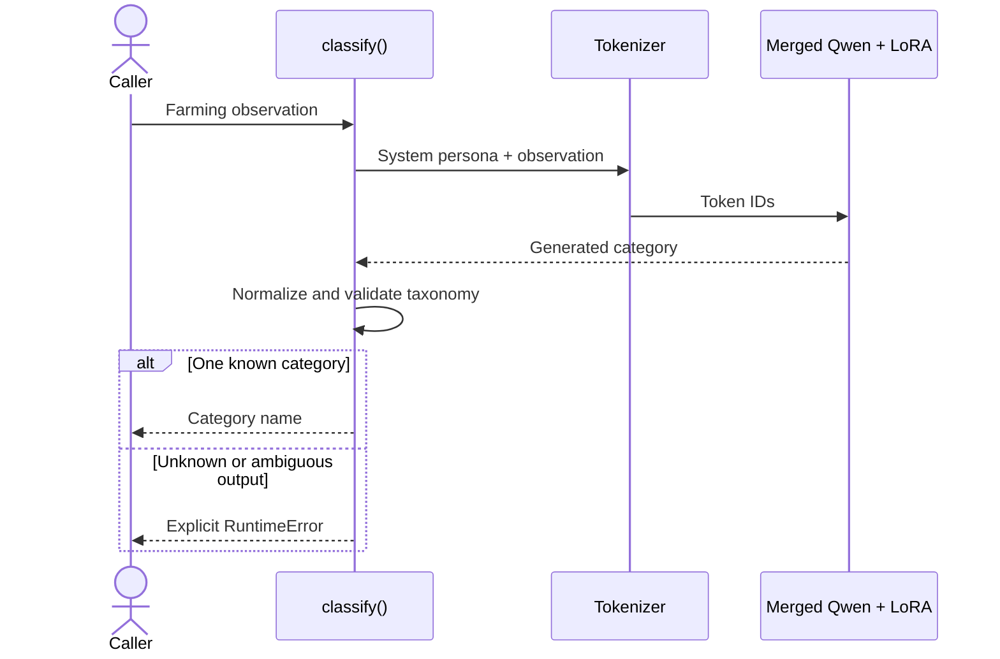

# System Architecture

The Backyard Crop Router fine-tunes a small language model to route a farming
observation to one of four specialist action categories. The project contains
an offline training pipeline and a reusable local inference function; it does
not yet expose a production API.

## Training and evaluation flow

## Runtime classification flow

## Key design decisions

| Decision | Reason | Trade-off |
|---|---|---|
| Qwen 1.5B | Small enough for fast local routing | Less general capability than a larger model |
| LoRA on attention projections | Trains only 0.141% of parameters | Adapter quality depends heavily on dataset coverage |
| Completion-only chat loss | Optimizes the target category response | Requires consistent prompt formatting |
| Adapter merge | Simple standalone inference path | Merged base weights still consume model-sized memory |
| Fixed four-category validation | Predictable downstream contract | New categories require data and retraining |

## Architecture boundaries

- **Included:** dataset generation, baseline evaluation, LoRA training, local
  inference, smoke tests, metrics, and confusion-matrix evidence.
- **Not included:** HTTP serving, authentication, model registry, production
  monitoring, human escalation, and continuous retraining.
- **Primary quality risk:** the synthetic random split shares symptom-template
  families between training and validation. Independent and ambiguous examples
  are required before production use.

