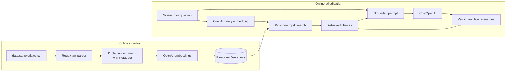

# Cricket RAG Engine

An end-to-end retrieval-augmented generation (RAG) learning project that retrieves
selected cricket-law clauses and generates a cited response to a match scenario.

> **Current corpus boundary:** the engine indexes only
> [`data/sample/laws.txt`](data/sample/laws.txt). This small educational fixture is
> not the complete or verified-current MCC Laws of Cricket, and the output is not
> authoritative umpiring advice.

## What is implemented

| Stage | Current implementation |
|---|---|
| Configuration | Loads provider credentials and model settings from `.env` without displaying secret values |
| Ingestion | Parses the single plain-text sample into 11 LangChain documents with law metadata |
| Indexing | Embeds the documents with OpenAI and upserts them into a Pinecone Serverless cosine index |
| Retrieval | Embeds a question and returns the top-k Pinecone matches, with optional law metadata filtering |
| Generation | Sends the question and retrieved clauses to a grounded LangChain prompt and ChatOpenAI |
| Interfaces | Provides retrieval and adjudication CLIs plus a Streamlit scenario UI |
| Evaluation | Runs 15 live-provider scenarios and writes `evaluation_report.md` |

## Supported corpus

The current file contains only these sections:

| Law | Included sections | Covered topic |
|---|---|---|
| 19 — Boundaries | 19.4, 19.5 | Ball beyond the boundary and a fielder grounded beyond it |
| 28 — The fielder | 28.3 | A fielding helmet placed on the ground |
| 34 — Hit the ball twice | 34.1, 34.3 | Dismissal and the wicket-protection exception |
| 38 — Run out | 38.1, 38.3 | General run out and the non-striker leaving early |

Everything else is out of scope, including other MCC laws and definitions, DRS,
Free Hit rules, IPL Impact Player rules, ICC or local playing conditions, match
statistics, player data, and live cricket information. Missing evidence means only
that the answer is absent from this fixture; it does not establish an official
cricket ruling.

See the [sample corpus data card](data/sample/README.md) for the exact inventory,
parser behavior, checksum, and unresolved provenance status.

## Current architecture



The retriever currently discards Pinecone similarity scores and always forwards the
returned top-k clauses. There is no programmatic relevance threshold. Abstention and
citation behavior are prompt instructions, not enforced validation gates.

For component responsibilities, sequences, failure paths, and architecture trade-offs,
see [Architecture](docs/architecture.md).

## Quick start

### 1. Create the environment

The checked-in environment targets Python 3.14.6. Ruff's target version is configured
for Python 3.11 syntax compatibility.

```bash
cd projects/cricket-rag-engine
python3 -m venv venv
source venv/bin/activate
python -m pip install --upgrade pip
python -m pip install -r requirements-dev.txt
cp .env.example .env
```

Set `OPENAI_API_KEY`, `PINECONE_API_KEY`, and `PINECONE_INDEX_NAME` in the local
`.env`. Never commit that file.

### 2. Index the sample corpus

```bash
python -m src.ingestion.indexer
```

This command makes live OpenAI and Pinecone calls. It creates the configured Pinecone
index in AWS `us-east-1` when the index does not exist, embeds the 11 parsed documents,
and upserts them with positional IDs such as `law_chunk_0`.

Indexing must complete before retrieval, adjudication, the UI, or evaluation can work.

### 3. Use the engine

Retrieve clauses only:

```bash
python -m src.retrieval.retriever "helmet on the field" --top-k 4
python -m src.retrieval.retriever "boundary catch" --law 19
```

Generate an adjudication:

```bash
python -m src.generation.chain \
  "A ball hits a fielding helmet on the ground behind the keeper. What happens?" \
  --top-k 4
```

Start the Streamlit UI:

```bash
streamlit run app.py
```

These paths require configured provider credentials, network access, an indexed
corpus, and available OpenAI/Pinecone quota. They may incur provider charges.

### 4. Run the live evaluation

```bash
python -m src.evaluation.evaluator
```

The evaluator makes live calls for 15 scenarios and overwrites
[`evaluation_report.md`](evaluation_report.md). Its current checks are lightweight
string and retrieval heuristics, not semantic correctness or faithfulness evaluation.
Read [Evaluation](docs/evaluation.md) before interpreting the report.

## Configuration

| Variable | Required | Default | Purpose |
|---|---:|---|---|
| `OPENAI_API_KEY` | Yes | — | Embedding and answer-generation authentication |
| `PINECONE_API_KEY` | Yes | — | Vector-index authentication |
| `PINECONE_INDEX_NAME` | Yes | — | Target vector index |
| `EMBEDDING_MODEL` | No | `text-embedding-3-small` | Document and query embeddings |
| `EMBEDDING_DIM` | No | `1536` | Pinecone vector dimension |
| `LLM_MODEL` | No | `gpt-5.6-luna` | Adjudication model |
| `TOP_K_RETRIEVAL` | No | `5` | Default number of retrieved documents |

The environment configuration is the source of truth for model selection. Any model
name shown in UI copy is descriptive only.

## Development checks

```bash
pytest
ruff check .
```

Provider clients are mocked in the unit tests. The current Streamlit smoke test still
assumes offline startup, while the app now eagerly constructs a live engine; that test
and the UI initialization lifecycle need to be aligned before treating the full suite
as a release gate.

## Project structure

```text
cricket-rag-engine/
├── app.py                         # live Streamlit adjudication UI
├── data/sample/laws.txt           # only indexed corpus
├── docs/
│   ├── architecture.md            # implemented flow and trade-offs
│   └── evaluation.md              # benchmark method and validity limits
├── evaluation_report.md           # generated live-run snapshot
├── src/
│   ├── config.py                  # environment configuration
│   ├── ingestion/
│   │   ├── parser.py              # text to LangChain documents
│   │   └── indexer.py             # OpenAI embeddings to Pinecone
│   ├── retrieval/retriever.py     # top-k vector retrieval
│   ├── generation/chain.py        # grounded adjudication chain
│   └── evaluation/evaluator.py    # 15-scenario runner
└── tests/
    ├── unit/
    └── smoke/
```

## Current limitations

- Only `data/sample/laws.txt` can be treated as the supported corpus; there is no
  multi-file, PDF, Markdown, or incremental ingestion workflow.
- The sample has no recorded source URL, edition, effective date, retrieval date, or
  redistribution permission. Verify provenance before public or production use.
- Chunk IDs are positional, so inserting or reordering content can change their
  meaning. Re-indexing does not remove stale vectors.
- The existing Pinecone index dimension and metric are not validated before upsert.
- Retrieval exposes no score or evidence threshold, hybrid search, reranking, or
  authorization filter.
- Citations, verdicts, signals, and abstentions are model-generated and are not
  programmatically verified against the retrieved text.
- The current UI and system prompt still use official-adjudicator language, and the UI
  contains a hard-coded GPT-4o caption. Those labels are presentation debt, not claims
  about corpus authority or the configured runtime model.
- The application has no API boundary, authentication, rate limiting, retry policy,
  observability, cost telemetry, or provider failover.

## Data and security

The real `.env`, virtual environments, downloaded corpora, generated indexes, model
caches, databases, and logs are excluded by the project `.gitignore`. Do not place
credentials, private datasets, or unverified third-party content in tracked files.
