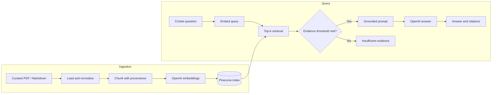

# Cricket RAG Engine

An architecture-first learning project for building a retrieval-augmented generation
(RAG) service that answers cricket questions from an explicitly curated corpus and
returns evidence with every grounded answer.

This commit establishes the project boundary and development environment. Provider
connectivity, ingestion, retrieval, generation, and evaluation are the next vertical
slices; the setup screen does not make external API calls.

## Target outcome

```text
Question: Who won the fictional Harbour Cup final?
    -> retrieve: harbour-cup-final.pdf, page 4
    -> answer: The Cape Comets won by five wickets. [harbour-cup-final.pdf, p. 4]
```

When the indexed evidence is missing or scores below the configured threshold, the
engine must say that it has insufficient evidence instead of inventing an answer.

## Architecture



The codebase keeps provider-specific adapters behind domain-oriented ingestion,
retrieval, and generation boundaries. This limits lock-in and keeps evaluation tests
deterministic even when the production path uses hosted services.

## Quick start

The checked-in environment targets Python 3.14.6. `pyenv` users can select it from
`.python-version`; another Python 3.11+ interpreter can also be used while the
dependency stack remains compatible.

```bash
cd projects/cricket-rag-engine
python3 -m venv venv
source venv/bin/activate
python -m pip install --upgrade pip
python -m pip install -r requirements-dev.txt
cp .env.example .env
streamlit run app.py
```

Add the real provider values only to `.env`. The project-local `.gitignore` excludes
that file, virtual environments, generated indexes, raw/downloaded corpora, model
caches, local databases, logs, and test/build output.

The learning defaults use `text-embedding-3-small` with 1,536 dimensions and
`gpt-5.6-luna` for cost-sensitive answer generation. They remain environment-driven
so retrieval quality, latency, and cost can be evaluated before a production choice
is governed.

## Development checks

```bash
pytest
ruff check .
```

The initial tests verify configuration behavior, deterministic parsing with synthetic
text, and that the Streamlit shell starts without contacting OpenAI or Pinecone.

## Project structure

```text
cricket-rag-engine/
├── app.py                  # local Streamlit setup shell
├── data/sample/            # committed synthetic/licensed fixtures only
├── src/
│   ├── config.py           # secret-safe environment loading
│   ├── ingestion/          # document loading and chunking boundary
│   ├── retrieval/          # embedding and vector-search boundary
│   ├── generation/         # grounded answer and citation boundary
│   └── evaluation/         # retrieval and answer quality boundary
└── tests/
    ├── unit/
    └── smoke/
```

## Architecture guardrails

| Concern | Foundation decision | Scale-out path |
|---|---|---|
| Grounding | Answers require retrieved evidence and citations | Add claim-level citation checks and golden evaluations |
| Security | Keys stay in environment variables and are never rendered | Move production secrets to a managed secret store |
| Data | Commit only synthetic or clearly redistributable fixtures | Add provenance, license, retention, and deletion metadata |
| Latency | Keep the synchronous learning path observable | Add async ingestion, caching, and reranking only when measured |
| Cost | No provider calls during setup or automated tests | Track tokens, embedding volume, and cost per answered query |
| Resilience | Low evidence produces an explicit abstention | Add retries, timeouts, circuit breaking, and degraded retrieval |
| Portability | Domain boundaries isolate OpenAI and Pinecone | Replace adapters without rewriting policy or evaluation logic |

## Delivery roadmap

1. **Ingestion:** load a small provenance-bearing sample corpus, normalize text, and
   create stable chunk identifiers.
2. **Retrieval:** embed chunks, upsert idempotently, apply metadata filters, and return
   scored top-k evidence.
3. **Generation:** constrain the model to retrieved context, attach citations, and
   abstain when evidence is weak.
4. **Evaluation:** add golden questions, retrieval hit-rate, citation correctness,
   faithfulness, latency, and cost checks.
5. **Service hardening:** add API authentication, authorization-aware retrieval,
   rate limits, observability, and provider failover where justified.

## Data and privacy

The repository must not contain real credentials, private cricket datasets, or
copyrighted source material without permission. `data/sample/` is reserved for small
synthetic or redistributable fixtures with documented provenance. Generated indexes
and downloaded source documents remain local and ignored.
