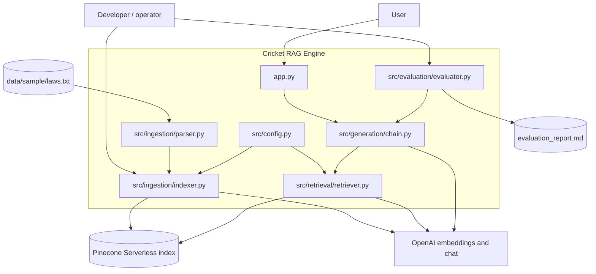
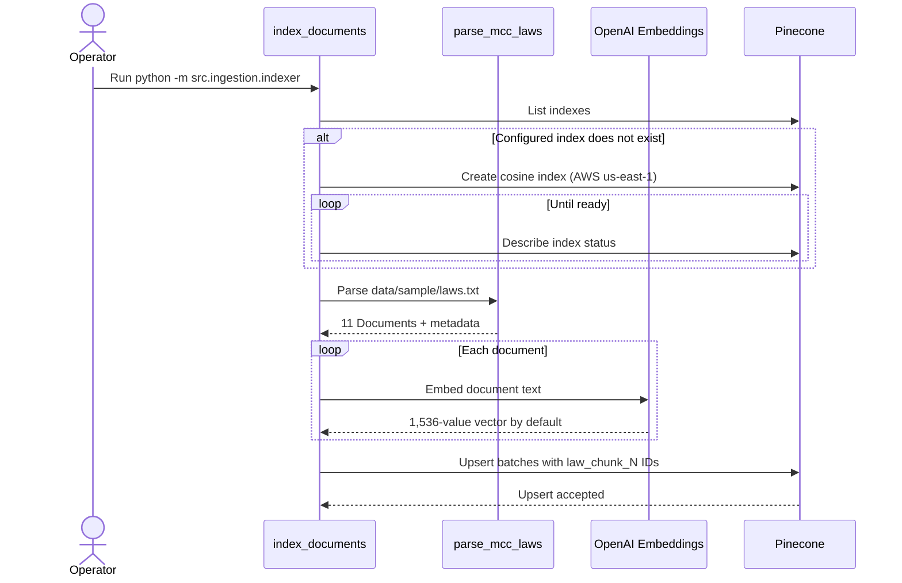
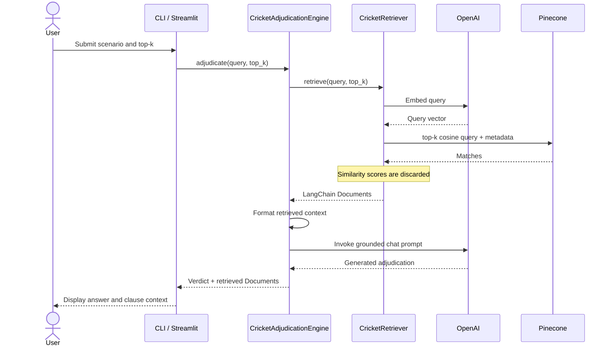

# Architecture

## Scope and context

The Cricket RAG Engine is a synchronous learning prototype. It converts one local
plain-text fixture, `data/sample/laws.txt`, into Pinecone vectors and uses retrieved
clauses to augment an OpenAI-generated response to a match scenario.

The current boundary is intentionally narrow:

```text
Input corpus: data/sample/laws.txt only
Input query:  one cricket-law question or scenario
Output:       generated verdict plus retrieved law references
Interfaces:   Python CLI and Streamlit
```

It is not a complete laws platform, live cricket data system, deterministic rules
engine, or production API.

## Component view



The provider integrations are direct dependencies rather than replaceable adapter
interfaces. Unit tests isolate them with mocks.

## Ingestion sequence



Important current semantics:

- Parsing splits at `LAW` and `x.y` headings. `x.y.z` clauses remain grouped inside
  their parent section document.
- Four of the 11 documents are Law-header-only chunks.
- IDs are based on list position, not source content, so they are not durable across
  insertions or reordering.
- Re-indexing updates reused IDs but does not remove stale higher-numbered vectors.
- Existing index dimension, metric, cloud, and region are not validated.

## Query and adjudication sequence



There is no relevance-score gate between retrieval and generation. The prompt asks
the model to refuse unsupported questions and cite laws, but code does not validate
the resulting claims, references, signals, or abstention.

## Data contracts

### Parsed document metadata

| Field | Meaning |
|---|---|
| `law_number` | Current Law number inferred from the latest Law heading |
| `law_title` | Current Law title |
| `section` | Section heading, or `Law <number>` for a header chunk |
| `source` | Static `MCC Laws of Cricket` label |

### Pinecone record

```text
id       = law_chunk_<ordinal>
values   = OpenAI embedding vector
metadata = parsed metadata + full chunk text under "text"
```

The retriever removes `text` from metadata and uses it as the returned Document's
`page_content`.

## Runtime and failure paths

| Failure | Current behavior | Consequence |
|---|---|---|
| Missing environment variable | Constructor raises `ValueError` | CLI or UI startup fails |
| Missing corpus file | Parser raises `FileNotFoundError` | Indexing stops |
| Provider/network/quota failure | Provider exception propagates | Request or ingestion fails |
| Pinecone index absent at query time | Provider exception propagates | Retrieval fails |
| Irrelevant top-k results | Results still reach the model | Unsupported or overconfident answer risk |
| Empty matches | Prompt receives fallback text | Refusal remains model-dependent |
| Partial indexing | No transaction or rollback | Index may contain an incomplete mix |

## Architecture trade-offs and NFRs

| Concern | Current choice | Trade-off / next control |
|---|---|---|
| Simplicity | Direct LangChain, OpenAI, and Pinecone integration | Fast to learn, but tightly coupled and harder to test end to end |
| Grounding | Top-k context plus prompt instructions | Add scores, a relevance threshold, claim checks, and citation validation |
| Security | Secrets loaded from ignored `.env` | Use managed secrets, least-privilege keys, rotation, and audit logging in production |
| Data governance | One committed sample file | Resolve provenance/license and record corpus version metadata |
| Latency | Sequential embedding, retrieval, then generation | Measure p50/p95 and consider batching/caching only after profiling |
| Cost | Hosted embedding, vector, and chat calls | Record tokens, vector volume, query counts, and cost per evaluation/run |
| Resilience | Provider errors fail the operation | Add timeouts, bounded retries, idempotency, and circuit breaking |
| Scalability | Synchronous UI/CLI and one index | Add async ingestion, namespaces/tenancy, and an API only when required |
| Observability | Console messages and generated report | Add structured logs, traces, run IDs, model/prompt versions, and metrics |

## Next architecture decisions

1. Resolve the sample corpus provenance or replace it with clearly permitted content.
2. Define a versioned canonical chunk and citation contract with content-stable IDs.
3. Retain retrieval scores and establish an evaluated abstention threshold.
4. Add semantic answer, citation, and unsupported-claim evaluation.
5. Decide whether provider ports/adapters are needed before adding another provider.
6. Add an authenticated API, operational controls, and observability only if the
   learning prototype becomes a shared service.
