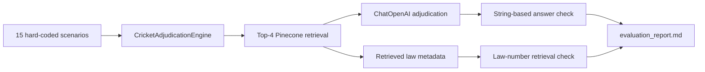

# Evaluation

## Purpose

`src/evaluation/evaluator.py` is a live-provider smoke benchmark for the current
`data/sample/laws.txt` corpus. It runs 15 fixed scenarios through the same retrieval
and generation path used by the CLI and Streamlit application, then overwrites
`evaluation_report.md`.

It is useful for observing regressions manually. It is not yet a correctness,
faithfulness, safety, or zero-hallucination benchmark.

## Execution flow



Run it from the project directory after indexing:

```bash
python -m src.evaluation.evaluator
```

This makes live OpenAI and Pinecone calls and can incur cost. Results can change when
the model, index contents, provider behavior, prompt, or retrieval order changes.
This document is the canonical methodology note; rerunning the evaluator overwrites
the generated report, including any manual annotations made directly in that report.

## Scenario coverage

| Group | Scenarios | Intended behavior |
|---|---:|---|
| Included Law 19 topics | 4, 6, 11, 14 | Retrieve boundary-related material |
| Included Law 28 topic | 2, 12 | Retrieve fielding-helmet material |
| Included Law 34 topics | 3, 5, 10 | Retrieve hit-the-ball-twice material |
| Included Law 38 topics | 1, 7, 13 | Retrieve run-out material |
| Explicit out-of-scope/refusal | 8, 9, 15 | Refuse DRS, Impact Player, and Free Hit questions |

Some scenarios require details absent from the sample, such as definitions, boundary
allowances, umpire signals, or when the ball comes into play. A same-Law retrieval is
therefore not proof that the fixture can support the expected verdict.

## What the current checks calculate

For an in-scope scenario:

```text
retrieval_pass = any retrieved law has the expected Law number
                 OR any section contains the expected section string

verdict_pass = generated answer contains the expected section string
```

For a refusal scenario:

```text
retrieval_pass = true
verdict_pass = answer contains "cannot determine" or "not in the corpus"
```

The stored `expected_verdict` is printed in the report but is not compared with the
generated answer. The report's historical `Faithfulness`/`Grounded` labels therefore
mean only that the simple string heuristic passed.

## Known validity gaps

- Retrieval success does not require the expected subsection; any result from the
  same Law number can pass.
- Refusal retrieval is automatically marked successful regardless of retrieved data.
- No semantic verdict comparison, entailment, unsupported-claim detection, or human
  review score is calculated.
- Citations are not checked against the claims they purportedly support.
- Retrieved similarity scores are unavailable, so relevance and threshold behavior
  cannot be evaluated.
- Scenario 13 demonstrates a false-positive label: the expected result is `OUT`, the
  recorded answer refuses to rule, but the answer mentions `38.3` and is marked
  grounded by the current heuristic.
- Some report answers state run values or umpire signals that are not present in the
  limited sample corpus.
- The report records no run timestamp, corpus checksum, index namespace, model and
  embedding versions, prompt version, latency, token usage, or cost.
- `temperature=0` reduces sampling variation but does not make a hosted-model run
  fully deterministic.

## How to interpret the current report

Treat `evaluation_report.md` as an illustrative snapshot of one live run. The reported
`15 / 15` is a loose retrieval-coverage result under the rules above; it must not be
reported as 100% answer accuracy, verified faithfulness, or zero hallucinations.

The adjudication logs remain valuable for human review. In particular, compare each
claim with the exact retrieved text and mark unsupported details explicitly.

## Next evaluation increment

1. Version each run with timestamp, commit, corpus checksum, index, model, embedding,
   prompt, and parameters.
2. Separate retrieval labels from answer labels and define expected source chunk IDs.
3. Capture similarity scores and measure hit@k, reciprocal rank, and thresholded
   abstention.
4. Compare normalized verdicts against explicit acceptable outcomes.
5. Validate every cited clause and flag claims not entailed by retrieved text.
6. Add human-reviewed golden cases for ambiguity and insufficient-context behavior.
7. Track latency, token consumption, provider errors, and estimated cost.
8. Keep a deterministic mocked suite for CI and run live-provider evaluation as a
   separately authorized integration workflow.
