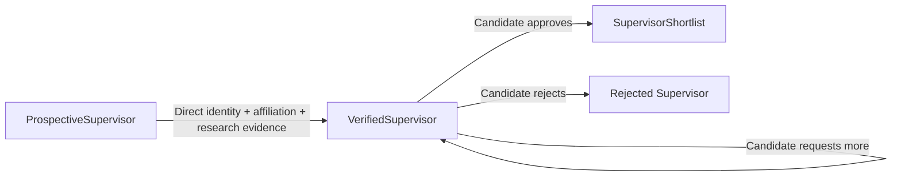
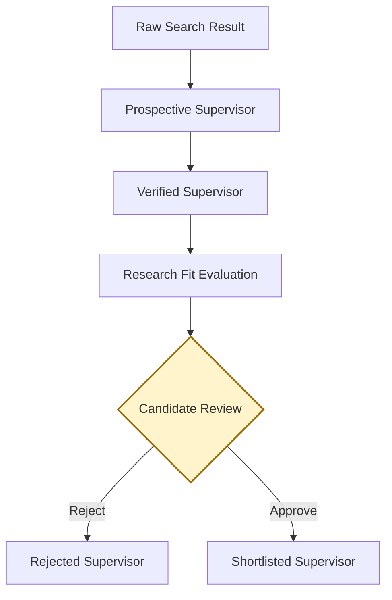
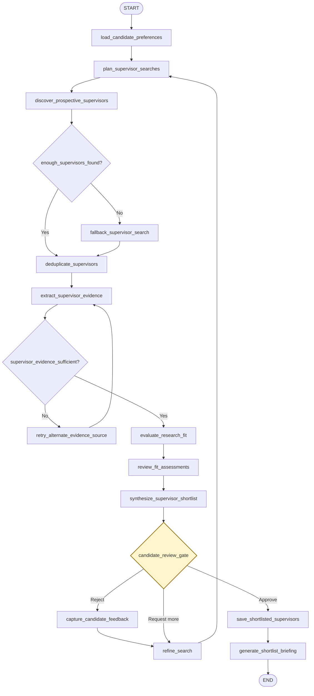

# ScholarPath

**Multi-Agent Doctoral Supervisor Discovery and Research-Fit System**

ScholarPath helps a prospective doctoral Candidate discover, verify, evaluate, and
shortlist research-aligned Supervisors through a Streamlit web application. It is
intended to replace hours of fragmented searching across university profiles and
academic publications with an evidence-backed, human-controlled workflow.

The system plans searches, discovers Prospective Supervisors, verifies supporting
evidence, evaluates Research Fit, and learns from Candidate feedback. It uses six
planned platform integrations while retaining a Candidate approval gate before any
Supervisor is shortlisted or any outreach is drafted.

## Project status

Milestone M1 establishes typed domain contracts for Candidate input, search planning,
Supervisor discovery and verification, Research Fit assessments, Candidate review,
and shortlisting. Pure functions enforce evidence sufficiency, valid lifecycle
transitions, and the Candidate approval gate.

No orchestration graph, agent behavior, model provider, search integration, memory
service, Research Fit calculation, or Streamlit interface is implemented yet.

## M0 foundation

| Capability | M0 implementation |
|---|---|
| Python | Python 3.12 or newer; local repository convention is 3.14.6 |
| Packaging | Physical `src/` root mapped to the importable `scholarpath` package |
| Runtime dependencies | Pydantic and pydantic-settings only |
| Configuration | Safe non-secret defaults and deferred provider-key validation |
| Quality gates | Ruff, strict mypy, pytest, branch coverage, and GitHub Actions |
| Network policy | Default and CI tests exclude tests marked `live` |

See [M1 architecture](docs/architecture.md) and
[canonical terminology](docs/terminology.md) for the current boundaries.

## M1 domain contracts



All M1 models are frozen Pydantic contracts. URLs and timezone-aware timestamps are
validated, Research Fit scores are constrained to 0–100, evidence retains source
provenance, and unknown fields are rejected. Availability defaults to `not_stated` and
does not block verification. Explicit availability states must match typed availability
evidence, and every shortlisted record retains its Candidate approval decision.

The deterministic fixture cohort is available from `tests.fixtures` for offline tests:

```python
from tests.fixtures import (
    make_candidate_profile,
    make_prospective_supervisors,
    make_research_fit_assessments,
    make_verified_supervisors,
)

candidate = make_candidate_profile()
prospective = make_prospective_supervisors()  # 8 records
verified = make_verified_supervisors()  # 6 records
assessments = make_research_fit_assessments()  # 5 records
```

## Setup

Run these commands from the repository root:

```bash
cd projects/scholar-path
python3 -m venv venv
source venv/bin/activate
python -m pip install --upgrade pip
python -m pip install -e ".[dev]" --config-settings editable_mode=strict
cp .env.example .env
```

No API key is required to install the package, import `scholarpath`, or run the M0
test suite. The copied `.env` contains non-secret defaults only and is ignored by Git.

Verify the editable installation:

```bash
python -m pip check
python -c "import scholarpath; print(scholarpath.__version__)"
```

## Quality and test commands

Run the complete local quality gate from `projects/scholar-path`:

```bash
ruff format --check .
ruff check .
mypy src tests
pytest -m "not live"
```

The pytest configuration collects `tests/`, excludes live tests by default, measures
branch coverage for `scholarpath`, and requires at least 90 percent coverage.

The GitHub Actions workflow runs the same installation and quality commands on Python
3.12 whenever ScholarPath or its workflow changes.

## Target outcome and success measures

ScholarPath succeeds when one research run:

1. Produces five evidence-backed Supervisor recommendations in under 15 minutes.
2. Receives a relevant rating from the Candidate for at least four of the five
   recommendations.
3. Preserves the supporting evidence and rationale for every Research Fit assessment.
4. Gives the Candidate final control over rejection, further research, shortlisting,
   and any subsequent outreach drafting.
5. Traces, tests, and evaluates the complete workflow through LangSmith.

## Product principles

- **Evidence before recommendation:** discovery alone cannot qualify a Supervisor for
  Research Fit evaluation or Candidate review.
- **Explainable fit:** every score must include its supporting evidence, confidence,
  and a plain-language reason.
- **Human decision authority:** agents may recommend, but only the Candidate may move
  a Verified Supervisor to the shortlist.
- **No premature outreach:** outreach is not drafted before Candidate approval.
- **Source-aware resilience:** primary search and evidence paths have explicit fallback
  behavior.
- **Traceable execution:** agent decisions, tool calls, state transitions, retries,
  and evaluation results must be observable.
- **Feedback-driven refinement:** approvals and rejection reasons inform subsequent
  searches without replacing the Candidate's current instructions.

## Glossary

| Term | Definition |
|---|---|
| **Candidate** | The person pursuing a doctorate and using ScholarPath. |
| **Supervisor** | An academic or researcher who may supervise the Candidate's doctoral research. |
| **Prospective Supervisor** | A discovered Supervisor who has not yet completed verification and Candidate review. |
| **Verified Supervisor** | A Supervisor whose relevant information has been checked against supporting sources. |
| **Shortlisted Supervisor** | A Verified Supervisor approved by the Candidate. |
| **Rejected Supervisor** | A Supervisor excluded by the Candidate. |
| **Research Fit Score** | The assessed alignment between the Candidate's doctoral interests and a Supervisor's verified research profile. |

### Example Research Fit assessment

```text
Research Fit Score: 84/100
Confidence: High

Reason:
The Supervisor's work on enterprise architecture, digital transformation, and
organisational strategy aligns closely with the Candidate's proposed applied
research direction.
```

The score and confidence are decision-support signals, not proof of supervisory
availability or a substitute for the Candidate's judgment.

## Supervisor lifecycle



Only the Candidate Review decision can create a Shortlisted Supervisor.

## Agents

| Agent | Responsibility |
|---|---|
| **Candidate Intake Agent** | Captures and structures the Candidate's proposed research area, preferences, and constraints. |
| **Research Planning Agent** | Expands the Candidate's interests into search concepts and prepares the research strategy. |
| **Supervisor Discovery Agent** | Finds Prospective Supervisors using You.com, with Tavily as a fallback. |
| **Evidence Verification Agent** | Verifies Supervisor identity, affiliation, research interests, publications, and stated supervisor availability. |
| **Research Fit Evaluation Agent** | Calculates and explains the Research Fit between the Candidate and each Verified Supervisor. |
| **Independent Review Agent** | Reviews the evidence and fit assessment using Nebius, identifying unsupported claims or inflated scores. |
| **Shortlist Synthesis Agent** | Produces the ranked set of Verified Supervisors for Candidate review. |
| **Preference Learning Agent** | Records Candidate rejection reasons, approvals, and search preferences through Mem0. |
| **Orchestrator Agent** | Coordinates workflow state, transitions, retries, tool fallback, and human approval using LangGraph. |

## Planned platform integrations

Agents are logical responsibilities; integrations are the external platforms used to
execute, coordinate, remember, or observe those responsibilities.

| Integration | Planned role |
|---|---|
| **You.com** | Primary Supervisor discovery search. |
| **Tavily** | Fallback Supervisor discovery search. |
| **Nebius** | Independent evidence and Research Fit review. |
| **Mem0** | Candidate preference and feedback memory. |
| **LangGraph** | Stateful multi-agent orchestration and human approval flow. |
| **LangSmith** | End-to-end tracing, testing, and evaluation. |

Streamlit is the planned Candidate-facing web interface.

## Central workflow



Retry limits, sufficiency thresholds, scoring dimensions, source-authority rules, and
data-retention policies remain implementation decisions for later milestones.
