# ScholarPath

**Multi-Agent Doctoral Supervisor Discovery and Research-Fit System**

ScholarPath helps a prospective doctoral Candidate discover, verify, evaluate, and
shortlist research-aligned Supervisors through a Streamlit web application. It is
intended to replace hours of fragmented searching across university profiles and
academic publications with an evidence-backed, human-controlled workflow.

The system plans searches, discovers Prospective Supervisors, verifies supporting
evidence, evaluates Research Fit, and learns from Candidate feedback. It introduces
platform integrations incrementally while retaining a Candidate approval gate before
any Supervisor is shortlisted or any outreach is drafted.

## Project status

Milestone M11 adds a focused Streamlit application over the durable LangGraph workflow.
It captures a Candidate's doctoral research profile, streams allowlisted canonical node
names as progress, presents Prospective and Verified Supervisors with evidence-backed
Research Fit details, and resumes the exact checkpointed thread after an explicit
`approve`, `reject`, or `request_more` action.

The bounded M11.2 repair improves live discovery completion without adding calls or
weakening gates: incomplete affiliations are rejected or recovered from bounded context,
the existing Tavily budget prioritizes queries that produced plausible You.com profiles,
and five fixed privacy-safe rejection counts explain why raw results were excluded.

The bounded M11.3 repair targets the next measured gate: realistic untitled academic
profiles. It accepts one only when a person-like title, matching singular profile URL,
same-identity positive scholarly context, and owner-linked complete institution all agree;
planned topic phrases and unrelated-person results remain excluded.

Baseline LangSmith tracing is optional. When enabled, it traces the graph, planning,
evidence, Research Fit, and independent-review nodes with fixed environment and
graph-version tags, allowlisted metadata, and hidden trace inputs and outputs. Unit and
graph tests use an isolated in-memory checkpointer; trusted local development can use the
SQLite checkpointer at the ignored configured path. Mem0 failure is non-fatal and the
current CandidateProfile remains available. Streamlit stores only interface controls and
the opaque LangGraph thread ID in Session State; the complete graph state remains in the
checkpointer. Outreach drafting remains deferred.

## M0 foundation

| Capability | M0 implementation |
|---|---|
| Python | Python 3.12 or newer; local repository convention is 3.14.6 |
| Packaging | Physical `src/` root mapped to the importable `scholarpath` package |
| Runtime dependencies | Pydantic and pydantic-settings only in M0 |
| Configuration | Safe non-secret defaults and deferred provider-key validation |
| Quality gates | Ruff, strict mypy, pytest, branch coverage, and GitHub Actions |
| Network policy | Default and CI tests exclude tests marked `live` |

See [current architecture](docs/architecture.md), the historical
[M2 generated graph](docs/m2-walking-skeleton.mmd), the historical
[M3 generated graph](docs/m3-research-planning-graph.mmd), the historical
[M4 generated graph](docs/m4-you-com-discovery-graph.mmd), the historical
[M5 generated graph](docs/m5-resilient-discovery-graph.mmd), the historical
[M6 generated graph](docs/m6-evidence-verification-graph.mmd), the current
[M7 Research Fit graph](docs/m7-research-fit-graph.mmd), the historical
[M8 independent-review graph](docs/m8-independent-review-graph.mmd), the historical
[M9 Candidate-review persistence graph](docs/m9-candidate-review-persistence-graph.mmd),
the current [M10 Candidate-memory graph](docs/m10-candidate-preference-memory-graph.mmd),
the [M11 Streamlit application boundary](docs/m11-streamlit-interface.mmd), the
[M11.2 discovery-completion repair](docs/m11-2-discovery-completion-repair.mmd), the
[M11.3 academic-profile context repair](docs/m11-3-academic-profile-context-repair.mmd), and
[canonical terminology](docs/terminology.md) for the current boundaries.

## M1 domain contracts

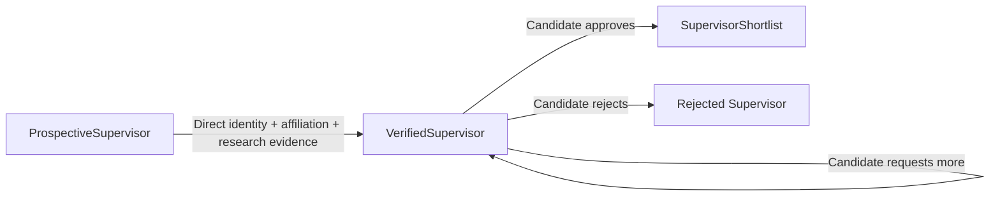

All M1 models are frozen Pydantic contracts. URLs and timezone-aware timestamps are
validated, Research Fit scores are constrained to 0–100, evidence retains source
provenance, and unknown fields are rejected. Availability defaults to `not_stated` and
does not block verification. Explicit availability states must match typed availability
evidence, and every shortlisted record retains its Candidate approval decision.

The deterministic fixture cohort is available from `tests.fixtures` for offline tests:

```python
from tests.fixtures import (
    make_candidate_profile,
    make_prospective_supervisors,
    make_research_fit_assessments,
    make_verified_supervisors,
)

candidate = make_candidate_profile()
prospective = make_prospective_supervisors()  # 8 records
verified = make_verified_supervisors()  # 6 records
assessments = make_research_fit_assessments()  # 5 records
```

## M2 walking skeleton, extended through M11

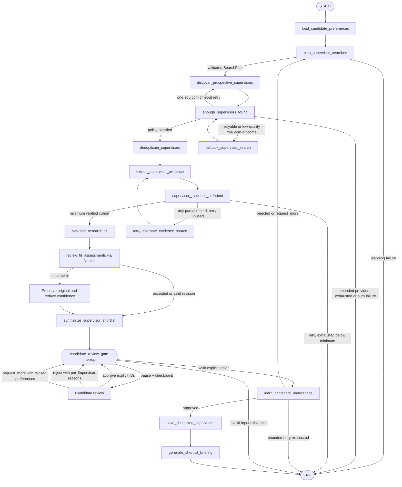

The proposal contains at most five ranked, evidence-backed records. No lifecycle change
or shortlist save occurs while the graph is interrupted. Rejection and `request_more`
return to planning only while the explicit review iteration budget remains.
Discovery uses explicit per-provider budgets; evidence and review retain their own
bounded controls. The graph never relies on LangGraph's recursion limit for normal
termination.

## M3 Research Planning Agent

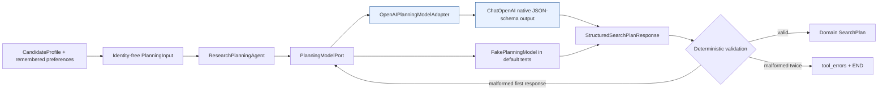

The versioned `research-planning-v2` system prompt requires four to eight distinct
queries whose combined targets cover official university profiles, department or
research-group pages, recent publications, and explicit doctoral-supervision
information. Each query carries its purpose and intended source types. Deterministic
query-shape validation allows at most one `site:` restriction, two explicit uppercase
Boolean operators, and one quoted phrase per query. An over-constrained model response
uses the same single bounded format retry as any other malformed structured output.

The adapter calls `ChatOpenAI.with_structured_output` with `method="json_schema"` and
`strict=True`; ScholarPath never parses important output from prose. A provider DTO is
converted into the stricter domain `SearchPlan`, where ordinary Python and Pydantic
enforce query count, normalized uniqueness, source coverage, and non-empty fields.
Candidate target regions are copied from typed input rather than rewritten by the
model.

A malformed structured response receives exactly one bounded retry. OpenAI invocation
failure, or a second malformed response, creates a sanitized planning error and routes
to END before discovery. The OpenAI client has `max_retries=0`, so there are no hidden
SDK retries beyond ScholarPath's explicit policy.

The port is the substitution seam:

```python
paused_state = run_scholarpath_graph(
    thread_id="candidate-run-opaque-id",
    planning_model=fake_planning_model,
    supervisor_search=fake_supervisor_search,
)
```

Default tests inject `FakePlanningModel`; they never instantiate OpenAI or use the
network. Calling `run_scholarpath_graph(thread_id=...)` without an injected model lazily creates the
OpenAI adapter and validates `OPENAI_API_KEY` at that boundary.

## M4 You.com Supervisor discovery

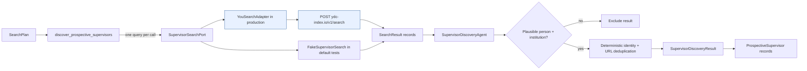

`YouSearchAdapter` is transport-only. It sends the exact query and configured result
limit to the official POST endpoint, applies an explicit HTTP timeout, and normalizes
web/news results into typed `SearchResult` records. Provider snippets are whitespace
normalized, deduplicated, and bounded to five excerpts of at most 1,000 characters each;
full-page content is never retained during discovery. The adapter does not identify
people, evaluate Research Fit, or infer doctoral availability.

`SupervisorDiscoveryAgent` uses conservative deterministic extraction because M4 does
not introduce another model integration. A result must contain a plausible person name
and institution. Equivalent records are merged by normalized name, normalized
institution, and canonical profile URL; each exact `(source URL, originating query)`
pair remains attached as provenance. This is discovery only: availability is not
represented and every output remains prospective.

Production composition lazily validates `YDC_API_KEY` only when `YouSearchAdapter` is
requested. Default tests inject `FakeSupervisorSearch`, mock HTTP only at the adapter
boundary, and make no external requests. This was the M4 boundary; M5 adds the fallback
below without changing the adapter.

## M5 resilient Supervisor discovery

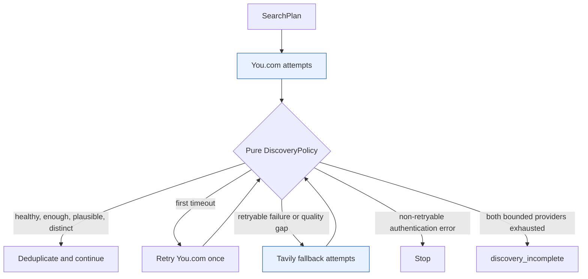

`TavilySearchAdapter` implements the same `SupervisorSearchPort` as You.com and uses
the official top-level `langchain_tavily.TavilySearch` integration. It invokes one
exact query at a time, applies an application deadline, and normalizes only URL,
title, description, optional publication date, and originating query. The exact
`langchain-tavily==0.2.17` pin is the newest compatible release for the project's
current LangChain Core/OpenAI dependency range; no deprecated community import is
used.

Routing is ordinary deterministic code. `DiscoveryPolicy` owns the minimum unique
count, one You.com timeout retry, Tavily call budget, timeout behavior,
duplicate-result threshold, plausible-profile ratio, and stopping condition. Every
provider call appends a typed `SearchAttempt` to graph state. Provider exception text,
credentials, and result content are not copied into the audit record.

You.com results accumulate in a typed node-local buffer before later queries execute,
so a caught later failure does not erase useful Prospective Supervisors when the node
commits its update. A non-retryable authentication error stops
immediately. Exhausting both providers below the minimum ends with
`review_status=discovery_incomplete` and a recoverable tool error rather than looping
or raising an unhandled exception. Tavily credentials are validated lazily only if the
policy actually selects the fallback.

### M11.1 discovery-quality repair

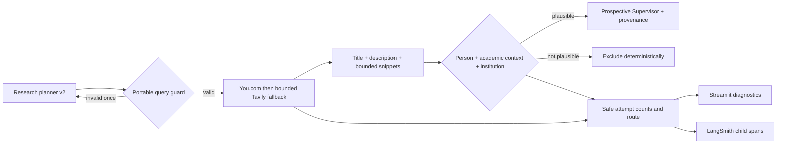

The live trace that motivated this repair showed a healthy planning call, zero You.com
results, then forty raw Tavily results from four calls but zero plausible profiles. The
repair treats those as three different measures: raw provider results, plausible profiles
before deduplication, and retained Prospective Supervisors. Only those counts, provider,
query-local attempt number, typed error category, fallback flag, and route may appear in
the UI or trace metadata. Queries, Candidate research content, names, URLs, page content,
and secrets remain excluded.

Discovery remains deterministic. The added title and snippet layouts improve recall for
real academic-profile results, while retention still requires a plausible person name,
academic context, and institution. Availability and Research Fit remain later evidence
boundaries.

### M11.2 discovery-completion repair

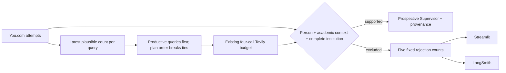

The live run motivating M11.2 returned 106 raw results but retained only four unique
Prospective Supervisors. Two You.com queries were productive, while the four Tavily calls
used the first four plan positions and found no additional plausible profiles. The repair
keeps the minimum of five, four-call Tavily budget, retry bounds, providers, and downstream
workflow unchanged. Fallback queries are now ordered by the latest current-round You.com
plausible count, descending, with original `SearchPlan` order as the deterministic
tie-breaker. If a local checkpoint already contains a current-round Tavily attempt,
ranked queries not yet tried by Tavily consume the remaining budget before any repeat.

Discovery rejects institution fragments ending in `and`, `at`, `for`, `of`, `the`, or
`with`, then continues scanning bounded result context for a complete affiliation. For
example, a title ending in `University of` can recover `University of East London` from
the provider description; an incomplete-only result is excluded.

Every successful M11.2 `SearchAttempt` stores aggregate counts for `person not
established`, `academic context not established`, `identity conflict`, `institution not
established`, and `incomplete institution`. The UI and trace receive only these counts and
the existing provider/routing aggregates. Queries, Candidate content, names, URLs,
snippets, raw results, page content, and secrets remain outside both projections. Older
checkpoints remain readable and explicitly report that this newer breakdown is unavailable.

### M11.3 academic-profile context repair

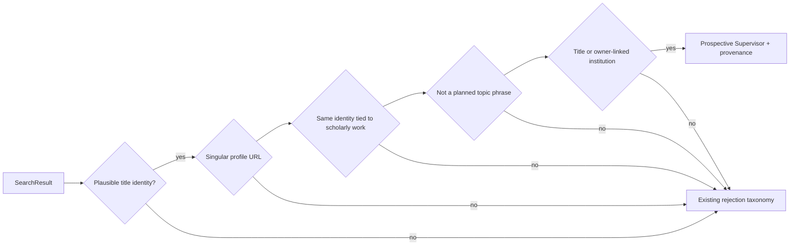

The live run motivating M11.3 completed all eleven provider calls but produced
`101 raw -> 0 plausible -> 0 retained`: 35 results did not establish a person, 64
person-like titles lacked recognized academic context, and two had identity conflicts.
No result reached institution validation. This was a deterministic interpretation
bottleneck rather than a provider, retry, or affiliation failure.

Untitled names on paths such as `/people/<name>`, `/profiles/<name>`, or
`/persons/<name>` now receive one conservative alternative route. The normalized URL
identity must match the title identity, at most the first 1,000 description characters plus
already bounded snippets must positively relate that identity to explicit scholarly work,
and a complete institution must come from the title or an explicit owner-linked affiliation
clause. Negated or unrelated personal interests are insufficient.

The alternative route also rejects an untitled identity that exactly reproduces an expanded
research concept or contiguous planned-query phrase. This keeps a page such as
`/people/enterprise-architecture` excluded even if its summary uses person-like grammar.
A capitalized topic plus a research keyword never establishes a person.

When bounded context names both the supported profile owner and a collaborator, the second
academic is treated as a co-mention. If contextual academic names exist but none supports
the title identity, the result remains an `identity_conflict`; another academic's affiliation
cannot be borrowed. Institution-first SEO titles can use a later titled identity only when
it matches the profile URL. Search planning, provider ordering, budgets, retries,
diagnostics, provenance, verification, Research Fit, memory, and Candidate approval are
unchanged.

## M6 Supervisor evidence extraction and verification

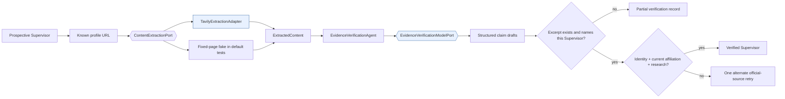

`TavilyExtractionAdapter` is transport-only. It calls the official top-level
`langchain_tavily.TavilyExtract` integration for exactly one public URL, applies
provider and application deadlines, caps retained content, and returns a typed
retrieval timestamp. It rejects credential-bearing and clearly non-public URLs and
does not interpret Supervisor facts.

`EvidenceVerificationAgent` accepts only native structured output. Each retained
`EvidenceClaim` receives a deterministic system-owned ID and the exact source URL,
source kind, retrieval timestamp, supporting excerpt, confidence, direct-support flag,
typed asserted values, and links to conflicting claims. Expected profile fields are
comparison hints, never evidence. Model knowledge and search snippets cannot satisfy
verification. A deterministic domain rule also rejects another person's facts,
ungrounded affiliation values, or availability whose typed polarity contradicts the
quoted statement. Evidence IDs hash every semantic claim field so distinct conflicts
cannot overwrite one another.

The pure `VerificationPolicy` retries every partial record once through an alternate
official URL before deciding whether at least five Verified Supervisors may continue.
Alternate selection requires the complete normalized person name, institution
correlation, HTTPS, and a label-valid academic domain; commercial lookalike hosts are
rejected.
Identity, current institution and department, plus either research-interest or
publication evidence are mandatory. Availability is optional: without an explicit
page statement it remains `not_stated`. Exhaustion below the minimum ends with
`review_status=evidence_incomplete`; otherwise useful verified and partial results are
retained and the graph continues.

## M7 Research Fit evaluation and preliminary synthesis

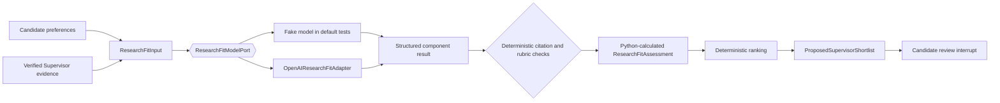

The configurable rubric totals 100 points: topic alignment 40, methodology or
discipline 20, applied-versus-theoretical orientation 15, recent activity 15, and
practical constraints 10. Each positive component cites suitable, directly supported
`EvidenceClaim` IDs. Missing evidence yields zero points, low component confidence, and
an explicit gap. The model never supplies the total; Python sums the five components.

Recent-activity points require publication or project evidence with a typed
`activity_year` that appears in the supporting excerpt and falls inside the rubric's
configurable freshness window, which defaults to five years from retrieval. A component's
confidence cannot exceed its weakest cited claim, and the assessment confidence is a
deterministic rubric-weighted aggregate of the five component confidences. M7 has no
typed region or study-mode evidence category, so affiliation prose cannot earn practical
points; the current production-safe result for that component is zero with an explicit
gap.

`ShortlistSynthesisAgent` is model-free. It ranks only Verified Supervisors by overall
score, evidence confidence, normalized name, and a stable ID fallback. The maximum five
recommendations retain strengths, concerns, availability status, and evidence
confidence. Their lifecycle remains `verified` until the existing Candidate approval
gate explicitly creates Shortlisted Supervisors.

Proposal `generated_at` values come from an injected `UtcClockPort`: production uses the
current aware UTC time and tests inject a fixed clock. The Research Fit trace metadata
uses the configured rubric's version rather than a hard-coded label, without adding
evidence text or Candidate identity to metadata.

## M8 independent Research Fit review

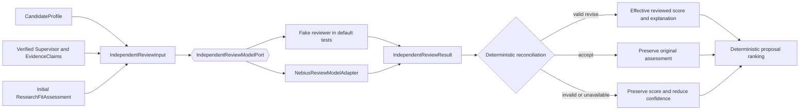

The reviewer receives a closed evidence record and cannot browse, add factual evidence,
change Candidate preferences, infer availability, estimate admission probability, or
modify the shortlist. A valid revision may reference only existing grounded evidence
IDs. Unsupported IDs are removed from the effective evidence view; overlooked IDs must
already exist in the same Verified Supervisor record.

`ReconciledResearchFitAssessment` overlays the immutable M7 assessment. Its effective
score and confidence drive deterministic shortlist ordering, while the original
five-component assessment remains available for audit. Disagreement above the configured
threshold lowers confidence and requires Candidate attention. A timeout, malformed
response, or invalid evidence reference records a recoverable tool error, preserves the
original score, and lowers confidence rather than stopping the graph.

The effective values reorder only the proposal awaiting review. If the Candidate
approves those Supervisors in a different explicit order, the Candidate decision remains
authoritative for the completed shortlist; independent review never reorders an already
approved shortlist.

## M9 Candidate review interrupt and durable persistence

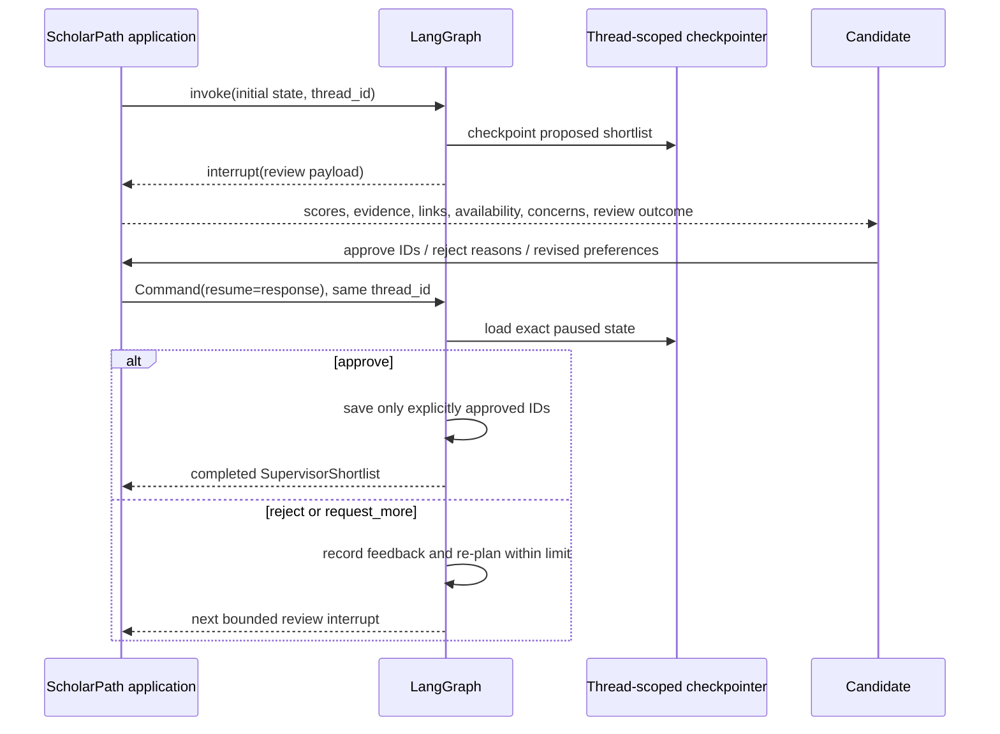

`candidate_review_gate` performs no side effect before `interrupt()`, because LangGraph
restarts the node from its beginning when a `Command(resume=...)` arrives. The payload is
a JSON-safe projection containing the proposal, effective Research Fit Score, evidence
confidence and source URLs, verified availability status, concerns, and independent-review
outcome. It excludes retrieved page content and the full Candidate research statement.

Resume values use action-specific Pydantic contracts. Approval requires one to five
explicit proposal IDs and preserves their order. Rejection requires a reason for every
targeted Supervisor. `request_more` requires at least one revised topic, region, study
mode, orientation, method, constraint, or exclusion. Unknown IDs cause a bounded
re-interrupt with a safe error; they never mutate feedback or Supervisor lifecycle state.

Every invocation requires a non-empty opaque `thread_id`. Tests use `InMemorySaver`.
Trusted local development uses `SqliteSaver` through `open_local_sqlite_checkpointer()`;
the default ignored database is `.scholarpath/checkpoints.sqlite3`. The serializer uses
strict MessagePack with an explicit ScholarPath type allowlist and a JSON projection for
Pydantic URL values—executable pickle fallback is not enabled. Treat the local checkpoint
database as Candidate data: restrict file access, define retention before production, and
do not share a thread ID between research runs.

## M10 persistent Candidate preference memory

```mermaid
sequenceDiagram
    participant Graph as LangGraph
    participant Planner as Research Planning Agent
    participant Candidate
    participant Learning as Preference Learning Agent
    participant Mem0

    Graph->>Mem0: load(filters: user_id = candidate_id)
    alt Mem0 available
        Mem0-->>Graph: versioned CandidateMemoryRecord values
    else unavailable
        Graph->>Graph: retain CandidateProfile + recoverable tool error
    end
    Graph->>Planner: profile + remembered preferences
    Graph-->>Candidate: interrupt with proposed shortlist
    Note over Graph,Mem0: Viewing stops here; no memory write
    Candidate->>Graph: approve / reject / request_more
    Graph->>Learning: checkpointed explicit action
    Learning->>Mem0: add exact typed JSON, infer=false, scoped user_id
    Learning->>Graph: continue even if Mem0 is unavailable
```

`CandidatePreferenceMemoryPort` isolates graph and agent code from Mem0.
`CandidateMemoryRecord` permits only durable preference kinds: themes, regions, study
modes, orientation, methods, constraints, exclusions, Candidate-authored rejection
reasons, and previously useful search concepts. Approval stores the current plan's
expanded concepts as a positive search signal; rejection stores only the opaque
Supervisor ID and the Candidate's reason.

The record schema has no fields for affiliation, publications, availability, evidence
URLs, Research Fit Scores, or graph position. The stable Candidate ID is a separate
required port argument and Mem0 `user_id` filter; it is not copied into memory content.
Writes use `infer=False`, so Mem0 stores the validated JSON rather than asking another
model to infer or broaden a preference. Case-and-whitespace-normalized semantic IDs,
pre-write scoped lookup, and a checkpointed feedback cursor suppress duplicates across
normal resumes and repeated actions.

## M11 Streamlit user interface

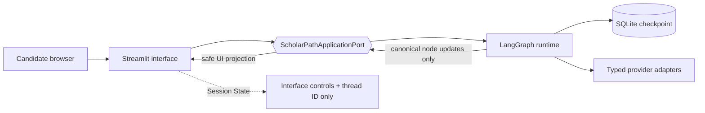

The single application walks through six visible stages: **Your Doctoral Research
Profile**, **Supervisor Search Progress**, **Prospective Supervisors**, **Verified
Supervisors**, **Review Supervisors**, and **Your Supervisor Shortlist**. The form captures
the research statement, topics, regions, study mode, research orientation, methods, and
exclusions. Results expose verification status, Research Fit Score and explanation,
evidence confidence and source links, availability, concerns, and independent-review
status.

`ScholarPathApplicationPort` keeps graph construction, checkpoint access, resume commands,
and business rules outside the Streamlit module. Streaming uses LangGraph update events,
allowlists canonical node names, and discards raw state deltas before they reach the UI.
The UI can approve selected Supervisor IDs, reject one Supervisor with a required reason,
or request more research with typed revisions. Merely rendering results never creates a
shortlist or a memory write.

## Setup

Run these commands from the repository root:

```bash
cd projects/scholar-path
python3 -m venv venv
source venv/bin/activate
python -m pip install --upgrade pip
python -m pip install -e ".[dev]" --config-settings editable_mode=strict
cp .env.example .env
```

No API key is required to install the package, import `scholarpath`, render the graph,
or run the default non-live test suite. The copied `.env` contains placeholders only
and is ignored by Git. OpenAI, You.com, and Nebius keys are validated only when their
respective adapters are instantiated. The shared Tavily key is validated only when
fallback search or evidence extraction is actually reached. Mem0 is imported and its
key validated only when persistent memory is first loaded; failure remains recoverable.

Run commands from `projects/scholar-path`, because the application resolves `.env`
relative to the current working directory. Keep the local file private:

```bash
chmod 600 .env
```

### Provider configuration

Set these variables in the ignored `.env` before running the live CLI:

```dotenv
OPENAI_API_KEY=your-openai-key
OPENAI_PLANNING_MODEL=gpt-5.4-mini
OPENAI_PLANNING_TIMEOUT_SECONDS=60
OPENAI_EVIDENCE_MODEL=gpt-5.4-mini
OPENAI_EVIDENCE_TIMEOUT_SECONDS=60
OPENAI_RESEARCH_FIT_MODEL=gpt-5.4-mini
OPENAI_RESEARCH_FIT_TIMEOUT_SECONDS=60
NEBIUS_API_KEY=your-nebius-key
NEBIUS_REVIEW_MODEL=Qwen/Qwen3-235B-A22B-Instruct-2507
NEBIUS_ENDPOINT=https://api.tokenfactory.nebius.com/v1/
NEBIUS_REVIEW_TIMEOUT_SECONDS=60
YDC_API_KEY=your-you-com-key
YOU_SEARCH_ENDPOINT=https://ydc-index.io/v1/search
YOU_SEARCH_TIMEOUT_SECONDS=20
YOU_SEARCH_RESULT_COUNT=10
TAVILY_API_KEY=your-tavily-key
TAVILY_SEARCH_TIMEOUT_SECONDS=20
TAVILY_SEARCH_RESULT_COUNT=10
TAVILY_EXTRACT_PROVIDER_TIMEOUT_SECONDS=20
TAVILY_EXTRACT_REQUEST_TIMEOUT_SECONDS=25
TAVILY_EXTRACT_DEPTH=advanced
TAVILY_EXTRACT_MAX_CONTENT_CHARACTERS=50000
MEM0_API_KEY=your-mem0-key
MEM0_TIMEOUT_SECONDS=20
MEM0_MEMORY_LIMIT=100
MEM0_TELEMETRY=false
SCHOLARPATH_DISCOVERY_FAILURE_MODE=off
SCHOLARPATH_CHECKPOINT_DATABASE_PATH=.scholarpath/checkpoints.sqlite3
```

`OPENAI_API_KEY`, `NEBIUS_API_KEY`, `YDC_API_KEY`, and `TAVILY_API_KEY` are required for
a complete live M11 graph path: OpenAI plans searches, extracts typed evidence, and
evaluates Research Fit; Nebius independently reviews each assessment; You.com performs
primary discovery; and Tavily retrieves known evidence pages or handles search fallback.
`MEM0_API_KEY` is optional: when present it enables cross-run preference recall; when
absent the graph continues from current profile and checkpoint data.
Endpoint, model, timeout, result-count, extraction, and failure-mode values shown are
the current non-secret defaults.

LangSmith is optional and disabled by default:

```dotenv
LANGSMITH_TRACING=false
LANGSMITH_ENDPOINT=https://api.smith.langchain.com
LANGSMITH_API_KEY=
LANGSMITH_PROJECT=scholarpath
LANGSMITH_WORKSPACE_ID=
SCHOLARPATH_RUN_LANGSMITH_EVALS=false
SCHOLARPATH_RUN_LIVE_E2E_EVALS=false
SCHOLARPATH_EVALUATION_DATASET_NAME=scholarpath-m12-regression-v1
SCHOLARPATH_EVALUATION_EXPERIMENT_PREFIX=scholarpath-m12
SCHOLARPATH_EVALUATION_JUDGE_MODEL=gpt-5.4-mini
SCHOLARPATH_EVALUATION_JUDGE_TIMEOUT_SECONDS=60
```

To trace a live run, set `LANGSMITH_TRACING=true` and provide
`LANGSMITH_API_KEY`. EU accounts must set
`LANGSMITH_ENDPOINT=https://eu.api.smith.langchain.com`; set
`LANGSMITH_WORKSPACE_ID` only when the API key is scoped to more than one workspace.
These values are loaded from `.env` and passed explicitly to the LangSmith client.
`SCHOLARPATH_ENVIRONMENT` supplies the `environment:*` trace tag; the implementation
supplies the fixed `graph-version:m12` tag. Disabling tracing does not construct a
LangSmith client, even if another process has globally enabled tracing.

### Run the M12 evaluation suite

The default evaluation is deterministic, fake-backed, and offline. It constructs no
LangSmith client and makes no model, search, memory, or network call:

```bash
venv/bin/python scripts/create_eval_dataset.py
venv/bin/python scripts/run_evals.py
venv/bin/python scripts/run_evals.py --target graph_fake
```

The first command previews all eleven synthetic scenarios. The second runs the complete
local baseline; the third limits execution to the fake end-to-end graph scenarios. The
expected baseline is `11/11` scenarios passed. Metric definitions and observed values are
recorded in [`docs/evaluation-baseline.md`](docs/evaluation-baseline.md).

Writing the dataset or an experiment to LangSmith requires both an explicit command option
and the environment gate. Load the ignored `.env` first so the configured regional endpoint
and workspace are used:

```bash
set -a
source .env
set +a

SCHOLARPATH_RUN_LANGSMITH_EVALS=true \
venv/bin/python scripts/create_eval_dataset.py --upload

SCHOLARPATH_RUN_LANGSMITH_EVALS=true \
venv/bin/python scripts/run_evals.py --upload --target graph_fake
```

Add `--include-llm-judges` only when the four qualitative OpenAI judges should run. A live
end-to-end experiment is a separate, stronger opt-in and uses only the bounded `graph-live`
scenario:

```bash
SCHOLARPATH_RUN_LANGSMITH_EVALS=true \
SCHOLARPATH_RUN_LIVE_E2E_EVALS=true \
venv/bin/python scripts/run_evals.py --upload --live --target graph_live
```

Uploaded target traces carry application, environment, graph version, prompt version, model
provider, fallback use, and Candidate review outcome tags. Candidate identity, full research
statements, queries, source content, credentials, and thread IDs are excluded from metadata;
the evaluation client also hides target inputs and outputs.

### Run the Streamlit application locally

Complete the setup above, add the required provider credentials to the ignored `.env`,
then run these exact commands from `projects/scholar-path`:

```bash
source venv/bin/activate
set -a
source .env
set +a
streamlit run streamlit_app.py
```

Open `http://localhost:8501` if Streamlit does not open it automatically. Complete **Your
Doctoral Research Profile**, choose **Start Supervisor Research**, watch the canonical
node names under **Supervisor Search Progress**, and use the review controls only after
the graph pauses. The application persists local threads at
`SCHOLARPATH_CHECKPOINT_DATABASE_PATH`; keep that ignored database private.

For an installation-independent invocation, the equivalent command is:

```bash
venv/bin/streamlit run streamlit_app.py
```

### Editor interpreter

When the parent `ai-builder` monorepo is open in VS Code, select this interpreter:

```text
projects/scholar-path/venv/bin/python
```

ScholarPath requires Python 3.12 or newer and relies on its strict editable installation
for the flattened physical `src/` layout. Using macOS `/usr/bin/python3` can therefore
produce false syntax and unresolved-import diagnostics.

Pylance normally reads configuration only from the opened workspace root. If
`ai-builder` is the root, enable its nearest-configuration mode in the ignored root
`.vscode/settings.json` so it discovers ScholarPath's nested `[tool.pyright]` section:

```json
{
  "python.defaultInterpreterPath": "${workspaceFolder}/projects/scholar-path/venv/bin/python",
  "python.analysis.useNearestConfiguration": true
}
```

Then run **Developer: Reload Window** in VS Code. Alternatively, open
`projects/scholar-path` directly as the workspace. The committed Pyright settings then
scope analysis to `src` and `tests`, target Python 3.12, and resolve the project virtual
environment.

Verify the editable installation:

```bash
python -m pip check
python -c "import scholarpath; print(scholarpath.__version__)"
```

Run the live graph path to its Candidate review interrupt after configuring OpenAI,
Nebius, You.com, and Tavily:

```bash
python -m scholarpath.cli
```

It uses OpenAI for research planning, typed evidence extraction, and structured
Research Fit component proposals; Nebius independently reviews the evidence-bound
assessments; You.com handles primary discovery; and Tavily handles page extraction and
conditional search fallback. ScholarPath validates citations, calculates initial totals,
reconciles reviews, and ranks proposals deterministically.
The CLI prints the typed Candidate review payload and exits while the run remains paused.
No Supervisor is shortlisted by merely displaying that payload. Application code resumes
the same checkpointed thread with `Command(resume=...)`; the CLI generates and prints an
opaque thread ID and writes the checkpoint to `SCHOLARPATH_CHECKPOINT_DATABASE_PATH`.
The 60-second SQLite example below shows the exact mechanism without requiring provider
credentials.

To exercise the same full graph without secrets, provider calls, or network access,
inject the test fake from the CLI:

```bash
LANGSMITH_TRACING=false python -c 'from scholarpath.cli import main; from tests.fakes import FakeCandidatePreferenceMemory, FakeContentExtraction, FakeEvidenceVerificationModel, FakeIndependentReviewModel, FakePlanningModel, FakeResearchFitModel, FakeSupervisorSearch; search=FakeSupervisorSearch(); raise SystemExit(main(planning_model=FakePlanningModel(), supervisor_search=search, tavily_search=search, content_extractor=FakeContentExtraction(), evidence_model=FakeEvidenceVerificationModel(), research_fit_model=FakeResearchFitModel(), independent_review_model=FakeIndependentReviewModel(), candidate_preference_memory=FakeCandidatePreferenceMemory(), alternate_evidence_search=search))'
```

To demonstrate an offline, deterministic You.com failure followed by successful
Tavily routing, inject both fakes and enable the failure mode for one process:

```bash
SCHOLARPATH_DISCOVERY_FAILURE_MODE=you_retryable_error LANGSMITH_TRACING=false python -c 'from scholarpath.graph import run_scholarpath_graph; from tests.fakes import FakeCandidatePreferenceMemory, FakeContentExtraction, FakeEvidenceVerificationModel, FakeIndependentReviewModel, FakePlanningModel, FakeResearchFitModel, FakeSupervisorSearch; search=FakeSupervisorSearch(); state=run_scholarpath_graph(thread_id="offline-fallback-demo", planning_model=FakePlanningModel(), supervisor_search=search, tavily_search=search, content_extractor=FakeContentExtraction(), evidence_model=FakeEvidenceVerificationModel(), research_fit_model=FakeResearchFitModel(), independent_review_model=FakeIndependentReviewModel(), candidate_preference_memory=FakeCandidatePreferenceMemory(), alternate_evidence_search=search); print("fallback_search_used:", state["fallback_search_used"]); print([(a.provider_used.value, a.attempt_number, a.error_category.value if a.error_category else None) for a in state["search_attempts"]])'
```

Use `you_timeout_once` to demonstrate a successful single retry, or
`both_providers_retryable_error` to demonstrate the recoverable terminal state. The
default is always `off`.

### 60-second M9 persistence demonstration

First run the offline fake command above and observe `ScholarPath paused for Candidate
review.` followed by five evidence-backed proposal items. Then exercise an actual SQLite
pause, process-style close/reopen, state inspection, and approval resume:

```bash
LANGSMITH_TRACING=false pytest -o addopts='' -q -s \
  tests/integration/test_m9_sqlite_persistence.py::test_sqlite_checkpoint_can_be_inspected_after_close_and_resumed_after_reopen
```

The test uses a temporary ignored database, so it does not need provider keys and leaves
no project data behind. For application code, pass the same opaque `thread_id` both to the
initial invocation and to `Command(resume=...)`; changing the ID deliberately selects a
different research run.

### 60-second M10 preference-memory demonstration

Run the two focused graph examples. The first pauses after viewing and proves there were
zero writes; the second resumes an approval and proves useful search concepts were stored:

```bash
pytest -o addopts='' -q -s \
  tests/graph/test_m10_candidate_preference_memory.py::test_viewing_candidate_review_results_does_not_write_memory \
  tests/graph/test_m10_candidate_preference_memory.py::test_approval_stores_useful_search_concepts_after_explicit_approval
```

Both use `FakeCandidatePreferenceMemory`, so the demonstration is deterministic and has
no network access. Inspect the matching tests to see the stable Candidate scope and exact
record kinds asserted at the boundary.

### 60-second M11 interface demonstration

Run the focused AppTest workflow. It renders the Candidate form, starts an injected
offline research run, displays evidence, and resumes the same thread after approval:

```bash
pytest -o addopts='' -q -s tests/integration/test_streamlit_app.py
```

The test uses `FakeScholarPathApplication`, so it requires no provider key, network call,
browser automation, or local checkpoint file. It also verifies recoverable error display,
secret redaction, and independent session isolation.

### 60-second discovery-quality repair demonstration

Run the three offline regressions that exercise the repaired boundaries:

```bash
pytest -o addopts='' -q \
  tests/unit/agents/test_research_planning.py::test_overconstrained_query_output_is_retried_once_then_repaired \
  tests/graph/test_m5_resilient_discovery.py::test_realistic_fallback_summaries_reach_downstream_evidence_processing \
  tests/integration/test_streamlit_app.py::test_zero_retained_results_show_accurate_privacy_safe_discovery_diagnostics
```

Expected result: `3 passed`. No provider key, network call, checkpoint file, or model is
used. The cases prove one bounded planning retry, six retained Prospective Supervisors
from realistic fallback summaries, and accurate `40 raw -> 0 plausible -> 0 retained`
diagnostics without exposing query or Candidate content.

### 60-second M11.2 discovery-completion demonstration

Run the bounded repair regressions without provider keys or network access:

```bash
pytest -o addopts='' -q \
  tests/unit/agents/test_supervisor_discovery.py::test_incomplete_title_institution_falls_through_to_complete_bounded_context \
  tests/graph/test_m5_resilient_discovery.py::test_tavily_budget_prioritizes_productive_you_query_slots \
  tests/integration/test_streamlit_app.py::test_typed_discovery_rejection_breakdown_is_rendered_without_sensitive_content
```

Expected result: `3 passed`. The cases demonstrate complete-affiliation recovery,
productive-query fallback ordering within the unchanged budget, and aggregate-only UI
diagnostics. No provider, model, trace client, or external network is used.

### 60-second M11.3 academic-profile context demonstration

Run the three offline regressions for the repaired recognition boundary:

```bash
pytest -o addopts='' -q \
  tests/unit/agents/test_supervisor_discovery_academic_profiles.py::test_supported_profile_owner_is_retained_when_a_collaborator_is_also_named \
  tests/integration/test_m11_3_you_discovery_pipeline.py::test_you_results_flow_through_conservative_academic_profile_recognition \
  tests/graph/test_m11_3_academic_profile_discovery_regression.py::test_m11_3_untitled_academic_profiles_continue_downstream_without_tavily
```

Expected result: `3 passed`. The cases prove collaborator-safe identity handling, the
mocked You.com transport-to-domain boundary for a `/persons/<name>` profile and a generic
topic page, and downstream graph continuation without Tavily. No provider key, model,
trace client, checkpoint file, or external network is used.

## Quality and test commands

Run the complete local quality gate from `projects/scholar-path`:

```bash
ruff format --check .
ruff check .
mypy src tests
pytest -m "not live"
```

The pytest configuration collects `tests/`, excludes live tests by default, measures
branch coverage for `scholarpath`, and requires at least 90 percent coverage.

The optional OpenAI smoke test requires both a process-environment key and explicit
opt-in. Load the ignored `.env` into the current shell first:

```bash
set -a
source .env
set +a
LANGSMITH_TRACING=false SCHOLARPATH_RUN_LIVE_TESTS=true pytest -o addopts='' -m live tests/integration/test_openai_planning_live.py
```

Without either condition, the live test skips. `-o addopts=''` deliberately overrides
the repository's default `-m "not live"` selection for this one command. The standalone
smoke test reads the process environment directly; it does not load `.env` itself.

The optional OpenAI Research Fit smoke test uses one fixed Verified Supervisor fixture
and validates every returned citation locally:

```bash
set -a
source .env
set +a
LANGSMITH_TRACING=false SCHOLARPATH_RUN_LIVE_TESTS=true pytest -o addopts='' -m live tests/integration/test_openai_research_fit_live.py
```

The optional Nebius smoke test reviews that fixed evidence record through strict
structured output and validates the score bounds and evidence references locally:

```bash
set -a
source .env
set +a
LANGSMITH_TRACING=false SCHOLARPATH_RUN_LIVE_TESTS=true pytest -o addopts='' -m live tests/integration/test_nebius_review_live.py
```

The optional You.com smoke test follows the same opt-in policy and performs one bounded
search call:

```bash
set -a
source .env
set +a
SCHOLARPATH_RUN_LIVE_TESTS=true pytest -o addopts='' -m live tests/integration/test_you_search_live.py
```

The optional Tavily smoke test uses the official package and the same explicit guard:

```bash
set -a
source .env
set +a
SCHOLARPATH_RUN_LIVE_TESTS=true pytest -o addopts='' -m live tests/integration/test_tavily_search_live.py
```

The optional Tavily Extract smoke test retrieves one fixed official Tavily documentation
URL and uses the same credential and opt-in boundary:

```bash
set -a
source .env
set +a
SCHOLARPATH_RUN_LIVE_TESTS=true pytest -o addopts='' -m live tests/integration/test_tavily_extraction_live.py
```

The optional Mem0 smoke test uses a UUID-scoped synthetic Candidate, verifies another
Candidate cannot retrieve the record, and deletes the synthetic scope in `finally`:

```bash
set -a
source .env
set +a
MEM0_TELEMETRY=false SCHOLARPATH_RUN_LIVE_TESTS=true pytest -o addopts='' -q -rs -m live tests/integration/test_mem0_memory_live.py
```

The GitHub Actions workflow runs the same installation and quality commands on Python
3.12 whenever ScholarPath or its workflow changes.

## Target outcome and success measures

ScholarPath succeeds when one research run:

1. Produces five evidence-backed Supervisor recommendations in under 15 minutes.
2. Receives a relevant rating from the Candidate for at least four of the five
   recommendations.
3. Preserves the supporting evidence and rationale for every Research Fit assessment.
4. Gives the Candidate final control over rejection, further research, shortlisting,
   and any subsequent outreach drafting.
5. Traces, tests, and evaluates the complete workflow through LangSmith.

## Product principles

- **Evidence before recommendation:** discovery alone cannot qualify a Supervisor for
  Research Fit evaluation or Candidate review.
- **Explainable fit:** every score must include its supporting evidence, confidence,
  and a plain-language reason.
- **Human decision authority:** agents may recommend, but only the Candidate may move
  a Verified Supervisor to the shortlist.
- **No premature outreach:** outreach is not drafted before Candidate approval.
- **Source-aware resilience:** primary search and evidence paths have explicit fallback
  behavior.
- **Traceable execution:** agent decisions, tool calls, state transitions, retries,
  and evaluation results must be observable.
- **Feedback-driven refinement:** approvals and rejection reasons inform subsequent
  searches without replacing the Candidate's current instructions.

## Glossary

| Term | Definition |
|---|---|
| **Candidate** | The person pursuing a doctorate and using ScholarPath. |
| **Supervisor** | An academic or researcher who may supervise the Candidate's doctoral research. |
| **Prospective Supervisor** | A discovered Supervisor who has not yet completed verification and Candidate review. |
| **Verified Supervisor** | A Supervisor whose relevant information has been checked against supporting sources. |
| **Shortlisted Supervisor** | A Verified Supervisor approved by the Candidate. |
| **Rejected Supervisor** | A Supervisor excluded by the Candidate. |
| **Research Fit Score** | The assessed alignment between the Candidate's doctoral interests and a Supervisor's verified research profile. |

### Example Research Fit assessment

```text
Research Fit Score: 84/100
Confidence: High

Reason:
The Supervisor's work on enterprise architecture, digital transformation, and
organisational strategy aligns closely with the Candidate's proposed applied
research direction.
```

The score and confidence are decision-support signals, not proof of supervisory
availability or a substitute for the Candidate's judgment.

## Supervisor lifecycle

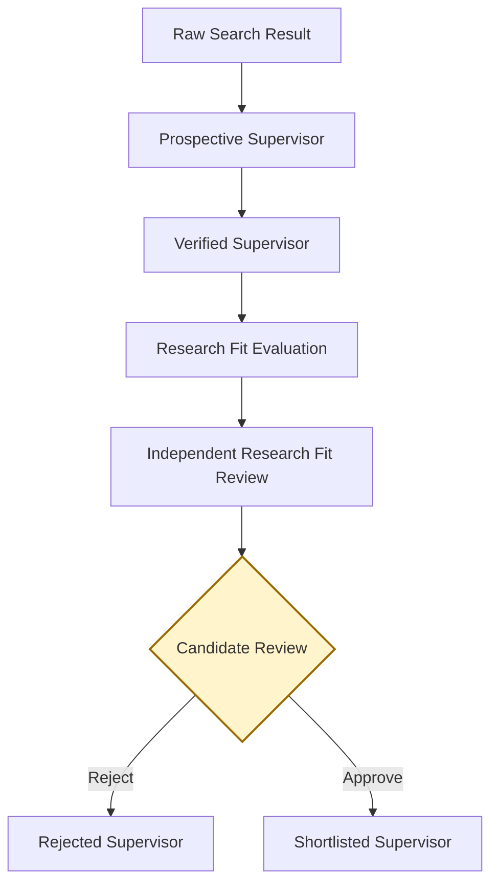

Only the Candidate Review decision can create a Shortlisted Supervisor.

## Agents

| Agent | Responsibility |
|---|---|
| **Candidate Intake Agent** | Captures and structures the Candidate's proposed research area, preferences, and constraints. |
| **Research Planning Agent** | Produces a structured, source-diverse SearchPlan through an injected model port. |
| **Supervisor Discovery Agent** | Identifies Prospective Supervisors from typed You.com or Tavily results; provider routing stays outside the agent. |
| **Evidence Verification Agent** | Verifies Supervisor identity, affiliation, research interests, publications, and stated supervisor availability. |
| **Research Fit Evaluation Agent** | Calculates and explains the Research Fit between the Candidate and each Verified Supervisor. |
| **Independent Review Agent** | Reviews the evidence and fit assessment using Nebius, identifying unsupported claims or inflated scores. |
| **Shortlist Synthesis Agent** | Produces the ranked set of Verified Supervisors for Candidate review. |
| **Preference Learning Agent** | Records Candidate rejection reasons, approvals, and search preferences through Mem0. |
| **Orchestrator Agent** | Coordinates workflow state, transitions, retries, tool fallback, and human approval using LangGraph. |

## Platform integrations

Agents are logical responsibilities; integrations are the external platforms used to
execute, coordinate, remember, or observe those responsibilities.

| Integration | Role |
|---|---|
| **OpenAI** | Current native structured-output model for research planning, page-grounded claim extraction, and evidence-cited Research Fit components; no tools or browsing. |
| **You.com** | Current primary Supervisor discovery search through the official Web Search API. |
| **Tavily** | Current bounded fallback search and known-page evidence extraction through official LangChain integrations. |
| **Nebius** | Current independent Research Fit review through the Token Factory OpenAI-compatible endpoint; no browsing or tools. |
| **Mem0** | Candidate preference and feedback memory. |
| **LangGraph** | Current deterministic state orchestration, durable interrupt, and Candidate approval flow. |
| **LangSmith** | Optional graph tracing plus the M12 synthetic dataset, deterministic regression evaluators, and separately selected qualitative judges. |
| **Streamlit** | Current Candidate-facing interface for profile intake, safe progress, evidence review, and thread-correct interrupt resume. |

## Future production evolution

M11 keeps Candidate feedback in thread-scoped graph state and also persists the permitted
durable preference projection through Mem0. The graph state remains authoritative for the
current position, while Supervisor facts remain authoritative only in verified evidence.
Streamlit renders only a safe projection and resumes the same opaque thread; viewing a
proposal never translates into approval. Authenticated Candidate identity and authorization
over thread ownership; Mem0 consent, retention, deletion, residency, and access controls;
source freshness and authority weighting; evaluation calibration; checkpoint encryption and
retention; and multi-process persistence remain deferred. Retry limits, sufficiency
thresholds, arithmetic, routing, and ranking remain explicit deterministic configuration
rather than model decisions.
