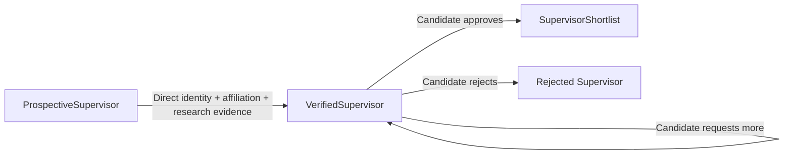
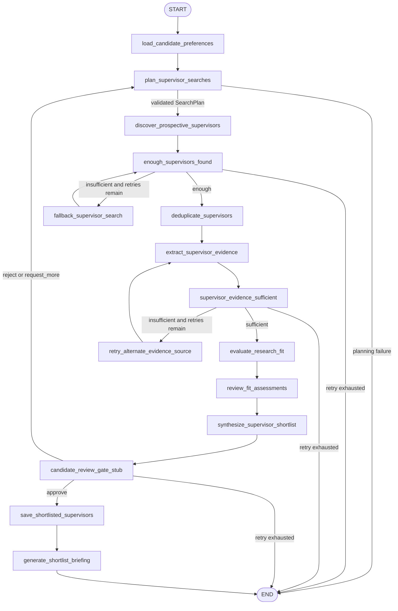
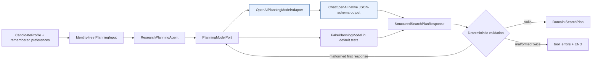
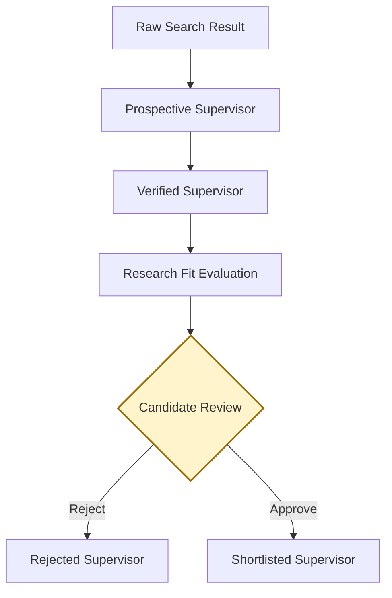

# ScholarPath

**Multi-Agent Doctoral Supervisor Discovery and Research-Fit System**

ScholarPath helps a prospective doctoral Candidate discover, verify, evaluate, and
shortlist research-aligned Supervisors through a Streamlit web application. It is
intended to replace hours of fragmented searching across university profiles and
academic publications with an evidence-backed, human-controlled workflow.

The system plans searches, discovers Prospective Supervisors, verifies supporting
evidence, evaluates Research Fit, and learns from Candidate feedback. It introduces
platform integrations incrementally while retaining a Candidate approval gate before
any Supervisor is shortlisted or any outreach is drafted.

## Project status

Milestone M3 replaces only `plan_supervisor_searches` with an injected Research
Planning Agent. Its OpenAI adapter uses native structured output to create a typed
search strategy; it has no tools and cannot browse. The remaining discovery,
verification, Research Fit, review, and shortlist nodes stay deterministic and
fixture-backed.

Baseline LangSmith tracing is optional. When enabled, it traces the graph and planning
node with fixed environment and graph-version tags, allowlisted metadata, and hidden
trace inputs and outputs. The Candidate review gate remains a configured fixture stub rather than
a user interface. Search providers, memory, Streamlit, and other model-backed agents
are not implemented yet.

## M0 foundation

| Capability | M0 implementation |
|---|---|
| Python | Python 3.12 or newer; local repository convention is 3.14.6 |
| Packaging | Physical `src/` root mapped to the importable `scholarpath` package |
| Runtime dependencies | Pydantic and pydantic-settings only in M0 |
| Configuration | Safe non-secret defaults and deferred provider-key validation |
| Quality gates | Ruff, strict mypy, pytest, branch coverage, and GitHub Actions |
| Network policy | Default and CI tests exclude tests marked `live` |

See [current architecture](docs/architecture.md), the historical
[M2 generated graph](docs/m2-walking-skeleton.mmd), the current
[M3 generated graph](docs/m3-research-planning-graph.mmd), and
[canonical terminology](docs/terminology.md) for the current boundaries.

## M1 domain contracts



All M1 models are frozen Pydantic contracts. URLs and timezone-aware timestamps are
validated, Research Fit scores are constrained to 0–100, evidence retains source
provenance, and unknown fields are rejected. Availability defaults to `not_stated` and
does not block verification. Explicit availability states must match typed availability
evidence, and every shortlisted record retains its Candidate approval decision.

The deterministic fixture cohort is available from `tests.fixtures` for offline tests:

```python
from tests.fixtures import (
    make_candidate_profile,
    make_prospective_supervisors,
    make_research_fit_assessments,
    make_verified_supervisors,
)

candidate = make_candidate_profile()
prospective = make_prospective_supervisors()  # 8 records
verified = make_verified_supervisors()  # 6 records
assessments = make_research_fit_assessments()  # 5 records
```

## M2 walking skeleton, extended in M3



The successful path yields five ranked, evidence-backed records. Rejection and
`request_more` return to planning only while the explicit review retry budget remains.
Discovery and evidence retries follow the same bounded rule, so the graph never relies
on LangGraph's recursion limit for normal termination.

## M3 Research Planning Agent



The versioned `research-planning-v1` system prompt requires four to eight distinct
queries whose combined targets cover official university profiles, department or
research-group pages, recent publications, and explicit doctoral-supervision
information. Each query carries its purpose and intended source types.

The adapter calls `ChatOpenAI.with_structured_output` with `method="json_schema"` and
`strict=True`; ScholarPath never parses important output from prose. A provider DTO is
converted into the stricter domain `SearchPlan`, where ordinary Python and Pydantic
enforce query count, normalized uniqueness, source coverage, and non-empty fields.
Candidate target regions are copied from typed input rather than rewritten by the
model.

A malformed structured response receives exactly one bounded retry. OpenAI invocation
failure, or a second malformed response, creates a sanitized planning error and routes
to END before discovery. The OpenAI client has `max_retries=0`, so there are no hidden
SDK retries beyond ScholarPath's explicit policy.

The port is the substitution seam:

```python
final_state = run_scholarpath_graph(planning_model=fake_planning_model)
```

Default tests inject `FakePlanningModel`; they never instantiate OpenAI or use the
network. Calling `run_scholarpath_graph()` without an injected model lazily creates the
OpenAI adapter and validates `OPENAI_API_KEY` at that boundary.

## Setup

Run these commands from the repository root:

```bash
cd projects/scholar-path
python3 -m venv venv
source venv/bin/activate
python -m pip install --upgrade pip
python -m pip install -e ".[dev]" --config-settings editable_mode=strict
cp .env.example .env
```

No API key is required to install the package, import `scholarpath`, render the graph,
or run the default non-live test suite. The copied `.env` contains placeholders only
and is ignored by Git. An OpenAI key is validated only when the OpenAI planning adapter
is instantiated.

### Provider configuration

Set these variables in the ignored `.env` before running the live CLI:

```dotenv
OPENAI_API_KEY=your-openai-key
OPENAI_PLANNING_MODEL=gpt-5.4-mini
OPENAI_PLANNING_TIMEOUT_SECONDS=60
```

`OPENAI_API_KEY` is required for a live planning run. The model and timeout shown are
the current non-secret defaults.

LangSmith is optional and disabled by default:

```dotenv
LANGSMITH_TRACING=false
LANGSMITH_API_KEY=
LANGSMITH_PROJECT=scholarpath
```

To trace a live run, set `LANGSMITH_TRACING=true` and provide
`LANGSMITH_API_KEY`. `SCHOLARPATH_ENVIRONMENT` supplies the `environment:*` trace tag;
the implementation supplies the fixed `graph-version:m3` tag. Disabling tracing does
not construct a LangSmith client, even if another process has globally enabled
tracing.

### Editor interpreter

When the parent `ai-builder` monorepo is open in VS Code, select this interpreter:

```text
projects/scholar-path/venv/bin/python
```

ScholarPath requires Python 3.12 or newer and relies on its strict editable installation
for the flattened physical `src/` layout. Using macOS `/usr/bin/python3` can therefore
produce false syntax and unresolved-import diagnostics. The shared Pyright settings in
`pyproject.toml` scope analysis to `src` and `tests`, target Python 3.12, and resolve
packages from the project virtual environment.

Verify the editable installation:

```bash
python -m pip check
python -c "import scholarpath; print(scholarpath.__version__)"
```

Run the live graph demonstration after configuring OpenAI:

```bash
python -m scholarpath.cli
```

It uses OpenAI only for research planning, then executes the remaining fixture-backed
approval path and prints the final five Shortlisted Supervisors with their fixture
Research Fit Scores. If OpenAI is not configured, the CLI exits cleanly with setup
guidance.

## Quality and test commands

Run the complete local quality gate from `projects/scholar-path`:

```bash
ruff format --check .
ruff check .
mypy src tests
pytest -m "not live"
```

The pytest configuration collects `tests/`, excludes live tests by default, measures
branch coverage for `scholarpath`, and requires at least 90 percent coverage.

The optional OpenAI smoke test requires both an exported key and explicit opt-in:

```bash
export OPENAI_API_KEY="your-openai-key"
SCHOLARPATH_RUN_LIVE_TESTS=true pytest -o addopts='' -m live tests/integration/test_openai_planning_live.py
```

Without either condition, the live test skips. `-o addopts=''` deliberately overrides
the repository's default `-m "not live"` selection for this one command.

The GitHub Actions workflow runs the same installation and quality commands on Python
3.12 whenever ScholarPath or its workflow changes.

## Target outcome and success measures

ScholarPath succeeds when one research run:

1. Produces five evidence-backed Supervisor recommendations in under 15 minutes.
2. Receives a relevant rating from the Candidate for at least four of the five
   recommendations.
3. Preserves the supporting evidence and rationale for every Research Fit assessment.
4. Gives the Candidate final control over rejection, further research, shortlisting,
   and any subsequent outreach drafting.
5. Traces, tests, and evaluates the complete workflow through LangSmith.

## Product principles

- **Evidence before recommendation:** discovery alone cannot qualify a Supervisor for
  Research Fit evaluation or Candidate review.
- **Explainable fit:** every score must include its supporting evidence, confidence,
  and a plain-language reason.
- **Human decision authority:** agents may recommend, but only the Candidate may move
  a Verified Supervisor to the shortlist.
- **No premature outreach:** outreach is not drafted before Candidate approval.
- **Source-aware resilience:** primary search and evidence paths have explicit fallback
  behavior.
- **Traceable execution:** agent decisions, tool calls, state transitions, retries,
  and evaluation results must be observable.
- **Feedback-driven refinement:** approvals and rejection reasons inform subsequent
  searches without replacing the Candidate's current instructions.

## Glossary

| Term | Definition |
|---|---|
| **Candidate** | The person pursuing a doctorate and using ScholarPath. |
| **Supervisor** | An academic or researcher who may supervise the Candidate's doctoral research. |
| **Prospective Supervisor** | A discovered Supervisor who has not yet completed verification and Candidate review. |
| **Verified Supervisor** | A Supervisor whose relevant information has been checked against supporting sources. |
| **Shortlisted Supervisor** | A Verified Supervisor approved by the Candidate. |
| **Rejected Supervisor** | A Supervisor excluded by the Candidate. |
| **Research Fit Score** | The assessed alignment between the Candidate's doctoral interests and a Supervisor's verified research profile. |

### Example Research Fit assessment

```text
Research Fit Score: 84/100
Confidence: High

Reason:
The Supervisor's work on enterprise architecture, digital transformation, and
organisational strategy aligns closely with the Candidate's proposed applied
research direction.
```

The score and confidence are decision-support signals, not proof of supervisory
availability or a substitute for the Candidate's judgment.

## Supervisor lifecycle



Only the Candidate Review decision can create a Shortlisted Supervisor.

## Agents

| Agent | Responsibility |
|---|---|
| **Candidate Intake Agent** | Captures and structures the Candidate's proposed research area, preferences, and constraints. |
| **Research Planning Agent** | Current M3 agent: produces a structured, source-diverse SearchPlan through an injected model port. |
| **Supervisor Discovery Agent** | Finds Prospective Supervisors using You.com, with Tavily as a fallback. |
| **Evidence Verification Agent** | Verifies Supervisor identity, affiliation, research interests, publications, and stated supervisor availability. |
| **Research Fit Evaluation Agent** | Calculates and explains the Research Fit between the Candidate and each Verified Supervisor. |
| **Independent Review Agent** | Reviews the evidence and fit assessment using Nebius, identifying unsupported claims or inflated scores. |
| **Shortlist Synthesis Agent** | Produces the ranked set of Verified Supervisors for Candidate review. |
| **Preference Learning Agent** | Records Candidate rejection reasons, approvals, and search preferences through Mem0. |
| **Orchestrator Agent** | Coordinates workflow state, transitions, retries, tool fallback, and human approval using LangGraph. |

## Platform integrations

Agents are logical responsibilities; integrations are the external platforms used to
execute, coordinate, remember, or observe those responsibilities.

| Integration | Role |
|---|---|
| **OpenAI** | Current native structured-output model for research planning; no tools or browsing. |
| **You.com** | Primary Supervisor discovery search. |
| **Tavily** | Fallback Supervisor discovery search. |
| **Nebius** | Independent evidence and Research Fit review. |
| **Mem0** | Candidate preference and feedback memory. |
| **LangGraph** | Current deterministic state orchestration and future human approval flow. |
| **LangSmith** | Current optional graph/planning tracing; evaluation remains planned. |

Streamlit is the planned Candidate-facing web interface.

## Future production evolution

M3 keeps feedback capture inside `candidate_review_gate_stub` and deterministically
replays the fixture discovery path after rejection or `request_more`; only the search
plan is regenerated. Later milestones may split feedback persistence and search
refinement into provider-backed responsibilities. An alternate planning-model failover,
source-authority rules, Research Fit calculation policy, trace evaluation, and
data-retention policy remain deferred. Retry limits and sufficiency thresholds are
explicit configuration rather than model decisions.
