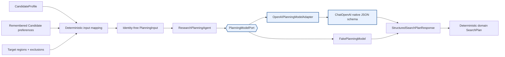
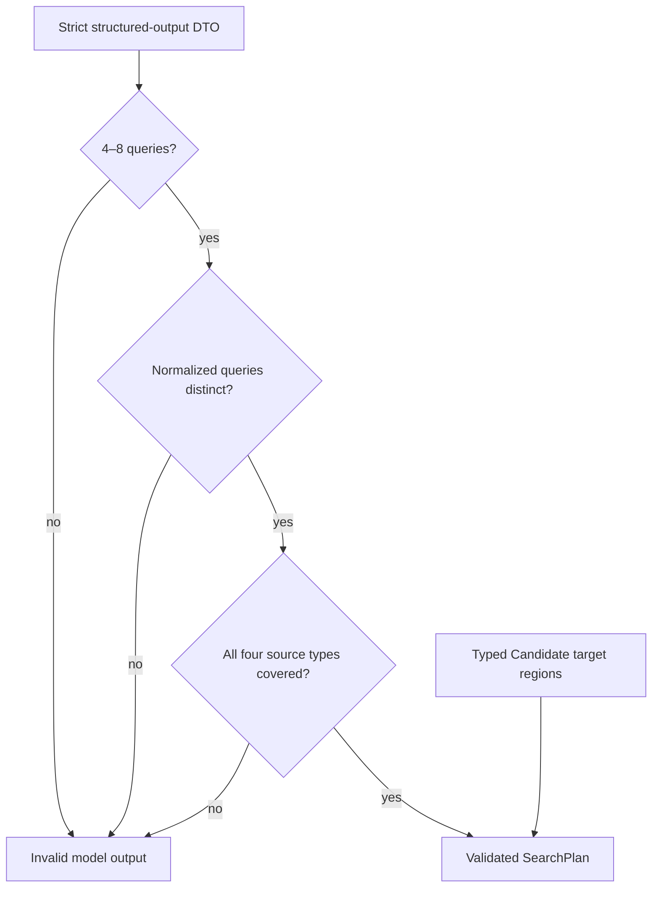
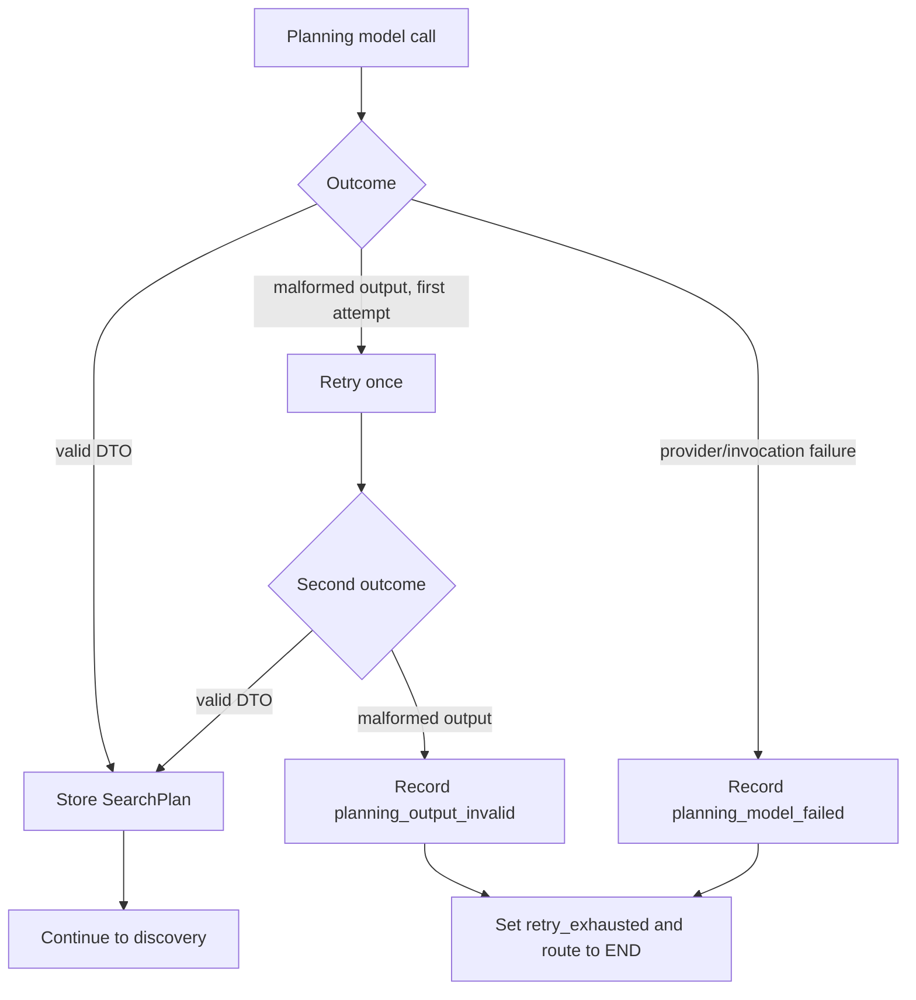
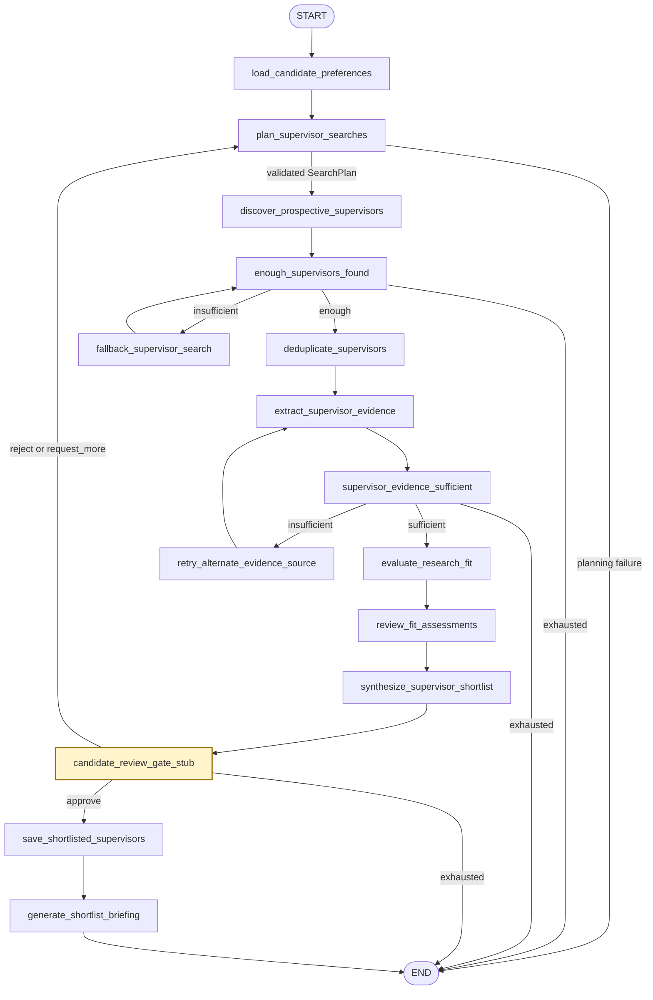
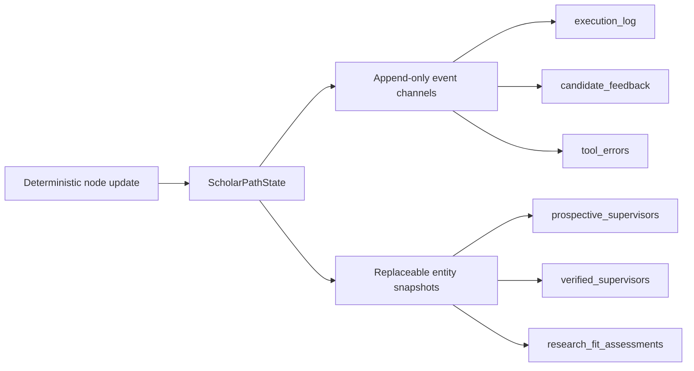
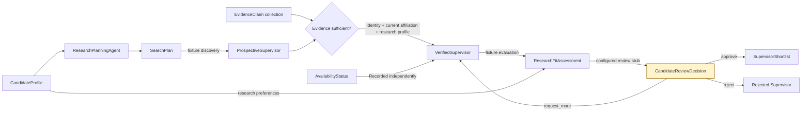
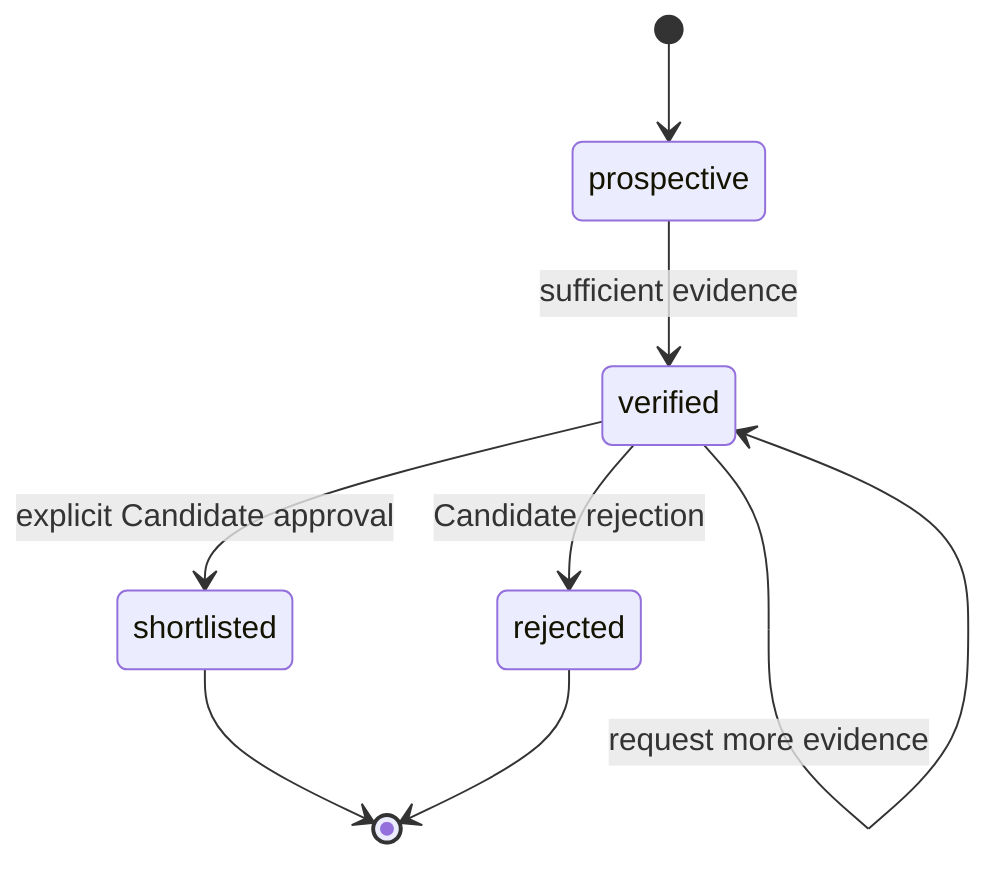
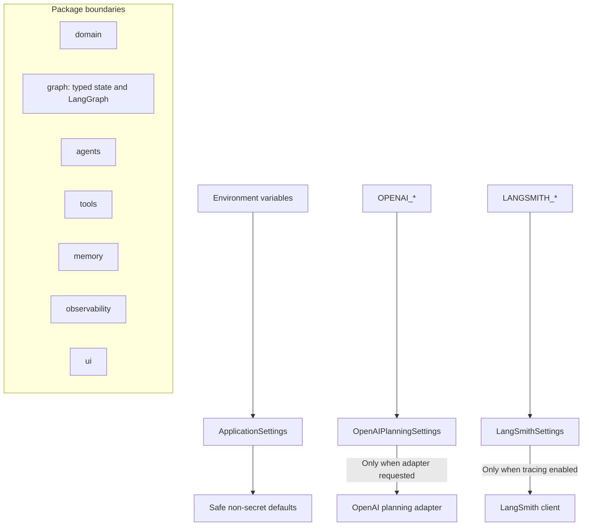
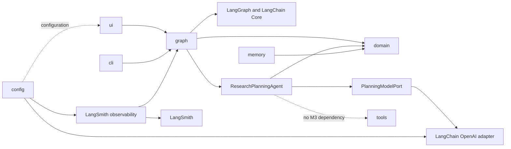
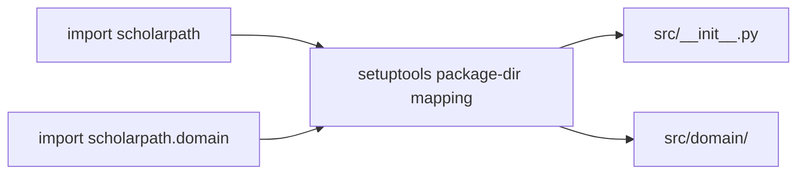

# ScholarPath M3 Architecture

M3 retains the M2 typed LangGraph walking skeleton and replaces only
`plan_supervisor_searches`. That node now delegates to a Research Planning Agent
through an injected `PlanningModelPort`. The production adapter uses OpenAI native
structured output without tools or web access; every downstream node remains
fixture-backed. Optional LangSmith observability traces the graph and planning node.

Search providers, evidence retrieval, Research Fit calculation, Candidate interaction,
memory, and the web interface remain outside M3.

## Research-planning boundary



`PlanningModelPort` isolates model execution from orchestration and domain logic.
Default tests inject a deterministic fake, while `run_scholarpath_graph()` lazily
constructs `OpenAIPlanningModelAdapter` only when no model was injected. Merely
importing ScholarPath or compiling the topology never validates an OpenAI key.

The adapter composes the versioned `research-planning-v1` system prompt with
`ChatOpenAI.with_structured_output(StructuredSearchPlanResponse,
method="json_schema", strict=True)`. It does not bind tools, grant web access, or parse
JSON from prose. OpenAI produces the provider DTO; the agent then constructs the
stricter domain contract.



Each query contains its purpose and intended source types. Across the plan, source
coverage must include official university profiles, department or research-group
pages, recent publication evidence, and explicit doctoral-supervision information.
Pydantic and ordinary Python enforce these rules; the model does not validate,
deduplicate, route, or perform arithmetic. Candidate target regions are copied from
typed input so model output cannot silently change that constraint.

## Planning failure policy



Malformed structured output receives one explicit retry, for at most two planning
calls. Provider failures are not retried. The OpenAI client is configured with
`max_retries=0`, avoiding hidden retries that would obscure latency and cost. Error
records use fixed sanitized messages rather than provider exception text. Planning
failure terminates before discovery, so no stale or absent SearchPlan can drive the
workflow.

## Walking-skeleton orchestration



The original graph-derived M2 Mermaid source remains at
[`docs/m2-walking-skeleton.mmd`](m2-walking-skeleton.mmd) as the walking-skeleton
baseline. M3 adds the conditional planning-success edge shown above; all downstream
routing remains unchanged.

## Typed state and reducer policy



| State category | Channels | Merge behavior |
|---|---|---|
| Immutable input | `candidate_profile` | Preserved |
| Append-only history | preferences, raw results, feedback, errors, execution log | Typed reducers append new events |
| Canonical snapshots | Prospective, Verified, Research Fit, proposed and shortlisted records | Latest node output replaces the prior snapshot |
| Unique terminal history | rejected Supervisors | Reducer merges by `supervisor_id` |
| Routing control | retry counts and review status | Deterministic replacement |
| Validated output | authoritative `supervisor_shortlist`, projected list, and briefing | Created only after Candidate approval; contract-tested for consistency |

This distinction prevents a planning loop from duplicating canonical Supervisor
collections while retaining an auditable history of searches, decisions, errors, and
node execution.

## Bounded routing

```text
Failed sufficiency check
        ↓
retry count below configured maximum? ── no ──> record sanitized error ──> END
        │
       yes
        ↓
execute fallback or alternate node
        ↓
increment explicit counter
        ↓
repeat sufficiency check
```

The LangGraph recursion limit remains defense-in-depth. It is not the workflow's
termination mechanism. Fixture configuration caps each retry budget at five and derives
a recursion guard above the maximum valid configured path.

The planning agent's malformed-output retry is intentionally separate from graph retry
state: it repairs one model-boundary format failure before the node returns. A terminal
planning error enters graph state and follows the explicit planning-to-END edge.

## Optional LangSmith observability


Tracing is scoped to one graph invocation with `langsmith.tracing_context`. Disabled
execution explicitly uses `enabled=False` and does not construct a LangSmith client.
Enabled execution validates the key at activation, sends traces to
`LANGSMITH_PROJECT`, flushes them, and closes the client.

Graph tags are `environment:<SCHOLARPATH_ENVIRONMENT>` and `graph-version:m3`. The
planning node additionally records its component and prompt version. Metadata passes a
fixed scalar allowlist only:

- `application`
- `environment`
- `graph_version`
- `component`
- `prompt_version`

Candidate identifiers, names, email addresses, API keys, full research statements,
and arbitrary caller metadata cannot enter that allowlist. The LangSmith client also
uses `hide_inputs=True` and `hide_outputs=True`, preventing graph state and the model
prompt—including the full research statement required for planning—from being recorded
as trace payloads.

## Domain contract flow



M1 defines the core payloads on these boundaries. M3 generates `SearchPlan` through the
typed model boundary and exercises every later boundary with deterministic fixture
data. It still does not calculate scores, perform live discovery, or present a review
interface.

## Verification boundary

A Prospective Supervisor becomes a Verified Supervisor only when directly supported,
same-Supervisor evidence establishes all three required categories:

1. identity;
2. current affiliation; and
3. a research interest or publication.

Availability is a separate fact. `not_stated` never blocks verification. Any stronger
availability status must match a typed, directly supported availability claim;
`conflicting_evidence` requires both accepting and not-accepting claims. This prevents
research activity from being mistaken for current doctoral availability.

The verification helper derives this status from the typed claims. With no direct
availability claim it deterministically selects `not_stated`, so availability cannot
become a verification prerequisite.



The self-loop represents an unchanged lifecycle status, not a persisted state
transition. Shortlisted and rejected states are terminal in M1. Each terminal record
retains the matching Candidate review decision, so deserialization cannot create a
terminal status from a bare status flag.

## Foundation structure



Importing `scholarpath` does not instantiate providers or validate credentials.
`ApplicationSettings` supplies application defaults, while provider-specific settings
use the canonical `OPENAI_*` and `LANGSMITH_*` variables. OpenAI validation occurs only
when `for_planning_model()` is requested. LangSmith validation occurs only when tracing
is enabled and its activation scope begins.

## Dependency direction



Solid arrows include implemented M3 dependencies; the dashed tools edge emphasizes
that the planner cannot search. Domain rules stay independent of LangGraph, provider
SDKs, tracing, and user-interface code.

## Physical package layout

The repository avoids an additional physical package-name directory beneath `src/`.
Setuptools maps the `scholarpath` import namespace directly onto the physical source
root.



```text
src/
├── __init__.py
├── cli.py
├── config.py
├── py.typed
├── domain/
├── agents/
│   ├── openai_planning.py
│   ├── prompts.py
│   └── research_planning.py
├── graph/
├── memory/
├── observability/
│   └── tracing.py
├── tools/
└── ui/
```

Strict editable installation materializes this logical mapping for runtime and static
analysis while source files remain in the flattened structure.

## Operational trade-offs and NFRs

| Concern | M3 decision | Trade-off or remaining risk |
|---|---|---|
| Latency | One OpenAI call on the happy path; at most two for malformed output; 60-second configurable timeout | Candidate refinement invokes planning again; provider failure currently ends the run |
| Cost | Only the planning node uses a model; all later nodes remain fixtures | One extra model charge is possible for malformed output and for each rejection or `request_more` refinement cycle |
| Failover | One bounded malformed-output retry; fixed error and clean END on failure | No alternate model/provider fallback yet; retrying invocation failures could amplify outages and cost |
| Security | Secrets use environment variables and `SecretStr`; trace metadata is allowlisted; trace inputs and outputs are hidden | The full statement must still be sent to OpenAI to plan effectively; provider data-governance review remains necessary |
| Reliability | Native strict structured output is converted through a stricter domain contract | Schema or model-version changes require adapter contract tests and prompt-version governance |
| Scalability | Planning is stateless behind a port and graph state remains typed | Concurrency, rate limiting, backpressure, and provider quotas are not yet managed |
| Observability | Optional graph/node traces carry environment, graph, component, and prompt versions | The LangSmith service is not contacted when disabled; evaluation datasets and alerting are deferred |
| Determinism | Input mapping, validation, uniqueness, source coverage, routing, and retry arithmetic stay in Python | Expanded concepts and query wording remain probabilistic in live OpenAI runs |

## M3 quality boundaries

| Concern | M3 control |
|---|---|
| Packaging | Flattened physical `src/` mapped to the `scholarpath` namespace |
| Configuration | Pydantic settings with deferred secret validation |
| Data contracts | Frozen Pydantic models reject unknown fields and invalid values |
| Provenance | Each evidence claim carries source URL, kind, retrieval time, and confidence |
| Planning | Injected model port; versioned prompt; native structured output; no tools or search |
| Determinism | Validation, query uniqueness, source coverage, deduplication, sorting, routing, retry arithmetic, and transitions use ordinary Python logic |
| Human authority | Terminal records retain the matching Candidate review decision |
| Network isolation | Default pytest selection excludes `live`; fakes replace OpenAI in non-live tests |
| Orchestration | LangGraph coordinates one model-backed planning node and 14 fixture-backed nodes |
| Termination | Planning failure has an END edge; discovery, evidence, and review loops have explicit retry limits |
| Observability | Scoped optional LangSmith graph/node traces with safe tags, allowlisted metadata, and hidden inputs |
| Quality | Ruff formatting/linting, strict mypy, pytest, and branch coverage |
| Automation | Path-scoped GitHub Actions workflow on Python 3.12 |
| Secrets | Environment variables, `SecretStr`, ignored `.env`, and sanitized errors |

## Runtime and verification commands

From `projects/scholar-path`:

```bash
python3 -m venv venv
source venv/bin/activate
python -m pip install --upgrade pip
python -m pip install -e ".[dev]" --config-settings editable_mode=strict
cp .env.example .env

ruff format --check .
ruff check .
mypy src tests
pytest -m "not live"
```

The live CLI requires `OPENAI_API_KEY` in `.env` or the process environment:

```bash
python -m scholarpath.cli
```

The optional smoke test requires both credential and explicit opt-in:

```bash
export OPENAI_API_KEY="your-openai-key"
SCHOLARPATH_RUN_LIVE_TESTS=true pytest -o addopts='' -m live tests/integration/test_openai_planning_live.py
```

Optional tracing uses the exact variables `LANGSMITH_TRACING`, `LANGSMITH_API_KEY`,
and `LANGSMITH_PROJECT`. The OpenAI planning adapter additionally recognizes
`OPENAI_PLANNING_MODEL` and `OPENAI_PLANNING_TIMEOUT_SECONDS`.

## Deferred beyond M3

- Search clients and evidence retrieval
- Research Fit calculation policy and ranking
- Source authority, freshness, and conflict-resolution policy
- Real Candidate interaction and graph interruption/resumption
- Preference-only `request_more` refinement currently replays the same synthetic cohort
- Streamlit user experience
- Preference-memory services
- Alternate planning-provider failover, rate limiting, and circuit breaking
- LangSmith evaluation datasets, scoring, dashboards, and alerting
