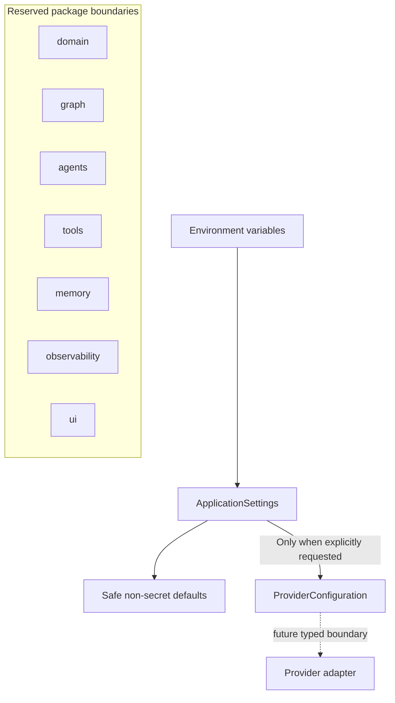
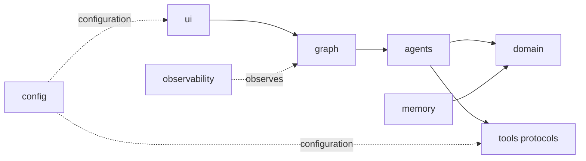

# ScholarPath M0 Architecture

M0 establishes packaging, configuration, quality gates, and future component
boundaries. It intentionally implements no orchestration graph, agent behavior,
provider client, model integration, memory service, or web interface.

## Foundation structure

Importing `scholarpath` does not instantiate settings or validate credentials.
`ApplicationSettings` loads non-secret defaults and optional secrets. A future provider
adapter must call `for_provider()` during its own construction, which activates
provider-specific credential validation at that boundary.

## Dependency direction

The arrows describe intended future dependency direction, not implemented runtime
behavior. Domain rules remain independent of provider SDKs and user-interface code.

## M0 quality boundaries

| Concern | M0 control |
|---|---|
| Packaging | Python src-layout with editable installation |
| Configuration | Pydantic settings with deferred secret validation |
| Determinism | Configuration and terminology checks use ordinary Python logic |
| Network isolation | Default pytest selection excludes tests marked `live` |
| Quality | Ruff formatting/linting, strict mypy, pytest, and branch coverage |
| Automation | Path-scoped GitHub Actions workflow on Python 3.12 |
| Secrets | Environment variables, `SecretStr`, ignored `.env`, and sanitized errors |

## Deferred beyond M0

- LangGraph and workflow state
- Agent implementations or model SDKs
- Search clients and evidence retrieval
- Streamlit user experience
- Preference-memory services
- LangSmith runtime tracing
- Supervisor domain schemas, scoring, and lifecycle transitions
