# ScholarPath M5 Architecture

M5 retains the M3 planning and M4 discovery boundaries, then adds resilient provider
routing. You.com remains primary. A pure `DiscoveryPolicy` selects one bounded retry,
the official Tavily fallback, continuation, or a clear terminal state from typed
`SearchAttempt` history and deterministic result-quality metrics. Deduplication,
provenance merging, routing, and retry arithmetic remain deterministic. Optional
LangSmith observability traces the graph and planning node.

Evidence retrieval, Research Fit calculation, Candidate interaction, memory, and the
web interface remain outside M5. Those graph nodes continue to use fixtures.

## Research-planning boundary

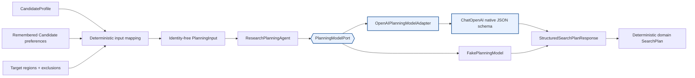

`PlanningModelPort` isolates model execution from orchestration and domain logic.
Default tests inject a deterministic fake, while `run_scholarpath_graph()` lazily
constructs `OpenAIPlanningModelAdapter` only when no model was injected. Merely
importing ScholarPath or compiling the topology never validates an OpenAI key.

The adapter composes the versioned `research-planning-v1` system prompt with
`ChatOpenAI.with_structured_output(StructuredSearchPlanResponse,
method="json_schema", strict=True)`. It does not bind tools, grant web access, or parse
JSON from prose. OpenAI produces the provider DTO; the agent then constructs the
stricter domain contract.

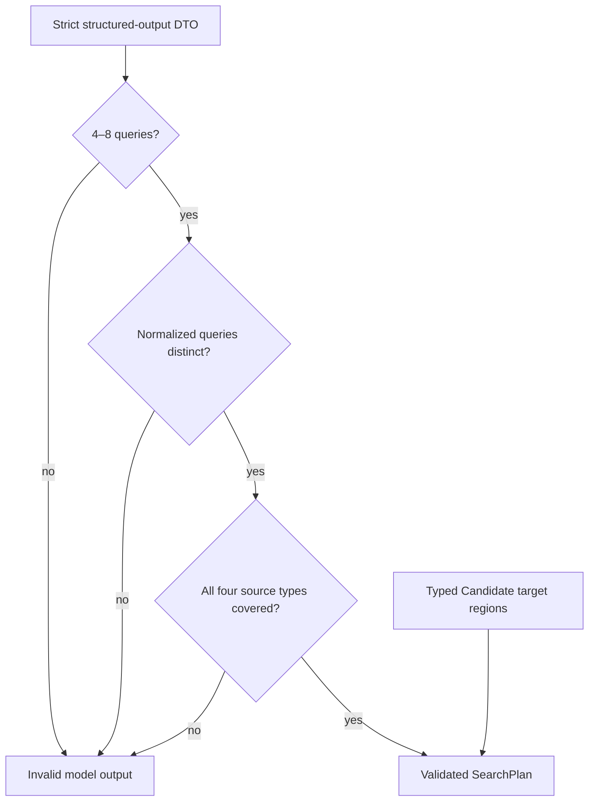

Each query contains its purpose and intended source types. Across the plan, source
coverage must include official university profiles, department or research-group
pages, recent publication evidence, and explicit doctoral-supervision information.
Pydantic and ordinary Python enforce these rules; the model does not validate,
deduplicate, route, or perform arithmetic. Candidate target regions are copied from
typed input so model output cannot silently change that constraint.

## Planning failure policy

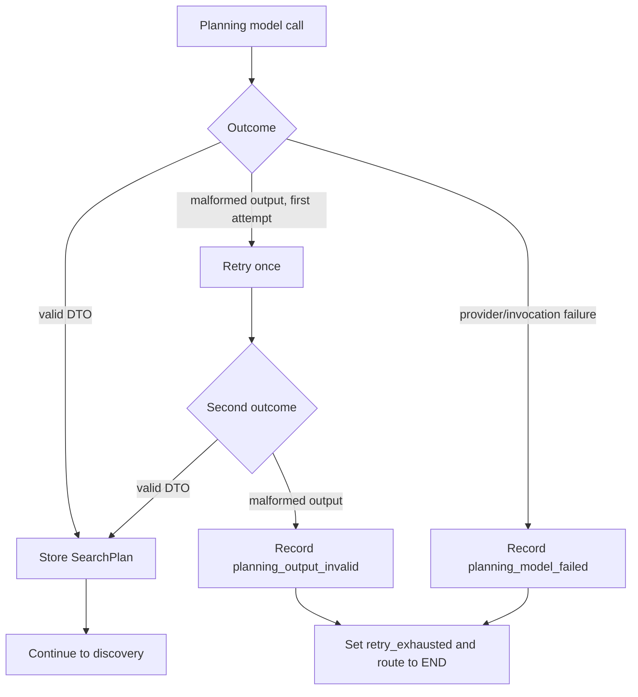

Malformed structured output receives one explicit retry, for at most two planning
calls. Provider failures are not retried. The OpenAI client is configured with
`max_retries=0`, avoiding hidden retries that would obscure latency and cost. Error
records use fixed sanitized messages rather than provider exception text. Planning
failure terminates before discovery, so no stale or absent SearchPlan can drive the
workflow.

## Supervisor-discovery boundary

```mermaid
flowchart LR
    Plan[SearchPlan] --> Node[discover_prospective_supervisors]
    Node -->|one exact query| Port{{SupervisorSearchPort}}
    Port --> Fake[FakeSupervisorSearch]
    Port --> You[YouSearchAdapter]
    Port --> Tavily[TavilySearchAdapter]
    You --> API[POST ydc-index.io/v1/search]
    Tavily --> TavilyAPI[Official langchain-tavily tool]
    API --> Raw[Provider response]
    TavilyAPI --> Raw
    Raw --> Normalize[Transport normalization]
    Normalize --> Results[SearchResult]
    Fake --> Results
    Results --> Agent[SupervisorDiscoveryAgent]
    Agent --> Filter{Plausible person and institution?}
    Filter -->|no| Drop[Exclude]
    Filter -->|yes| Merge[Normalize identity + canonicalize URL]
    Merge --> Output[SupervisorDiscoveryResult]
    Output --> Prospective[ProspectiveSupervisor]

    classDef boundary fill:#e8f1ff,stroke:#245a9b,stroke-width:2px;
    class Port,You,Tavily,API,TavilyAPI boundary;
```

The port receives one query and returns `tuple[SearchResult, ...]`. Production
composition lazily creates `YouSearchAdapter`; Tavily is constructed only after the
fallback route is selected; tests inject recording fakes. The You.com adapter uses the
current official POST endpoint with `X-API-Key`, a JSON body containing
`query` and `count`, and an explicit HTTP timeout. It combines web and news sections in
stable order and preserves URL, title, description, optional publication timestamp,
and the exact originating query. It contains no academic classification, Supervisor
identity logic, Research Fit evaluation, or availability reasoning.

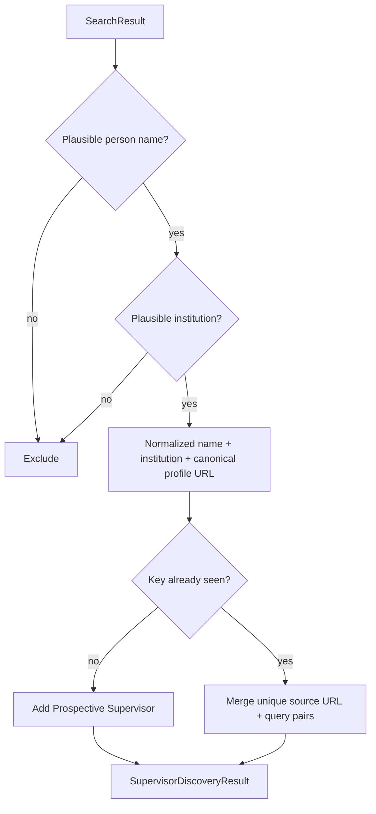

M4 deliberately uses conservative deterministic extraction rather than introducing a
second model integration. The output schema structurally contains no Research Fit
Score or availability field. Even if a search snippet mentions doctoral availability,
the discovery result remains prospective and carries no availability assertion.

Adapter errors are normalized into typed provider, category, retryability, and optional
status-code fields. Graph state stores only fixed sanitized messages and typed attempt
metadata. Provider exception text is not persisted. You.com performs no hidden retry;
the graph owns the one explicit timeout retry. Tavily uses its public async invocation
behind an application deadline and the official top-level `langchain_tavily` import.

## Resilient discovery policy

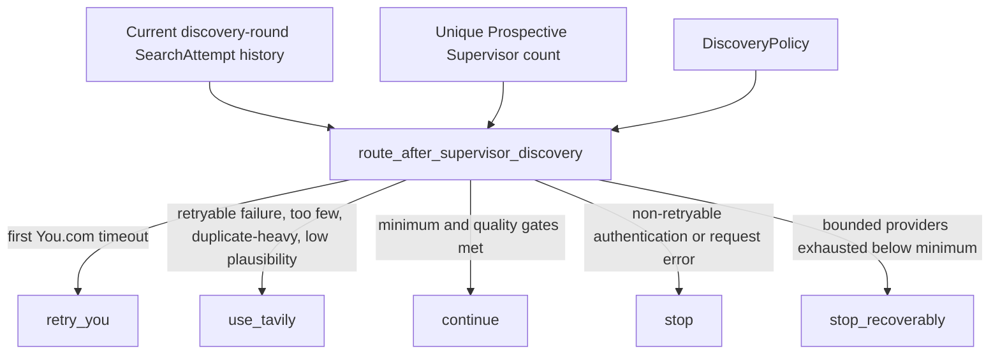

`route_after_supervisor_discovery` is pure: it receives validated values and returns an
enum without provider calls, graph mutation, clocks, randomness, or model use. Its
policy controls minimum unique Prospective Supervisors, maximum You.com retries,
maximum Tavily calls, timeout behavior, duplicate threshold, plausible-profile ratio,
and stopping condition. Only current discovery-round attempts and discovered identities
participate in route-quality metrics, so old unique records or an old authentication
failure cannot mask or poison a later Candidate-requested refinement. Older useful
records remain in the cumulative discovery pool for downstream deduplication.

```text
Search query
   ↓
provider port → normalized SearchResult → SupervisorDiscoveryAgent
   ↓                                      ↓
SearchAttempt metadata              Prospective Supervisors
   └──────── accumulate both in node-local typed buffers ─────────┘
                              ↓
                 commit graph state when node returns
```

Accumulating after every caught query outcome preserves partial success within the
node. For example, six useful Prospective Supervisors are committed to
`raw_search_results` if a fourth query later returns a typed failure. A process crash
before the node returns would replay from the prior LangGraph checkpoint; per-query
checkpointing is deferred.
The policy still offers Tavily; after a fallback attempt, six retained records can
continue as soon as the quality gate is met. A below-minimum cohort ends as
`discovery_incomplete` after the bounded budget, and a non-retryable authentication
error always stops immediately.

## Walking-skeleton orchestration

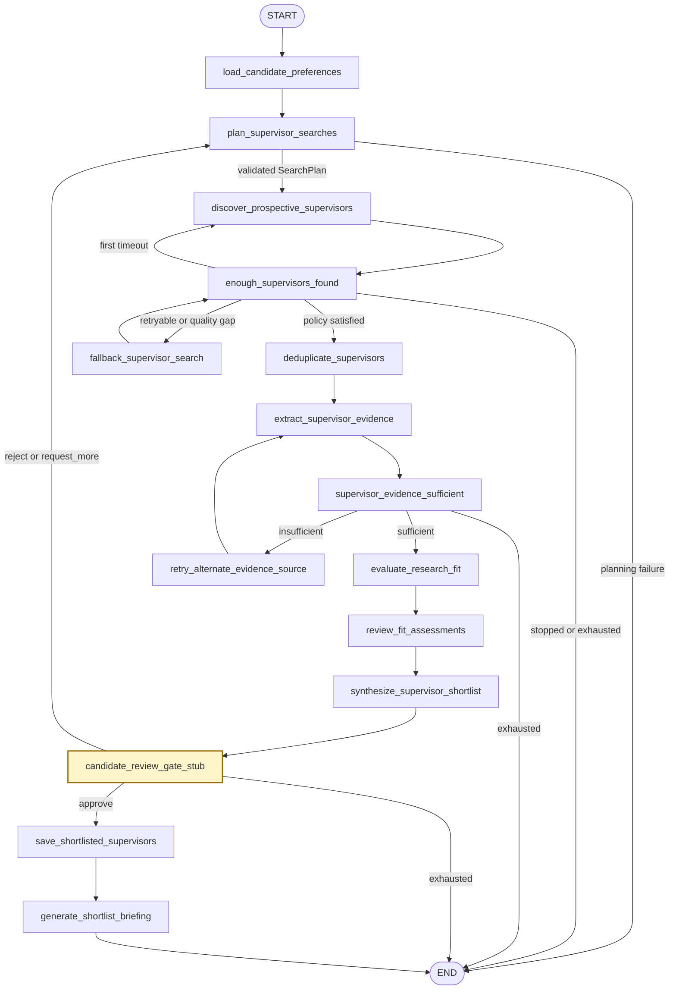

The original graph-derived M2 Mermaid source remains at
[`docs/m2-walking-skeleton.mmd`](m2-walking-skeleton.mmd) as the walking-skeleton
baseline. M3 adds the conditional planning-success edge shown above. M4 replaces the
primary discovery implementation behind the same node. M5 activates the existing
fallback node with Tavily and adds the bounded retry edge back to primary discovery;
the graph still contains the same fifteen canonical operational nodes.

## Typed state and reducer policy

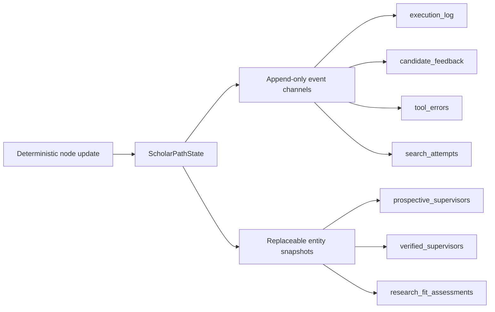

| State category | Channels | Merge behavior |
|---|---|---|
| Immutable input | `candidate_profile` | Preserved |
| Append-only history | preferences, raw results, feedback, errors, search attempts, execution log | Typed reducers append new events |
| Canonical snapshots | Prospective, Verified, Research Fit, proposed and shortlisted records | Latest node output replaces the prior snapshot |
| Unique terminal history | rejected Supervisors | Reducer merges by `supervisor_id` |
| Routing control | retry counts, review status, discovery round, and fallback flags | Deterministic replacement |
| Validated output | authoritative `supervisor_shortlist`, projected list, and briefing | Created only after Candidate approval; contract-tested for consistency |

This distinction prevents a planning loop from duplicating canonical Supervisor
collections while retaining an auditable history of searches, decisions, errors, and
node execution.

## Bounded routing

```text
You.com timeout → attempt 1 → retry once → attempt 2 → Tavily
Retryable You.com provider error ─────────────────────→ Tavily
Tavily attempt count < configured maximum ───────────→ next bounded call
Tavily budget exhausted + enough retained results ───→ continue
Tavily budget exhausted + too few retained results ──→ recoverable END
Non-retryable authentication error ──────────────────→ immediate END
```

The LangGraph recursion limit remains defense-in-depth. It is not the workflow's
termination mechanism. Provider attempts are bounded by validated policy fields, and
the recursion guard is derived above the largest configured graph path. Tavily cycles
over planned queries only when its configured call budget exceeds the plan length, so
every activation still consumes finite budget.

The planning agent's malformed-output retry is intentionally separate from graph retry
state: it repairs one model-boundary format failure before the node returns. A terminal
planning error enters graph state and follows the explicit planning-to-END edge.

## Optional LangSmith observability

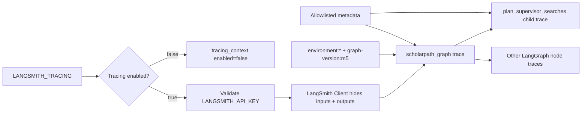

Tracing is scoped to one graph invocation with `langsmith.tracing_context`. Disabled
execution explicitly uses `enabled=False` and does not construct a LangSmith client.
Enabled execution validates the key at activation, sends traces to
`LANGSMITH_PROJECT`, flushes them, and closes the client.

Graph tags are `environment:<SCHOLARPATH_ENVIRONMENT>` and `graph-version:m5`. The
planning node additionally records its component and prompt version. Metadata passes a
fixed scalar allowlist only:

- `application`
- `environment`
- `graph_version`
- `component`
- `prompt_version`

Candidate identifiers, names, email addresses, API keys, full research statements,
and arbitrary caller metadata cannot enter that allowlist. The LangSmith client also
uses `hide_inputs=True` and `hide_outputs=True`, preventing graph state and the model
prompt—including the full research statement required for planning—from being recorded
as trace payloads.

## Domain contract flow

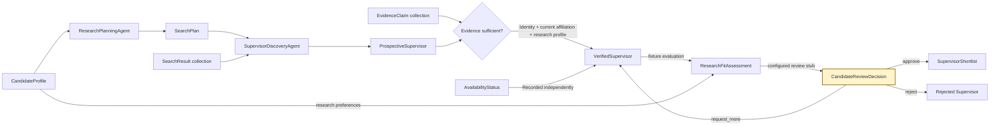

M1 defines the core payloads on these boundaries. M3 generates `SearchPlan` through the
typed model boundary. M4 performs live primary discovery when configured, and M5 adds
bounded Tavily fallback. Every later boundary continues to use deterministic fixture
data. M5 still does not retrieve evidence, calculate scores, infer availability, or
present a review interface.

## Verification boundary

A Prospective Supervisor becomes a Verified Supervisor only when directly supported,
same-Supervisor evidence establishes all three required categories:

1. identity;
2. current affiliation; and
3. a research interest or publication.

Availability is a separate fact. `not_stated` never blocks verification. Any stronger
availability status must match a typed, directly supported availability claim;
`conflicting_evidence` requires both accepting and not-accepting claims. This prevents
research activity from being mistaken for current doctoral availability.

The verification helper derives this status from the typed claims. With no direct
availability claim it deterministically selects `not_stated`, so availability cannot
become a verification prerequisite.

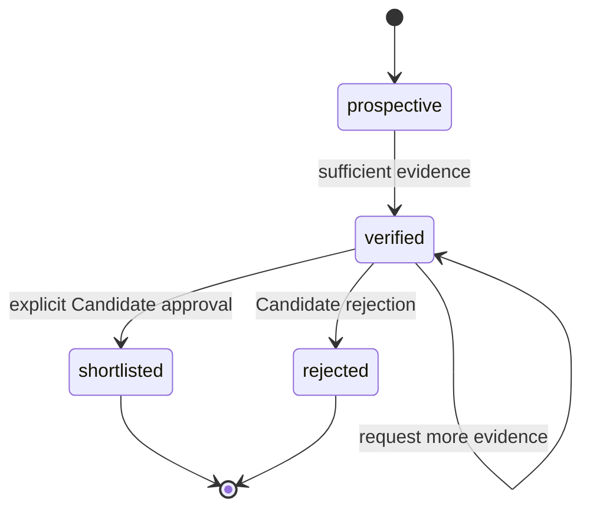

The self-loop represents an unchanged lifecycle status, not a persisted state
transition. Shortlisted and rejected states are terminal in M1. Each terminal record
retains the matching Candidate review decision, so deserialization cannot create a
terminal status from a bare status flag.

## Foundation structure

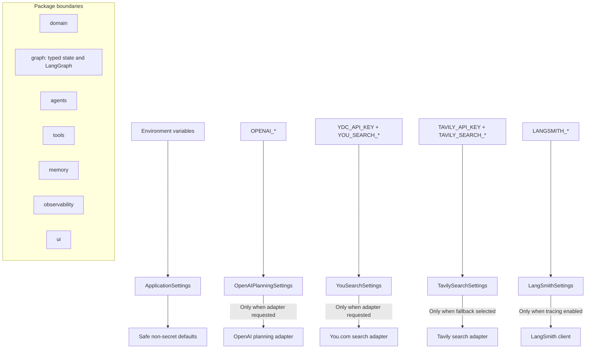

Importing `scholarpath` does not instantiate providers or validate credentials.
`ApplicationSettings` supplies application defaults, while provider-specific settings
use canonical provider variables. OpenAI validation occurs only when
`for_planning_model()` is requested; You.com validation occurs only when
`for_search_adapter()` is requested. Tavily settings may load without a credential;
validation and adapter construction occur only after fallback is routed. LangSmith
validation occurs only when tracing is enabled and its activation scope begins.

## Dependency direction

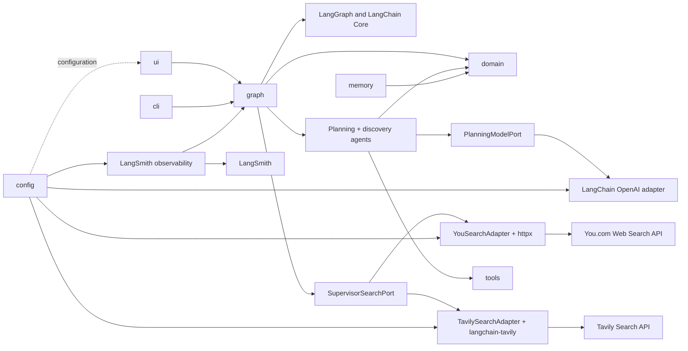

Solid arrows include implemented M5 dependencies. The planner still has no search
tool; the graph executes its typed query plan through `SupervisorSearchPort`, then
passes normalized results to the discovery agent. Domain rules stay independent of
LangGraph, provider SDKs, tracing, and user-interface code.

## Physical package layout

The repository avoids an additional physical package-name directory beneath `src/`.
Setuptools maps the `scholarpath` import namespace directly onto the physical source
root.

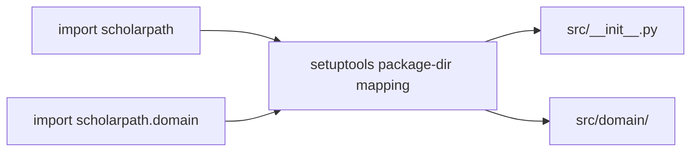

```text
src/
├── __init__.py
├── cli.py
├── config.py
├── py.typed
├── domain/
├── agents/
│   ├── openai_planning.py
│   ├── prompts.py
│   ├── research_planning.py
│   └── supervisor_discovery.py
├── graph/
│   ├── discovery.py
│   ├── state.py
│   └── workflow.py
├── memory/
├── observability/
│   └── tracing.py
├── tools/
│   ├── failure_injection.py
│   ├── supervisor_search.py
│   ├── tavily_search.py
│   └── you_search.py
└── ui/
```

Strict editable installation materializes this logical mapping for runtime and static
analysis while source files remain in the flattened structure.

## Operational trade-offs and NFRs

| Concern | M5 decision | Trade-off or remaining risk |
|---|---|---|
| Latency | Sequential You.com queries, one timeout retry, and bounded Tavily calls use explicit deadlines | Worst-case latency grows with both provider budgets; safe concurrency is deferred |
| Cost | Tavily is invoked only when deterministic health or quality checks fail | A broad plan can consume both providers' quotas; budget values need production tuning |
| Failover | Pure policy routes You.com to Tavily and retains partial success | There is no provider-wide circuit breaker or cross-run health memory yet |
| Security | OpenAI, You.com, and Tavily keys use environment variables and `SecretStr`; persisted errors are sanitized | Search queries leave the application boundary and require provider governance review |
| Reliability | Typed normalization, finite attempts, recoverable terminal status, and deterministic provenance merge | Provider payload formats and website titles vary; conservative extraction trades recall for precision |
| Scalability | Both search providers implement one typed port and can be replaced by fakes | Calls remain sequential; rate limiting, backpressure, caching, and bulkheads are deferred |
| Observability | Optional graph/node traces carry environment, graph, component, and prompt versions | The LangSmith service is not contacted when disabled; evaluation datasets and alerting are deferred |
| Determinism | Extraction, URL canonicalization, identity deduplication, provenance merge, routing, thresholds, and arithmetic stay in Python | OpenAI query wording and provider ranking remain externally variable |

## M5 quality boundaries

| Concern | M5 control |
|---|---|
| Packaging | Flattened physical `src/` mapped to the `scholarpath` namespace |
| Configuration | Pydantic settings with deferred secret validation |
| Data contracts | Frozen Pydantic models reject unknown fields and invalid values |
| Provenance | Every discovered Supervisor retains paired source URL and exact originating query records |
| Planning | Injected model port; versioned prompt; native structured output; no tools or search |
| Discovery | One-query provider port; You.com primary; official Tavily fallback; typed results, attempts, and policy; no fit or availability fields |
| Determinism | Validation, query uniqueness, source coverage, deduplication, sorting, routing, retry arithmetic, and transitions use ordinary Python logic |
| Human authority | Terminal records retain the matching Candidate review decision |
| Network isolation | Default pytest selection excludes `live`; fakes replace OpenAI, You.com, and Tavily in non-live tests |
| Orchestration | LangGraph coordinates model-backed planning, two-provider discovery, and unchanged fixture-backed downstream nodes |
| Termination | Planning failure has an END edge; provider calls, evidence, and review loops have explicit validated limits |
| Observability | Scoped optional LangSmith graph/node traces with safe tags, allowlisted metadata, and hidden inputs |
| Quality | Ruff formatting/linting, strict mypy, pytest, and branch coverage |
| Automation | Path-scoped GitHub Actions workflow on Python 3.12 |
| Secrets | Environment variables, `SecretStr`, ignored `.env`, and sanitized errors |

## Runtime and verification commands

From `projects/scholar-path`:

```bash
python3 -m venv venv
source venv/bin/activate
python -m pip install --upgrade pip
python -m pip install -e ".[dev]" --config-settings editable_mode=strict
cp .env.example .env

ruff format --check .
ruff check .
mypy src tests
pytest -m "not live"
```

The primary live graph path requires `OPENAI_API_KEY` and `YDC_API_KEY` in `.env` or
the process environment. `TAVILY_API_KEY` is required only if fallback is routed:

```bash
python -m scholarpath.cli
```

Each optional smoke test requires its credential and explicit opt-in:

```bash
export OPENAI_API_KEY="your-openai-key"
SCHOLARPATH_RUN_LIVE_TESTS=true pytest -o addopts='' -m live tests/integration/test_openai_planning_live.py

export YDC_API_KEY="your-you-com-key"
SCHOLARPATH_RUN_LIVE_TESTS=true pytest -o addopts='' -m live tests/integration/test_you_search_live.py

export TAVILY_API_KEY="your-tavily-key"
SCHOLARPATH_RUN_LIVE_TESTS=true pytest -o addopts='' -m live tests/integration/test_tavily_search_live.py
```

Optional tracing uses the exact variables `LANGSMITH_TRACING`, `LANGSMITH_API_KEY`,
and `LANGSMITH_PROJECT`. The OpenAI planning adapter additionally recognizes
`OPENAI_PLANNING_MODEL` and `OPENAI_PLANNING_TIMEOUT_SECONDS`. You.com search recognizes
`YOU_SEARCH_ENDPOINT`, `YOU_SEARCH_TIMEOUT_SECONDS`, and `YOU_SEARCH_RESULT_COUNT`.
Tavily recognizes `TAVILY_SEARCH_TIMEOUT_SECONDS` and `TAVILY_SEARCH_RESULT_COUNT`.
`SCHOLARPATH_DISCOVERY_FAILURE_MODE` enables explicitly requested local routing
demonstrations and defaults to `off`.

## Deferred beyond M5

- Evidence retrieval and source-level fallback
- Research Fit calculation policy and ranking
- Source authority, freshness, and conflict-resolution policy
- Real Candidate interaction and graph interruption/resumption
- Preference-only `request_more` refinement currently repeats primary searches
- Streamlit user experience
- Preference-memory services
- Additional provider failover, rate limiting, caching, and circuit breaking
- An async search-port variant before invoking the synchronous Tavily adapter from an
  already-running event-loop runtime
- LangSmith evaluation datasets, scoring, dashboards, and alerting
