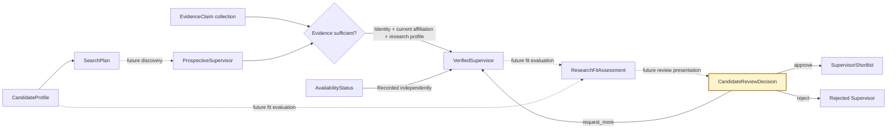
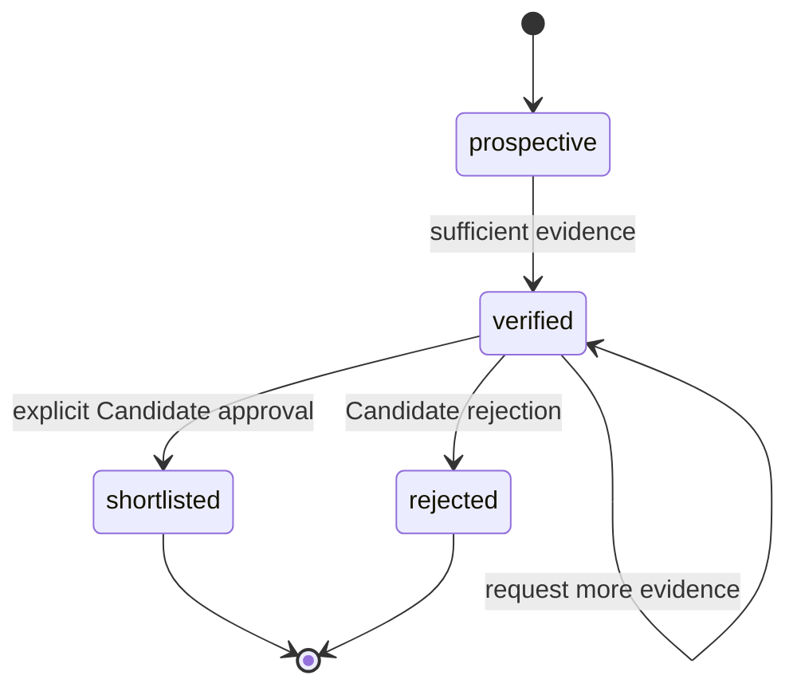
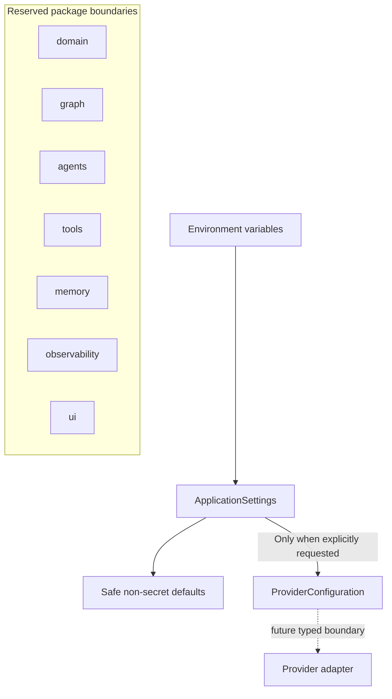
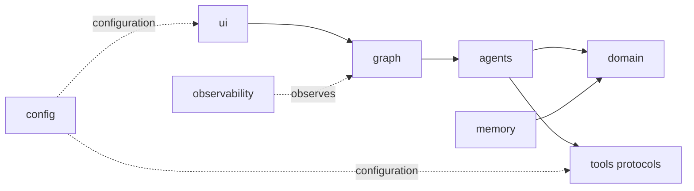
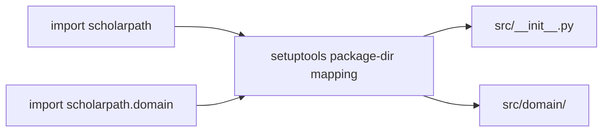

# ScholarPath M1 Architecture

M1 adds the typed domain language that later components will exchange. It implements
immutable data contracts, evidence-sufficiency rules, and Supervisor lifecycle
transitions. It still contains no orchestration graph, agent behavior, provider client,
model integration, memory service, or web interface.

## Domain contract flow



Dashed arrows identify behavior deferred to later milestones. M1 defines the payloads
on those boundaries but does not generate search plans, discover people, calculate
scores, or present a review interface.

## Verification boundary

A Prospective Supervisor becomes a Verified Supervisor only when directly supported,
same-Supervisor evidence establishes all three required categories:

1. identity;
2. current affiliation; and
3. a research interest or publication.

Availability is a separate fact. `not_stated` never blocks verification. Any stronger
availability status must match a typed, directly supported availability claim;
`conflicting_evidence` requires both accepting and not-accepting claims. This prevents
research activity from being mistaken for current doctoral availability.

The verification helper derives this status from the typed claims. With no direct
availability claim it deterministically selects `not_stated`, so availability cannot
become a verification prerequisite.



The self-loop represents an unchanged lifecycle status, not a persisted state
transition. Shortlisted and rejected states are terminal in M1. Each terminal record
retains the matching Candidate review decision, so deserialization cannot create a
terminal status from a bare status flag.

## Foundation structure



Importing `scholarpath` does not instantiate settings or validate credentials.
`ApplicationSettings` loads non-secret defaults and optional secrets. A future provider
adapter must call `for_provider()` during its own construction, which activates
provider-specific credential validation at that boundary.

## Dependency direction



The arrows describe intended future dependency direction, not implemented runtime
behavior. Domain rules remain independent of provider SDKs and user-interface code.

## Physical package layout

The repository avoids an additional physical package-name directory beneath `src/`.
Setuptools maps the `scholarpath` import namespace directly onto the physical source
root.



```text
src/
├── __init__.py
├── config.py
├── py.typed
├── domain/
├── agents/
├── graph/
├── memory/
├── observability/
├── tools/
└── ui/
```

Strict editable installation materializes this logical mapping for runtime and static
analysis while source files remain in the flattened structure.

## M1 quality boundaries

| Concern | M1 control |
|---|---|
| Packaging | Flattened physical `src/` mapped to the `scholarpath` namespace |
| Configuration | Pydantic settings with deferred secret validation |
| Data contracts | Frozen Pydantic models reject unknown fields and invalid values |
| Provenance | Each evidence claim carries source URL, kind, retrieval time, and confidence |
| Determinism | Validation, evidence sufficiency, score bounds, and transitions use ordinary Python logic |
| Human authority | Terminal records retain the matching Candidate review decision |
| Network isolation | Default pytest selection excludes tests marked `live` |
| Quality | Ruff formatting/linting, strict mypy, pytest, and branch coverage |
| Automation | Path-scoped GitHub Actions workflow on Python 3.12 |
| Secrets | Environment variables, `SecretStr`, ignored `.env`, and sanitized errors |

## Deferred beyond M1

- LangGraph and workflow state
- Agent implementations or model SDKs
- Search clients and evidence retrieval
- Research Fit calculation policy and ranking
- Source authority, freshness, and conflict-resolution policy
- Streamlit user experience
- Preference-memory services
- LangSmith runtime tracing
