# ScholarPath M11 Architecture

M11 adds a Candidate-facing Streamlit delivery layer over the durable LangGraph workflow.
The UI depends on a typed application port, streams only canonical node names, and reads a
safe projection while complete workflow state remains in the checkpointer. It preserves
M10 Candidate-scoped preference memory, the M9 interrupt, and the useful M3–M8 boundaries:

- M3 plans searches through a structured OpenAI boundary.
- M4 discovers Prospective Supervisors through You.com.
- M5 adds deterministic discovery quality checks and Tavily search fallback.
- M6 retrieves known pages with Tavily Extract, extracts grounded claims through a
  structured model boundary, and deterministically decides whether each record is
  Verified or partially verified.
- M7 evaluates Research Fit through an injected structured-output model, validates
  every component citation against verified evidence, sums components in Python, and
  deterministically creates a five-result proposal for Candidate review.
- M8 independently audits each initial assessment through Nebius, preserves that
  immutable component assessment, and stores a reconciled effective score, explanation,
  evidence view, confidence, and attention status.
- M9 checkpoints the proposed shortlist, pauses for explicit Candidate control, and
  resumes approval or refinement on the same isolated thread.
- M10 recalls typed durable preferences before planning and learns only after an explicit
  approval, rejection, or direct preference submission.
- M11 captures the research profile, reports safe progress, renders evidence-backed
  results, and resumes the exact thread after explicit Candidate review.

Availability remains a separate verified status and never contributes points. Candidate
review is now a real interrupt; every proposed record stays `verified`, and no Supervisor
becomes Shortlisted until a validated approval names its exact Supervisor ID.

## M11 Streamlit application boundary

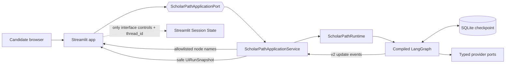

The Streamlit module is a delivery adapter. It does not construct the graph, interpret
business state transitions, validate Supervisor lifecycle changes, or retain a copy of
LangGraph state. `ScholarPathApplicationService` owns start, inspect, and resume operations;
`ScholarPathApplicationPort` lets AppTest replace it with an in-memory fake.


The service consumes LangGraph v2 `updates` events but retains only canonical node names
from an explicit allowlist. Raw update bodies, model messages, and hidden reasoning are
discarded before the UI projection. Checkpoint snapshots are transformed into typed view
models containing only the fields required to show Prospective Supervisors, verified
evidence, Research Fit, availability, concerns, and independent-review status.

`thread_id` is the durable run boundary. Streamlit Session State holds that opaque ID and
widget/interface state only; the checkpointer owns the Candidate profile, evidence,
assessments, proposed shortlist, feedback, and graph position. A stale checkpoint token or
unknown thread is rejected as a recoverable application error rather than resuming a
different state.

## End-to-end milestone view

```mermaid
flowchart LR
    CP[CandidateProfile] --> LOAD[Load Candidate preferences]
    MEM[(Mem0 Candidate scope)] --> LOAD
    LOAD --> PLAN[ResearchPlanningAgent]
    PLAN --> SQ[SearchPlan]
    SQ --> YOU[You.com discovery]
    YOU --> DP[DiscoveryPolicy]
    DP -->|quality gap or retryable failure| TS[Tavily search fallback]
    DP --> PS[Prospective Supervisors]
    TS --> PS
    PS --> TE[Tavily Extract known profile URL]
    TE --> EV[EvidenceVerificationAgent]
    EV --> VR[SupervisorVerificationRecord]
    VR -->|partial and retry remains| ALT[One alternate official-source search]
    ALT --> TE
    VR -->|sufficient direct evidence| VS[Verified Supervisor]
    VS --> RF[Evidence-cited ResearchFitEvaluationAgent]
    RF --> IR[IndependentReviewAgent via Nebius]
    IR --> REC[Deterministic reconciliation]
    REC --> SYNTH[Deterministic ShortlistSynthesisAgent]
    SYNTH --> GATE{{Candidate review interrupt}}
    GATE --> STORE[(Thread checkpoint)]
    STORE -->|explicit action| LEARN[PreferenceLearningAgent]
    LEARN -->|durable preference records| MEM
    LEARN -->|approve explicit IDs| SS[Shortlisted Supervisor]
    LEARN -->|reject with reasons| RS[Rejected Supervisor]
    LEARN -->|request_more| PLAN

    classDef human fill:#fff4cc,stroke:#9a6b00,stroke-width:2px;
    class GATE human;
```

The LangGraph topology contains sixteen canonical operational nodes. M10 inserts
`learn_candidate_preferences` after a valid interrupt response. The paused view path
performs no memory write; the learning node checkpoints a processed-feedback cursor and
then routes approval or refinement. M11 exposes that workflow through Streamlit without
changing graph topology or adding outreach.

## M10 Candidate preference memory boundary

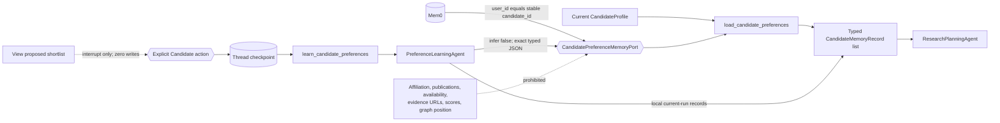

`CandidateMemoryRecord` has a finite kind allowlist, exact value, explicit source action,
aware timestamp, deterministic semantic identifier, and only an optional opaque Supervisor
ID for a Candidate-authored rejection reason. It deliberately contains no Candidate ID;
the port requires `candidate_id` separately on every read and write, so identity is used
only as the provider scope and never copied into the memory text.

The hosted adapter uses the official Mem0 SDK, `filters={"user_id": candidate_id}` for
reads, and `infer=False` for writes. It parses only versioned ScholarPath JSON records and
ignores unrelated or malformed memories. Before adding, it lists the Candidate scope and
skips deterministic record keys already present. The graph also tracks how many feedback
decisions were processed, providing idempotency across normal interrupt resumes. A crash
between a remote acknowledgement and a local checkpoint remains an at-least-once window;
the deterministic key and pre-write lookup are the mitigation because Mem0 has no
documented idempotency-key parameter.

Mem0 is personalization context, never workflow or Supervisor truth. A load failure keeps
the current `CandidateProfile`; a write failure keeps the explicit action and local typed
record. Both append a sanitized recoverable tool error and allow the graph to continue.

## M7 Research Fit and proposal boundary

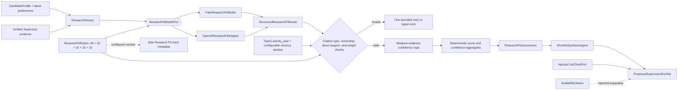

The model receives Candidate topics, methods, orientation, practical preferences, and
concise verified claims. It does not receive the Candidate ID or full research
statement. Availability evidence is removed before model invocation. The strict output
contains five component proposals, citations, confidence, rationale, and evidence gaps;
it deliberately contains no overall score. Python enforces component maxima and sums
the score, so arithmetic cannot drift between model calls.

The default rubric totals 100 points: topic 40, methodology or discipline 20,
orientation 15, recent activity 15, and practical constraints 10. A positive component
must cite suitable, direct, grounded `EvidenceClaim` IDs. A component without evidence
must score zero, have low confidence, and state the gap. Availability claims are never
valid scoring citations, and admission likelihood language is rejected.

Publication and project claims may carry a typed `activity_year` only when that exact
year occurs in the supporting excerpt and is not later than retrieval. Recent-research
points require this typed value and reject activity older than the rubric's configurable
`recent_activity_window_years`, which defaults to five. This makes freshness a versioned,
testable policy rather than a model interpretation of words such as "recent."

For every component, deterministic code caps model-proposed confidence at the weakest
cited `EvidenceClaim` confidence. It then derives assessment confidence from a
rubric-weighted aggregate of all five bounded component confidences; the domain contract
recalculates the same result. The current evidence schema has no typed region or
study-mode fact. Therefore M7 rejects all positive practical-constraint scores—even when
an affiliation excerpt contains suggestive prose—and records zero points plus an
evidence gap until an explicit typed contract is introduced.

Synthesis is model-free. It sorts by overall score descending, evidence confidence
descending, normalized Supervisor name ascending, and Supervisor ID as a total-order
fallback. Each recommendation reports strengths, concerns, availability, and evidence
confidence. The returned records remain Verified until the Candidate approval gate.
`ProposedSupervisorShortlist.generated_at` comes from an injected `UtcClockPort`;
production supplies current aware UTC time, while deterministic tests provide a fixed
clock. The configured rubric version is also passed into Research Fit node trace
metadata instead of being hard-coded.

## M8 independent-review and reconciliation boundary

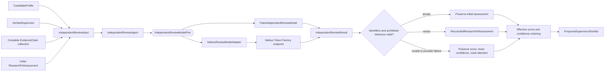

`IndependentReviewResult` is the only provider output. It contains `accept` or `revise`,
a bounded recommended score, unsupported and overlooked evidence IDs, reviewer
confidence, and a concise critique. It has no fields for availability, Candidate
preferences, admission likelihood, ranking, or lifecycle state. The versioned prompt
forbids browsing, tools, prior knowledge, new evidence, and shortlist mutation.

Reconciliation is pure application code. An accepted review preserves every initial
assessment field. A revision is applied only when unsupported IDs are citations from the
initial assessment and overlooked IDs are existing, direct, grounded, non-availability
claims for the same Verified Supervisor. Unsupported IDs are removed from the effective
view. A disagreement strictly greater than `IndependentReviewPolicy.disagreement_threshold`
lowers effective confidence and marks Candidate attention.

The original `ResearchFitAssessment` remains immutable because its `overall_score` must
continue to equal its five component values. The separate reconciled overlay therefore
holds the effective reviewed score and explanation used by synthesis. This avoids
inventing a component allocation for an overall revision and preserves both audit views.

Synthesis uses effective values to reorder the proposal. The later Candidate decision
remains authoritative for completed-shortlist membership and order; the independent
reviewer cannot directly mutate either one.

Nebius failure and malformed structured output are recoverable per-Supervisor outcomes.
The graph retains the initial score, lowers confidence one level, marks review
`unavailable`, appends a sanitized `tool_errors` record, and continues. The adapter has
no hidden retries; model name, HTTPS base endpoint, and timeout are configuration values.
Default tests inject a recording fake, so they cannot contact Nebius.

## M9 Candidate-control and persistence boundary

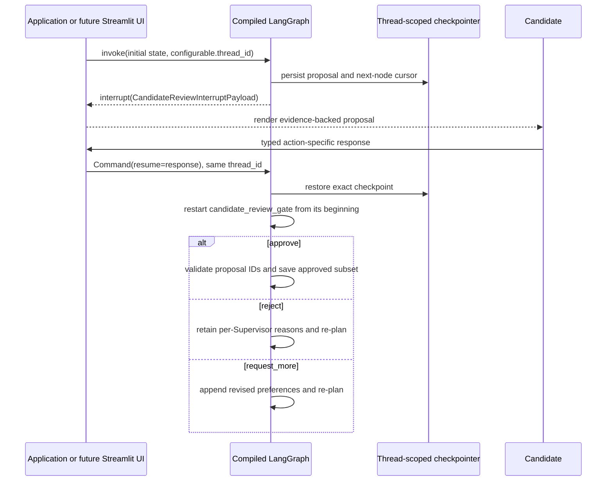

`CandidateReviewInterruptPayload` is a deliberate presentation projection, not the
entire graph state. For each proposed Supervisor it includes rank, identity, institution,
department, profile URL, effective Research Fit Score, evidence confidence, unique source
links, availability status, concerns, and the independent-review outcome. It excludes
retrieved page content and the full Candidate research statement.

Resume values are a discriminated union: `CandidateApproveResponse` carries one to five
ordered proposal IDs; `CandidateRejectResponse` carries a non-empty reason per ID; and
`CandidateRequestMoreResponse` carries a non-empty preference revision. Pydantic validates
shape, while ordinary Python validates that each referenced ID belongs to the exact paused
proposal. Invalid input re-enters the interrupt only within `max_review_input_retries`.
Repeated rejection or `request_more` consumes `max_review_retries`; neither loop relies on
the global recursion limit.

The node performs only deterministic payload construction before `interrupt()`. LangGraph
re-executes that code when resuming, so keeping it side-effect-free makes resume idempotent:
planning, discovery, extraction, scoring, and review nodes do not run again on approval.
Lifecycle changes, shortlist persistence, and briefing generation remain downstream of a
validated approval.

Tests compile with an isolated `InMemorySaver`. Trusted local development opens a
`SqliteSaver` at `SCHOLARPATH_CHECKPOINT_DATABASE_PATH`, which defaults to the ignored
`.scholarpath/checkpoints.sqlite3`. A non-empty opaque `thread_id` namespaces each research
run and is supplied through LangGraph's configurable runtime channel, not trace metadata.
The project serializer uses strict MessagePack with an explicit allowlist and converts
Pydantic URL values to safe JSON strings; pickle fallback is disabled. SQLite is a local
single-process development choice, not the final horizontally scaled persistence tier.

## M3 research-planning boundary

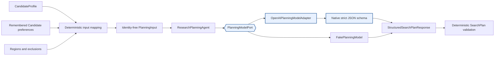

The planner receives the Candidate's research statement and typed preferences but no
search tool. `research-planning-v2` uses
`with_structured_output(..., method="json_schema", strict=True)`; prose JSON parsing
is not used. Python and Pydantic enforce four-to-eight distinct queries, required
source-category coverage, target regions, query uniqueness, and provider-portable query
shape: at most one `site:` filter, two explicit uppercase Boolean operators, and one
quoted phrase per query. Malformed output has one explicit retry; provider failures stop
cleanly. The OpenAI client has
`max_retries=0`, so the application owns the visible retry policy.

## M4–M5 resilient discovery boundary

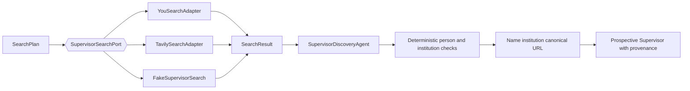

The search port executes one exact query at a time. Transport adapters normalize URL,
title, description, optional publication date, and originating query; they contain no
Supervisor reasoning. You.com snippets are typed, whitespace-normalized, deduplicated,
and capped at five excerpts of 1,000 characters. Full pages remain outside discovery.
The discovery agent conservatively identifies plausible people and institutions from
bounded result context, while deterministic deduplication merges exact source/query
pairs. Discovery never produces Research Fit or availability claims.

`route_after_supervisor_discovery` remains pure. It uses only the current discovery
round's typed `SearchAttempt` records and quality metrics to choose one You.com timeout
retry, Tavily fallback, continuation, immediate stop for non-retryable errors, or a
recoverable `discovery_incomplete` result. Useful partial results survive a later query
failure and remain available to downstream deduplication.

### M11.1 discovery-quality repair

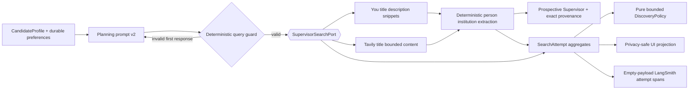

This repair addresses the observed `0 You.com results -> 40 raw Tavily results -> 0
plausible profiles` route without weakening the domain boundary. It improves recall for
common academic-profile title layouts, surname-first names, staff-directory URLs, and
bounded snippets, but a result still needs a plausible person, academic context, and an
institution. A directory page or non-academic person is excluded.

The diagnostics boundary is an explicit projection rather than a graph-state dump:

| Consumer | Allowed discovery diagnostics | Explicitly excluded |
|---|---|---|
| Streamlit | provider, query-local attempt number, raw count, plausible count, retained count, typed error category, fallback flag, route | query, Candidate content, names, URLs, snippets, raw records, page content, secrets |
| LangSmith | provider, attempt number, raw count, plausible count, typed error category, fallback flag, route | query, Candidate content, names, URLs, snippets, raw records, page content, secrets |

The distinction between raw, plausible, and retained counts explains provider quality
without implying that arbitrary search hits are partial Supervisor recommendations.

### M11.2 discovery-completion repair

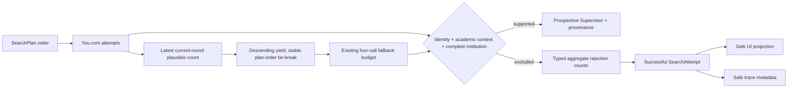

M11.2 addresses the observed `106 raw -> 4 plausible -> 4 retained` recoverable stop.
It changes neither the minimum-five gate nor the four-call Tavily budget. The pure fallback
ordering function considers only the latest You.com attempt for each query in the current
discovery round. Productive queries sort first by plausible-profile count; equal and
zero-yield queries retain the original `SearchPlan` order. Previous rounds and Tavily
outcomes cannot affect this yield ordering. On resume, current-round Tavily queries that
already have an attempt move behind all ranked untried queries, preventing a re-ranked
list from skipping its highest-priority remaining work or wasting a call on an early
repeat.

Institution extraction treats a phrase ending in `and`, `at`, `for`, `of`, `the`, or
`with` as incomplete. It continues across bounded provider description/snippet context and
retains a result only if a complete institution is found. This prevents a truncated title
such as `University of` from becoming affiliation data while still allowing deterministic
recovery of `University of East London` from the same bounded result.

Each excluded raw result is assigned exactly one fixed category:

| Category | Meaning |
|---|---|
| `person_not_established` | No plausible person identity is supported. |
| `academic_context_not_established` | A person-like identity lacks sufficient academic or researcher context. |
| `identity_conflict` | Title identity conflicts with a named academic in bounded context. |
| `institution_not_established` | Academic identity is plausible but no institution is supported. |
| `incomplete_institution` | Only a truncated institution phrase is available. |

M11.2 adds only aggregate category counts to graph audit state. `SearchAttempt` continues
to retain its exact query inside protected checkpoint state because deterministic routing
and replay require it. Streamlit and LangSmith receive no queries, Candidate content,
names, URLs, snippets, raw results, page content, or secrets. A pre-M11.2 checkpoint has no
taxonomy field; its attempt remains valid and the UI labels the breakdown unavailable
rather than fabricating historical counts.

### M11.3 academic-profile context repair

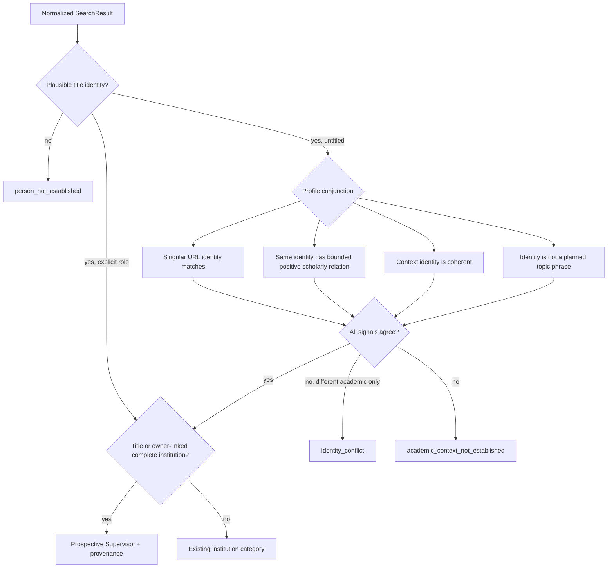

M11.3 addresses the measured `101 raw -> 0 plausible -> 0 retained` run. All provider
attempts succeeded, but 64 person-like titles failed academic-context recognition and no
result reached institution validation. The repair adds no provider call or inference
model; it refines only deterministic interpretation of provider-neutral `SearchResult`
objects.

The alternative untitled-profile route requires six agreeing signals:

1. A plausible title identity.
2. A singular academic profile path whose normalized slug identifies that same person,
   including locale-prefixed `/persons/<name>` paths.
3. At most the first 1,000 provider-description characters plus already bounded snippets,
   preventing page-sized summaries from expanding regex work or the interpretation scope.
4. An explicit positive grammatical relationship between the same identity and research,
   publications, scholarly work, or research-qualified expertise, interests, or projects;
   negated assertions and unrelated personal activity do not qualify.
5. The identity is neither an exact expanded research concept nor a contiguous phrase in a
   planned query. Direct named academic-role paths are unchanged by this topic guard.
6. A complete institution is present in the title or an explicit affiliation clause ties
   the selected owner to it. Collaborator clauses and collaboration targets cannot supply
   the owner's institution.

The conjunction prevents a path such as `/people/digital-transformation` plus a generic
research keyword from becoming a person. Generic topic, directory, listing, news,
publication, non-academic, and clinical layouts preserve their existing exclusions.
Additional named academics are co-mentions only when the title identity is independently
supported; if bounded academic names exist and none supports the title identity, the
result remains `identity_conflict`. A later titled identity in an institution-first SEO
title is accepted only when it matches the singular profile URL; it cannot override a
different primary identity.

This is discovery evidence only: bounded provider summaries may justify creating a
Prospective Supervisor, but they do not verify affiliation, research claims, or
availability. Verification still requires retrieved source content downstream.

## M6 content-extraction transport boundary

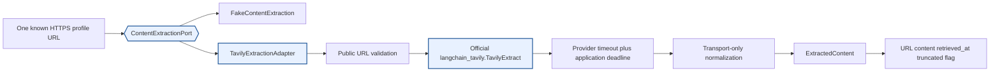

`ContentExtractionPort.extract()` accepts one known URL and returns one
`ExtractedContent`. Production uses the current official top-level
`langchain_tavily.TavilyExtract` import, not deprecated community imports. The adapter
requests Markdown, excludes images and favicons, applies Tavily's provider timeout
inside a slightly longer application deadline, and caps returned content at the
configured character limit.

The adapter is transport-only. It does not identify a Supervisor, extract a factual
claim, infer availability, resolve a conflict, or calculate Research Fit. It validates
the one-result response contract and normalizes failures into typed categories such as
timeout, transport, authentication, rate limit, quota, invalid request, provider,
response contract, or extraction failure. Provider response bodies are not persisted
in graph errors.

Public-URL validation rejects embedded credentials, localhost and local-domain names,
and non-global literal IP addresses. This reduces server-side request-forgery risk
before a URL reaches Tavily. A returned redirect URL is revalidated through the same
boundary.

## M6 structured evidence-model boundary

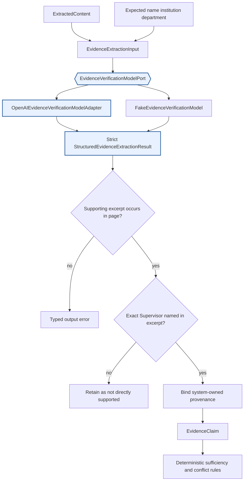

The versioned `evidence-verification-v1` prompt tells the model to use only the
retrieved page. Expected profile values are comparison hints, not evidence. The model
may classify identity, current affiliation, research interests, methodology,
publication, project, and explicit availability, but every structured claim must carry
a short supporting excerpt. Every claim proposed as directly supported must also carry
the asserted person name, and its excerpt must explicitly name that Supervisor.

The OpenAI adapter uses native strict JSON-schema output with `include_raw=False` and
`max_retries=0`. It does not manually parse JSON. The structured model returns no
authoritative evidence ID, retrieval timestamp, or source provenance. The application
binds those fields from trusted inputs after validating the response.

| Field | Authority |
|---|---|
| Claim type, concise claim, asserted values, confidence | Structured model output |
| Supporting excerpt | Structured model output, then checked against the page |
| `supervisor_id` | Prospective Supervisor record |
| Source URL and source kind | Extracted page and selected source reference |
| Retrieval timestamp | Content-extraction boundary |
| Evidence ID | Versioned deterministic hash of every persisted semantic claim field except retrieval time |
| Availability result, conflicts, sufficiency, lifecycle status | Deterministic Python rules |

The extracted full page is transient: it is sent to the evidence model but is not
stored in `ScholarPathState`. State retains concise claims and supporting excerpts.

## Deterministic grounding and verification rules

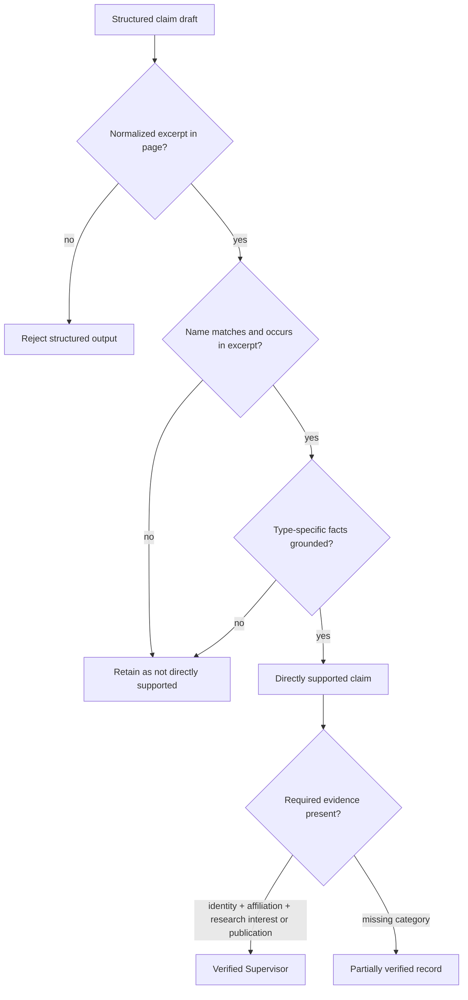

Important deterministic rules are:

1. Every directly supported claim must assert the matching Supervisor name and include
   that exact normalized name in its supporting excerpt. Page-level identity alone
   cannot attach another person's research, publication, project, or availability.
2. Current affiliation must directly state both institution and department. A value
   that differs from discovery remains evidence but is surfaced as a concern and never
   silently overwrites the profile fields.
3. At least one directly supported research-interest or publication claim is required.
   Project evidence is preserved but does not independently satisfy this exact gate.
4. Discovery fields and search snippets are never promoted into verification evidence.
5. A missing fact stays missing. Model knowledge cannot fill it.
6. Availability polarity is checked deterministically against the quoted statement;
   model output cannot invert accepting and not-accepting evidence.
7. Evidence IDs include all grounded semantic fields. Identical claims merge without
   randomness; a same-ID/different-payload collision is rejected rather than dropped.

Availability is derived separately:

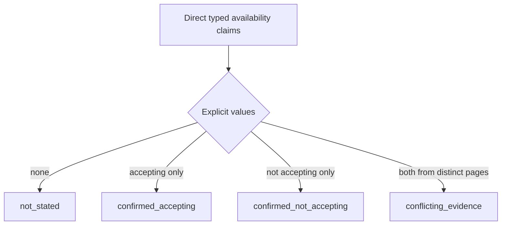

Only an explicit statement that a Supervisor is accepting or not accepting doctoral
Candidates may create an availability claim. General supervision history, student
lists, invitations to collaborate, and contact details are not availability.
`not_stated` never blocks verification. A confirmed not-accepting statement is retained
as a concern; it is not silently discarded.

For current-affiliation conflicts, the agent retains both claims and links their
evidence IDs through `conflicting_evidence_ids`. It does not choose one institution on
the model's authority. The completed record becomes `verified_with_concerns` when all
required categories still exist, and the conflict is surfaced explicitly.

## Partial verification is not a lifecycle shortcut

`SupervisorVerificationRecord` is deliberately separate from
`VerifiedSupervisor`:

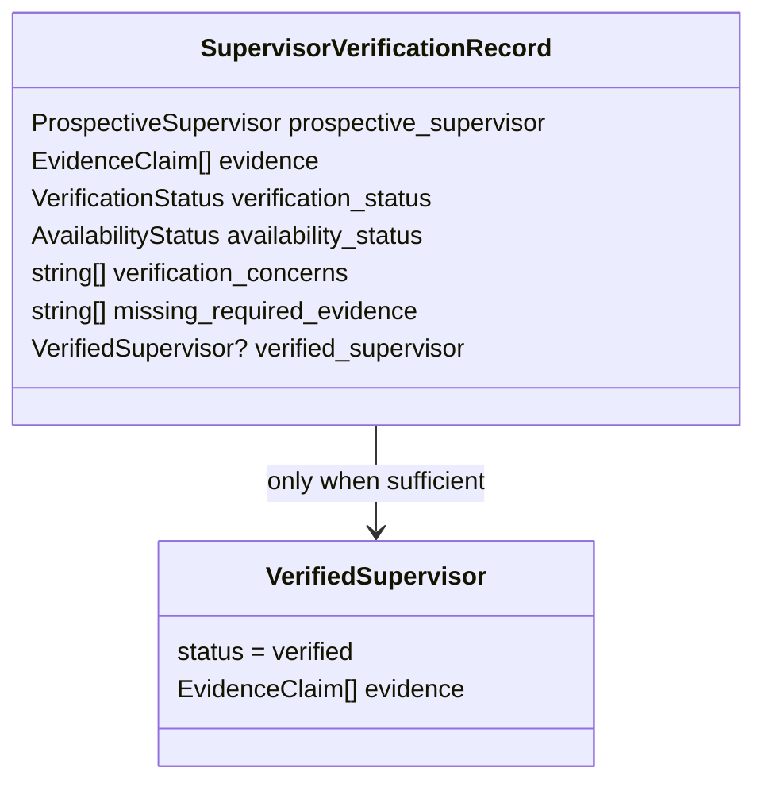

A `partially_verified` result retains available evidence, provenance, concerns, and
the exact missing categories, but its `verified_supervisor` field is absent. It cannot
enter the Supervisor lifecycle as Verified, be scored downstream, or be shortlisted.
This preserves partial work without weakening the lifecycle contract.

## One alternate official-source retry

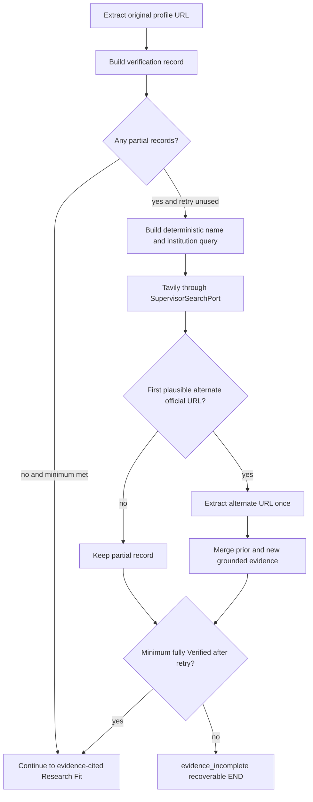

The pure `route_after_evidence_sufficiency()` function receives a frozen
`VerificationPolicy`, immutable verification records, and the alternate retry count.
It performs no provider or model call. The policy retries every partial record once
before applying the configured minimum of five fully Verified Supervisors.

`retry_alternate_evidence_source` searches for one stronger official page per partial
record. Selection is deterministic: it excludes the original URL and requires HTTPS,
the full normalized person-name sequence, institution correlation, and a
DNS-label-aware academic suffix such as `.edu`, `.edu.au`, or `.ac.za`. Institution
words on a commercial hostname and embedded suffixes such as `.edu.evil.com` are
rejected. The search result's title and description help select a URL only. A snippet
never becomes an
`EvidenceClaim`; the selected URL must pass through Tavily Extract and the structured
grounding boundary.

On the second extraction pass, already Verified records are retained unchanged. Only
partial records with a selected alternate source are processed, and new claims merge
with prior evidence. The retry budget is limited to one, so the loop cannot continue
indefinitely. If five records are fully Verified after the retry, the graph may proceed
while preserving other partial records for audit. Otherwise it ends with the clear,
recoverable `evidence_incomplete` status.

## Walking-skeleton orchestration

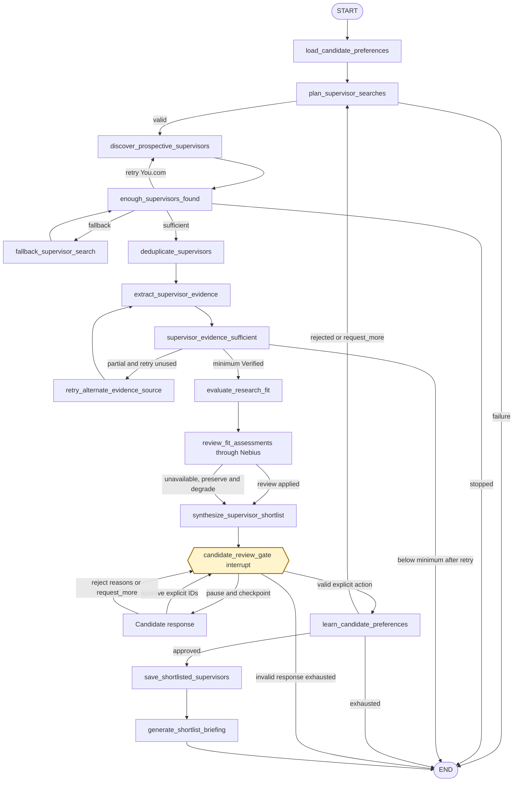

The graph-derived M2 diagram remains the topology baseline in
[`m2-walking-skeleton.mmd`](m2-walking-skeleton.mmd). M3 adds planning failure routing,
M4 replaces discovery, M5 activates resilient search fallback, and M6 replaces the
evidence path. M7 replaces Research Fit evaluation and shortlist proposal synthesis
without introducing additional operational nodes. M8 replaces the independent-review
implementation and extends synthesis. M9 replaces the review stub, adds the interrupt's
bounded validation self-route, and compiles the graph with thread-scoped persistence.
M10 adds a post-action learning node and Candidate-scoped durable memory.

## Typed state and reducers

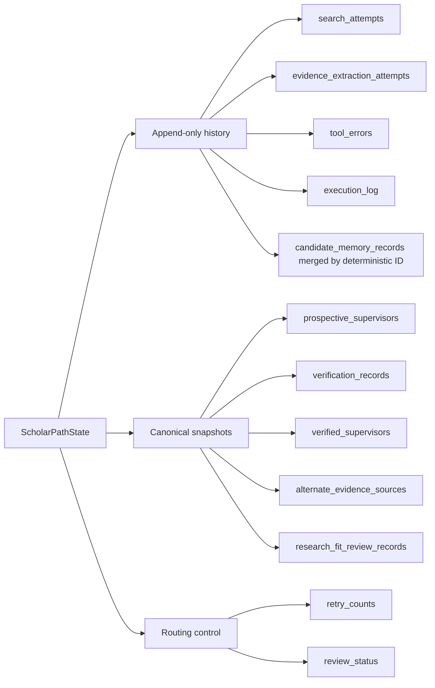

| State category | M11 channels | Merge behavior |
|---|---|---|
| Immutable Candidate input | `candidate_profile` | Preserved |
| Append-only history | preferences, raw search results, feedback, errors, search attempts, evidence extraction attempts, execution log | Reducers append events |
| Verification snapshots | `verification_records`, `verified_supervisors` | Node returns the complete current ordered snapshot |
| Alternate-source selection | `alternate_evidence_sources` | Deterministic dictionary replacement keyed by `supervisor_id` |
| Other entity snapshots | Prospective Supervisors, Research Fit assessments, reconciled review records, the typed proposal, and Shortlisted Supervisors | Latest node output replaces prior snapshot |
| Unique terminal history | Rejected Supervisors | Reducer merges by `supervisor_id` |
| Durable preference context | `candidate_memory_records` | Reducer merges by deterministic `memory_id` |
| Memory control | availability and processed-feedback count | Deterministic replacement; prevents normal resume replays |
| Routing control | discovery round, retry counts including review input, review status, validation error, fallback flags | Deterministic replacement |

Each `EvidenceExtractionAttempt` preserves Supervisor ID, exact source URL, source
kind, attempt number, discovery round, whether it was alternate, success, and a typed
error category. It does not store a full page or provider exception text. Planning a
new discovery round clears verification snapshots and the alternate-source map while
retaining append-only attempt history.

## Optional M11 LangSmith observability

```mermaid
flowchart LR
    Env[LANGSMITH_TRACING] --> Enabled{Enabled?}
    Enabled -->|no| Off[No LangSmith client]
    Enabled -->|yes| Key[Validate key]
    Key --> Client[Client hides inputs and outputs]
    Client --> Root[scholarpath_graph]
    Root --> PlanTrace[planning node metadata]
    Root --> EvidenceTrace[evidence node metadata]
    Root --> FitTrace[Research Fit node and rubric metadata]
    Root --> ReviewTrace[independent-review node metadata]
    Root --> Discovery[discovery node + aggregate attempt spans]
    Tags[environment plus graph-version:m12] --> Root
```

The graph version is `m12`. Root tags are
`environment:<SCHOLARPATH_ENVIRONMENT>` and `graph-version:m12`. Planning, discovery,
evidence, Research Fit, and independent-review nodes add only safe component and version
metadata. The fixed metadata allowlist is:

- `application`
- `environment`
- `graph_version`
- `component`
- `prompt_version`
- `rubric_version`
- `provider`
- `attempt_number`
- `raw_result_count`
- `plausible_supervisor_count`
- `rejected_person_not_established_count`
- `rejected_academic_context_not_established_count`
- `rejected_identity_conflict_count`
- `rejected_institution_not_established_count`
- `rejected_incomplete_institution_count`
- `error_category`
- `fallback_search_used`
- `discovery_route`

The evidence node records `component=evidence_verification_agent` and
`prompt_version=evidence-verification-v1`. Source URLs, full page content, Candidate
identifiers, names, email addresses, research statements, and API keys are not allowed
in trace metadata. The LangSmith client also uses `hide_inputs=True`,
`hide_outputs=True`, and omits runtime information, which is especially important
because the model input necessarily contains the retrieved page.

The Research Fit node records `component=research_fit_evaluation_agent`,
`prompt_version=research-fit-evaluation-v1`, and the active
`ResearchFitRubric.version` as `rubric_version` (the default is
`research-fit-rubric-v1`). Neither evidence text nor Candidate or Supervisor identity
is trace metadata. The review node records `component=independent_review_agent` and
`prompt_version=independent-review-v3`; Candidate and evidence payloads remain trace
inputs rather than metadata, and the LangSmith client hides all inputs and outputs.

Each discovery provider call creates an empty-input, empty-output child tool span. Only
aggregate attempt metadata is added at completion. The configured `LANGSMITH_ENDPOINT`
and optional `LANGSMITH_WORKSPACE_ID` are passed explicitly to the client, so regional
settings loaded from `.env` do not depend on process-environment side effects.

Tracing remains optional. When disabled, ScholarPath uses an explicitly disabled
tracing context and constructs no LangSmith client.

## M12 evaluation and regression architecture

[`m12-langsmith-evaluation-suite.mmd`](m12-langsmith-evaluation-suite.mmd) contains the
standalone Mermaid source for this flow.

```mermaid
flowchart LR
    Scenarios[11 synthetic typed scenarios] --> Dispatch{Target kind}
    Dispatch --> Plan[Search planning target]
    Dispatch --> Verify[Evidence verification target]
    Dispatch --> Fit[Research Fit target]
    Dispatch --> Graph[Fake end-to-end graph target]
    Plan --> Checks[Deterministic evaluators]
    Verify --> Checks
    Fit --> Checks
    Graph --> Checks
    Checks --> Local[Offline baseline report]
    Checks --> Upload{Explicit LangSmith opt-in?}
    Upload -->|no| Stop[No client and no network]
    Upload -->|yes| Experiment[LangSmith experiment]
    Experiment --> Judges[Optional structured qualitative judges]
    Experiment --> Trace[Privacy-safe tags and hidden payloads]

    classDef control fill:#fff4cc,stroke:#9a6b00,stroke-width:2px;
    class Upload control;
```

The checked-in dataset uses strict Pydantic scenario and output contracts. Component targets
exercise planning, evidence verification, and Research Fit independently; the fake graph
target exercises routing, fallback, deduplication, partial verification, independent review,
and Candidate approval boundaries with injected fakes. No default target calls a provider.

Deterministic evaluators own schema validity, terminology, evidence-ID ownership, URL
presence, score arithmetic, availability evidence, admission-probability exclusion, fallback
routing, duplicate rate, and approval enforcement. A model is never used for these facts.
Four versioned structured-output judges are separately selectable only for Research Fit
relevance, explanation usefulness, evidence-grounded rationale, and shortlist usefulness.

The offline runner directly invokes the typed targets and evaluators and deliberately does
not construct a LangSmith client. Dataset synchronization and `Client.evaluate` are reached
only when the command option and `SCHOLARPATH_RUN_LANGSMITH_EVALS=true` agree. Live graph
execution additionally requires `SCHOLARPATH_RUN_LIVE_E2E_EVALS=true`. Stable UUID5 example
IDs make dataset upserts idempotent.

Evaluation trace metadata is allowlisted to application, environment, graph version, prompt
version, model provider, fallback use, Candidate review outcome, target, and synthetic
scenario ID. Candidate identity, full research statements, search queries, source content,
URLs, checkpoint thread IDs, and secrets are omitted. The LangSmith client hides inputs and
outputs and omits runtime metadata.

## Configuration and deferred provider activation

```mermaid
flowchart TB
    OAI[OPENAI_API_KEY] --> OP[OpenAIPlanningSettings]
    OAI --> OE[OpenAIEvidenceSettings]
    OAI --> ORF[OpenAIResearchFitSettings]
    OP -->|planning requested| OPA[Planning adapter]
    OE -->|retrieved page ready| OEA[Evidence adapter]
    ORF -->|Verified evidence ready| ORFA[Research Fit adapter]
    NEB[NEBIUS_API_KEY and NEBIUS_*] --> NS[NebiusReviewSettings]
    NS -->|assessment review requested| NRA[NebiusReviewModelAdapter]
    YDC[YDC_API_KEY and YOU_SEARCH_*] --> YOU[YouSearchAdapter]
    TKEY[TAVILY_API_KEY] --> TS[TavilySearchSettings]
    TKEY --> TE[TavilyExtractionSettings]
    TS -->|fallback or alternate search selected| TSA[TavilySearchAdapter]
    TE -->|known URL extraction requested| TEA[TavilyExtractionAdapter]
    LS[LANGSMITH_*] --> LSC[LangSmith activation]
    MKEY[MEM0_API_KEY and MEM0_*] --> MS[Mem0MemorySettings]
    MS -->|Candidate memory load or explicit-action write| MEMA[Mem0CandidatePreferenceAdapter]
    DB[SCHOLARPATH_CHECKPOINT_DATABASE_PATH] --> SQLITE[Local SqliteSaver]
```

Provider-specific settings may load without credentials. Compiling the graph or
importing ScholarPath does not validate OpenAI, Nebius, You.com, Tavily, Mem0, or
LangSmith keys.
OpenAI evidence settings are validated only when a retrieved page reaches the lazy
evidence adapter. OpenAI Research Fit settings are validated only when Verified
evidence reaches the evaluation node. Tavily Extract settings are validated only when
content extraction is requested. Tavily search remains lazy until discovery fallback
or alternate official-source search requires it. Nebius settings are validated only
when an assessment reaches independent review.
Mem0 settings and the SDK import remain lazy until the graph loads long-term preferences.
Missing or invalid Mem0 credentials become a recoverable graph error rather than a startup
failure. `MEM0_TELEMETRY` defaults to false and is set before the dynamic SDK import.

M11 environment variables are:

| Boundary | Variables |
|---|---|
| OpenAI planning | `OPENAI_API_KEY`, `OPENAI_PLANNING_MODEL`, `OPENAI_PLANNING_TIMEOUT_SECONDS` |
| OpenAI evidence | `OPENAI_API_KEY`, `OPENAI_EVIDENCE_MODEL`, `OPENAI_EVIDENCE_TIMEOUT_SECONDS` |
| OpenAI Research Fit | `OPENAI_API_KEY`, `OPENAI_RESEARCH_FIT_MODEL`, `OPENAI_RESEARCH_FIT_TIMEOUT_SECONDS` |
| Nebius independent review | `NEBIUS_API_KEY`, `NEBIUS_REVIEW_MODEL`, `NEBIUS_ENDPOINT`, `NEBIUS_REVIEW_TIMEOUT_SECONDS` |
| You.com search | `YDC_API_KEY`, `YOU_SEARCH_ENDPOINT`, `YOU_SEARCH_TIMEOUT_SECONDS`, `YOU_SEARCH_RESULT_COUNT` |
| Tavily search | `TAVILY_API_KEY`, `TAVILY_SEARCH_TIMEOUT_SECONDS`, `TAVILY_SEARCH_RESULT_COUNT` |
| Tavily Extract | `TAVILY_API_KEY`, `TAVILY_EXTRACT_PROVIDER_TIMEOUT_SECONDS`, `TAVILY_EXTRACT_REQUEST_TIMEOUT_SECONDS`, `TAVILY_EXTRACT_DEPTH`, `TAVILY_EXTRACT_MAX_CONTENT_CHARACTERS` |
| Mem0 Candidate memory | `MEM0_API_KEY`, `MEM0_TIMEOUT_SECONDS`, `MEM0_MEMORY_LIMIT`, `MEM0_TELEMETRY` |
| LangSmith | `LANGSMITH_TRACING`, `LANGSMITH_API_KEY`, `LANGSMITH_PROJECT` |
| Local checkpointing | `SCHOLARPATH_CHECKPOINT_DATABASE_PATH` |

The Tavily Extract application request timeout must be greater than its provider
timeout. API keys use `SecretStr`, remain in environment variables, and are never
written into repository files or graph error records.

## Dependency direction

```mermaid
flowchart LR
    CLI[cli] --> GRAPH[graph]
    UI[ui] --> GRAPH
    GRAPH --> DOMAIN[domain]
    GRAPH --> AGENTS[agents]
    GRAPH --> SEARCHPORT[SupervisorSearchPort]
    GRAPH --> CONTENTPORT[ContentExtractionPort]
    GRAPH --> MEMORYPORT[CandidatePreferenceMemoryPort]
    AGENTS --> PLANPORT[PlanningModelPort]
    AGENTS --> EVIDENCEPORT[EvidenceVerificationModelPort]
    AGENTS --> FITPORT[ResearchFitModelPort]
    AGENTS --> REVIEWPORT[IndependentReviewModelPort]
    PLANPORT --> OPENAI[LangChain OpenAI]
    EVIDENCEPORT --> OPENAI
    FITPORT --> OPENAI
    REVIEWPORT --> NEBIUS[NebiusReviewModelAdapter]
    SEARCHPORT --> YOU[YouSearchAdapter and httpx]
    SEARCHPORT --> TSEARCH[TavilySearchAdapter]
    CONTENTPORT --> TEXTRACT[TavilyExtractionAdapter]
    MEMORYPORT --> MEM0[Mem0CandidatePreferenceAdapter]
    TSEARCH --> TSDK[langchain-tavily]
    TEXTRACT --> TSDK
    GRAPH --> LANGGRAPH[LangGraph and LangChain Core]
    GRAPH --> CHECKPOINT[InMemorySaver or SqliteSaver]
    OBS[LangSmith observability] --> GRAPH
    CONFIG[config] -. settings .-> OPENAI
    CONFIG -. settings .-> NEBIUS
    CONFIG -. settings .-> YOU
    CONFIG -. settings .-> TSEARCH
    CONFIG -. settings .-> TEXTRACT
    CONFIG -. settings .-> MEM0
```

Domain contracts remain independent of LangGraph and provider SDKs. Transport adapters
depend on provider libraries and return provider-neutral typed values. Agents depend
on typed ports and domain schemas. The graph composes those boundaries and owns finite
routing.

## Physical package layout

The flattened physical `src/` tree remains mapped directly to the `scholarpath` import
namespace:

```text
src/
├── __init__.py
├── cli.py
├── config.py
├── domain/
│   ├── enums.py
│   ├── lifecycle.py
│   └── models.py
├── agents/
│   ├── evidence_verification.py
│   ├── independent_review.py
│   ├── nebius_review.py
│   ├── openai_evidence.py
│   ├── openai_planning.py
│   ├── openai_research_fit.py
│   ├── prompts.py
│   ├── research_fit.py
│   ├── research_planning.py
│   ├── shortlist_synthesis.py
│   └── supervisor_discovery.py
├── graph/
│   ├── discovery.py
│   ├── persistence.py
│   ├── review.py
│   ├── state.py
│   ├── verification.py
│   └── workflow.py
├── memory/
│   ├── mem0_adapter.py
│   ├── models.py
│   ├── ports.py
│   └── preference_learning.py
├── observability/
│   └── tracing.py
└── tools/
    ├── content_extraction.py
    ├── supervisor_search.py
    ├── tavily_extraction.py
    ├── tavily_search.py
    └── you_search.py
```

Setuptools maps these physical paths onto `scholarpath.*`; no additional physical
`src/scholarpath/` directory is required.

## Operational trade-offs and NFRs

| Concern | M11 control | Trade-off or remaining risk |
|---|---|---|
| Evidence integrity | Every direct claim has a source URL, retrieval time, conservative source kind, matching asserted name, and checked excerpt; IDs hash all semantic fields | Textual grounding proves presence and subject binding, not that a page itself is truthful |
| Availability safety | Only explicit typed accepting or not-accepting statements are retained; absence stays `not_stated` | Institutional pages may be stale, so freshness policy remains limited |
| Conflict safety | Conflicting affiliations remain linked and visible | ScholarPath surfaces conflicts but does not adjudicate them |
| Reliability | Typed errors, application deadlines, one alternate retry, partial-result preservation, recoverable terminal status | A two-source cap may miss a valid third official source |
| Security | Deferred secrets, public-URL checks, sanitized errors, bounded content, hidden trace inputs/outputs | Institution pages and model inputs still leave the application boundary and require governance review |
| Privacy | Full page content is transient and excluded from state and trace metadata | Concise evidence excerpts remain persisted because they are required provenance |
| Latency | Sequential known-URL extraction with explicit deadlines | Worst-case latency grows with the number of Prospective Supervisors and one alternate pass |
| Cost | Extraction, evidence, Research Fit, and independent-review model calls are bounded per processed Supervisor | Mem0 adds one scoped read per run and bounded direct-import writes after explicit actions |
| Scalability | Provider and application ports support fakes and later alternative adapters | Current synchronous Streamlit process and sequential graph calls defer concurrency and backpressure |
| Determinism | IDs, grounding, sufficiency, routing, arithmetic, review reconciliation, confidence degradation, and shortlist ranking use Python | Evidence wording, semantic alignment, and reviewer recommendations remain model-variable |
| Research Fit integrity | Every positive component cites suitable direct evidence; availability is excluded; Python owns the total | Rubric calibration and model consistency still need empirical evaluation |
| Independent review | Closed evidence input, strict result schema, valid-ID reconciliation, immutable initial assessment, and safe per-record failure | Reviewer calibration and disagreement metrics still need empirical evaluation |
| Observability | M11 graph, prompt, and rubric versions are traceable with safe metadata; the UI exposes only canonical node progress | Evaluation datasets, quality dashboards, and alerts remain deferred |
| Persistence | Thread-scoped in-memory tests and restart-safe local SQLite checkpoints | Encryption, retention automation, multi-process writers, and production database selection remain deferred |
| Preference memory | Stable Candidate scope, finite typed allowlist, deterministic duplicate suppression, no provider inference, non-fatal failure | Mem0 is an external processor; retention, deletion, residency, and consent controls need production governance |
| Human authority | Streamlit resumes a typed interrupt; approval names exact IDs and viewing is side-effect free | Authentication, authorization, and verified session-to-thread ownership remain deferred |
| UI privacy | Session State contains only interface controls and an opaque thread ID; the UI uses safe typed projections and generic provider errors | Browser/session hardening, CSP, authenticated identity, and production privacy review remain deferred |
| Termination | Search, evidence, review, and invalid-input loops use validated finite budgets | LangGraph recursion limit remains defense-in-depth, not the primary termination rule |

The synchronous Tavily adapters currently bridge the provider's async invocation with
`asyncio.run()`. An async port is deferred before embedding ScholarPath inside an
already-running event-loop runtime.

## M11 quality boundaries

| Concern | Control |
|---|---|
| Packaging | Flattened physical `src/` mapped to the `scholarpath` namespace |
| Planning | Versioned strict structured output; no search tools; one visible format retry |
| Discovery | You.com primary, official Tavily fallback, deterministic quality policy and provenance merge |
| Extraction | One-URL `ContentExtractionPort`, official Tavily Extract, public-URL checks, dual timeouts and content cap |
| Evidence model | Injected typed port, versioned prompt, strict native schema, no prose parsing |
| Grounding | Every direct excerpt occurs in retrieved content, explicitly names the expected Supervisor, and passes type-specific deterministic checks |
| Verification | Identity, current institution and department, plus research interest or publication are mandatory |
| Partial work | Separate `SupervisorVerificationRecord`; partial records never masquerade as Verified Supervisors |
| Availability | Explicit name-bound evidence with deterministically matched polarity only; absence remains `not_stated` |
| Conflicts | Both affiliation claims and cross-referenced evidence IDs are preserved |
| Retry | One deterministic alternate official-source search and extraction pass |
| Network isolation | Default tests use fixed pages and fakes; `live` is excluded by default |
| Observability | `graph-version:m12`, prompt and rubric versions, allowlisted aggregate discovery and evaluation metadata, hidden inputs and outputs |
| Evaluation | Eleven typed synthetic scenarios, fake-default targets, ten deterministic metrics, optional scoped judges, stable dataset IDs, and separate upload/live gates |
| Human authority | A real interrupt requires typed explicit approval before Shortlisted status or briefing generation |
| Persistence | In-memory isolation in tests; ignored SQLite path for trusted local restart; opaque thread IDs partition runs |
| Checkpoint serialization | Explicit MessagePack type allowlist, URL JSON projection, and no executable pickle fallback |
| Preference memory | Typed port, exact `infer=False` records, Candidate-ID scope, explicit-action writes, deterministic semantic IDs, and non-fatal fallback |
| User interface | Thin Streamlit adapter, typed application port, safe view models, canonical progress allowlist, and recoverable errors without stack traces |
| Session isolation | Opaque thread ID only in Session State; checkpoint owns graph state; AppTest starts fresh isolated sessions |
| Research Fit | Injected typed model port proposes evidence-cited components; Python validates, totals, and bounds them |
| Independent review | Nebius behind an injected typed port; no tools or browsing; Python validates references and reconciles outcomes |
| Failure handling | Provider, timeout, malformed-output, and invalid-reference outcomes preserve the original score, lower confidence, and continue |
| Proposal synthesis | Verified-only, deterministic effective-score/confidence/name ordering, maximum five, and no lifecycle promotion before approval |

## Runtime and verification commands

From `projects/scholar-path`:

```bash
python3 -m venv venv
source venv/bin/activate
python -m pip install --upgrade pip
python -m pip install -e ".[dev]" --config-settings editable_mode=strict
cp .env.example .env

# After adding provider credentials to the ignored .env:
set -a
source .env
set +a
streamlit run streamlit_app.py

ruff format --check .
ruff check .
mypy src tests
pytest -m "not live"
```

The production CLI path requires the planning, discovery, evidence, Research Fit, and
independent-review credentials. `MEM0_API_KEY` activates cross-run preference memory;
without it, the graph continues and records memory as unavailable:

```bash
# Set OPENAI_API_KEY, NEBIUS_API_KEY, YDC_API_KEY, TAVILY_API_KEY, and optionally
# MEM0_API_KEY in ignored .env first.
python -m scholarpath.cli
```

Optional provider smoke tests require both their credential and explicit opt-in:

```bash
SCHOLARPATH_RUN_LIVE_TESTS=true \
pytest -o addopts='' -q -m live tests/integration/test_openai_planning_live.py

SCHOLARPATH_RUN_LIVE_TESTS=true \
pytest -o addopts='' -q -m live tests/integration/test_openai_research_fit_live.py

SCHOLARPATH_RUN_LIVE_TESTS=true \
pytest -o addopts='' -q -m live tests/integration/test_nebius_review_live.py

SCHOLARPATH_RUN_LIVE_TESTS=true \
pytest -o addopts='' -q -m live tests/integration/test_you_search_live.py

SCHOLARPATH_RUN_LIVE_TESTS=true \
pytest -o addopts='' -q -m live tests/integration/test_tavily_search_live.py

SCHOLARPATH_RUN_LIVE_TESTS=true \
pytest -o addopts='' -q -m live tests/integration/test_tavily_extraction_live.py

SCHOLARPATH_RUN_LIVE_TESTS=true \
pytest -o addopts='' -q -m live tests/integration/test_mem0_memory_live.py
```

The Research Fit smoke test evaluates one fixed Verified Supervisor and locally
validates structured citations, component arithmetic, bounds, and evidence ownership.
The Tavily extraction smoke test retrieves one bounded public documentation page and
asserts normalized non-empty content, HTTPS provenance, the content cap, and an aware
retrieval timestamp. Default test runs skip every live test and make no network call.

## Deferred beyond M12

- Empirical Research Fit rubric calibration and model-consistency evaluation
- Multi-source freshness and source-authority weighting beyond one alternate page
- Deterministic conflict adjudication with an explicit policy and Candidate visibility
- Concurrent or batched extraction, caching, quotas, rate limiting, and circuit breakers
- Per-Supervisor durable checkpoints inside a long extraction node
- An async provider-port variant for already-running event loops
- Authenticated Candidate identity and authorization over checkpoint thread ownership
- Streamlit production hardening, accessibility evaluation, browser security policy, and load testing
- Mem0 consent, retention, right-to-delete, residency, and production access controls
- Production checkpoint encryption, retention, access control, and a multi-process store
- Calibrated LLM-judge thresholds, trend dashboards, alerting, and consented production-like evaluation data
