# ScholarPath M7 Architecture

M7 replaces fixture Research Fit scoring and shortlist synthesis with an
evidence-cited model boundary followed by deterministic arithmetic and ranking, while
preserving the useful M3–M6 architecture:

- M3 plans searches through a structured OpenAI boundary.
- M4 discovers Prospective Supervisors through You.com.
- M5 adds deterministic discovery quality checks and Tavily search fallback.
- M6 retrieves known pages with Tavily Extract, extracts grounded claims through a
  structured model boundary, and deterministically decides whether each record is
  Verified or partially verified.
- M7 evaluates Research Fit through an injected structured-output model, validates
  every component citation against verified evidence, sums components in Python, and
  deterministically creates a five-result proposal for Candidate review.

Availability remains a separate verified status and never contributes points. Candidate
review remains the configured stub; M7 creates a proposal whose Supervisor records stay
`verified`, and no Supervisor becomes Shortlisted without the existing approval gate.

## End-to-end milestone view

```mermaid
flowchart LR
    CP[CandidateProfile] --> PLAN[ResearchPlanningAgent]
    PLAN --> SQ[SearchPlan]
    SQ --> YOU[You.com discovery]
    YOU --> DP[DiscoveryPolicy]
    DP -->|quality gap or retryable failure| TS[Tavily search fallback]
    DP --> PS[Prospective Supervisors]
    TS --> PS
    PS --> TE[Tavily Extract known profile URL]
    TE --> EV[EvidenceVerificationAgent]
    EV --> VR[SupervisorVerificationRecord]
    VR -->|partial and retry remains| ALT[One alternate official-source search]
    ALT --> TE
    VR -->|sufficient direct evidence| VS[Verified Supervisor]
    VS --> RF[Evidence-cited ResearchFitEvaluationAgent]
    RF --> SYNTH[Deterministic ShortlistSynthesisAgent]
    SYNTH --> GATE[Candidate review gate stub]
    GATE -->|approve| SS[Shortlisted Supervisor]
    GATE -->|reject| RS[Rejected Supervisor]

    classDef human fill:#fff4cc,stroke:#9a6b00,stroke-width:2px;
    class GATE human;
```

The LangGraph topology still contains the same fifteen canonical operational nodes.
M7 changes only `evaluate_research_fit` and `synthesize_supervisor_shortlist`; it does
not implement independent review, a real Candidate approval interface, or outreach.

## M7 Research Fit and proposal boundary

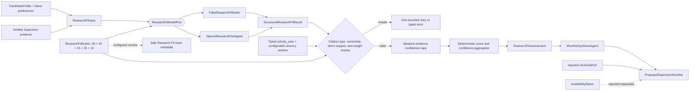

The model receives Candidate topics, methods, orientation, practical preferences, and
concise verified claims. It does not receive the Candidate ID or full research
statement. Availability evidence is removed before model invocation. The strict output
contains five component proposals, citations, confidence, rationale, and evidence gaps;
it deliberately contains no overall score. Python enforces component maxima and sums
the score, so arithmetic cannot drift between model calls.

The default rubric totals 100 points: topic 40, methodology or discipline 20,
orientation 15, recent activity 15, and practical constraints 10. A positive component
must cite suitable, direct, grounded `EvidenceClaim` IDs. A component without evidence
must score zero, have low confidence, and state the gap. Availability claims are never
valid scoring citations, and admission likelihood language is rejected.

Publication and project claims may carry a typed `activity_year` only when that exact
year occurs in the supporting excerpt and is not later than retrieval. Recent-research
points require this typed value and reject activity older than the rubric's configurable
`recent_activity_window_years`, which defaults to five. This makes freshness a versioned,
testable policy rather than a model interpretation of words such as "recent."

For every component, deterministic code caps model-proposed confidence at the weakest
cited `EvidenceClaim` confidence. It then derives assessment confidence from a
rubric-weighted aggregate of all five bounded component confidences; the domain contract
recalculates the same result. The current evidence schema has no typed region or
study-mode fact. Therefore M7 rejects all positive practical-constraint scores—even when
an affiliation excerpt contains suggestive prose—and records zero points plus an
evidence gap until an explicit typed contract is introduced.

Synthesis is model-free. It sorts by overall score descending, evidence confidence
descending, normalized Supervisor name ascending, and Supervisor ID as a total-order
fallback. Each recommendation reports strengths, concerns, availability, and evidence
confidence. The returned records remain Verified until the Candidate approval gate.
`ProposedSupervisorShortlist.generated_at` comes from an injected `UtcClockPort`;
production supplies current aware UTC time, while deterministic tests provide a fixed
clock. The configured rubric version is also passed into Research Fit node trace
metadata instead of being hard-coded.

## M3 research-planning boundary

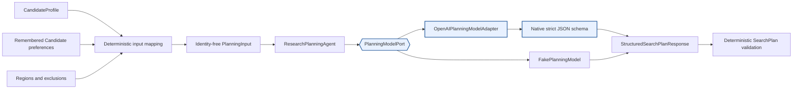

The planner receives the Candidate's research statement and typed preferences but no
search tool. `research-planning-v1` uses
`with_structured_output(..., method="json_schema", strict=True)`; prose JSON parsing
is not used. Python and Pydantic enforce four-to-eight distinct queries, required
source-category coverage, target regions, and query uniqueness. Malformed output has
one explicit retry; provider failures stop cleanly. The OpenAI client has
`max_retries=0`, so the application owns the visible retry policy.

## M4–M5 resilient discovery boundary

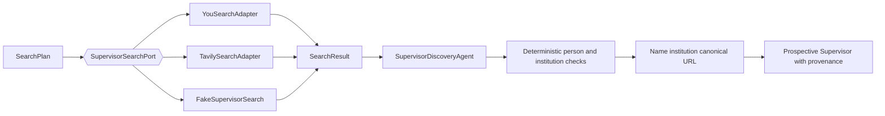

The search port executes one exact query at a time. Transport adapters normalize URL,
title, description, optional publication date, and originating query; they contain no
Supervisor reasoning. The discovery agent conservatively identifies plausible people
and institutions, while deterministic deduplication merges exact source/query pairs.
Discovery never produces Research Fit or availability claims.

`route_after_supervisor_discovery` remains pure. It uses only the current discovery
round's typed `SearchAttempt` records and quality metrics to choose one You.com timeout
retry, Tavily fallback, continuation, immediate stop for non-retryable errors, or a
recoverable `discovery_incomplete` result. Useful partial results survive a later query
failure and remain available to downstream deduplication.

## M6 content-extraction transport boundary

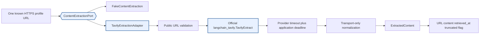

`ContentExtractionPort.extract()` accepts one known URL and returns one
`ExtractedContent`. Production uses the current official top-level
`langchain_tavily.TavilyExtract` import, not deprecated community imports. The adapter
requests Markdown, excludes images and favicons, applies Tavily's provider timeout
inside a slightly longer application deadline, and caps returned content at the
configured character limit.

The adapter is transport-only. It does not identify a Supervisor, extract a factual
claim, infer availability, resolve a conflict, or calculate Research Fit. It validates
the one-result response contract and normalizes failures into typed categories such as
timeout, transport, authentication, rate limit, quota, invalid request, provider,
response contract, or extraction failure. Provider response bodies are not persisted
in graph errors.

Public-URL validation rejects embedded credentials, localhost and local-domain names,
and non-global literal IP addresses. This reduces server-side request-forgery risk
before a URL reaches Tavily. A returned redirect URL is revalidated through the same
boundary.

## M6 structured evidence-model boundary

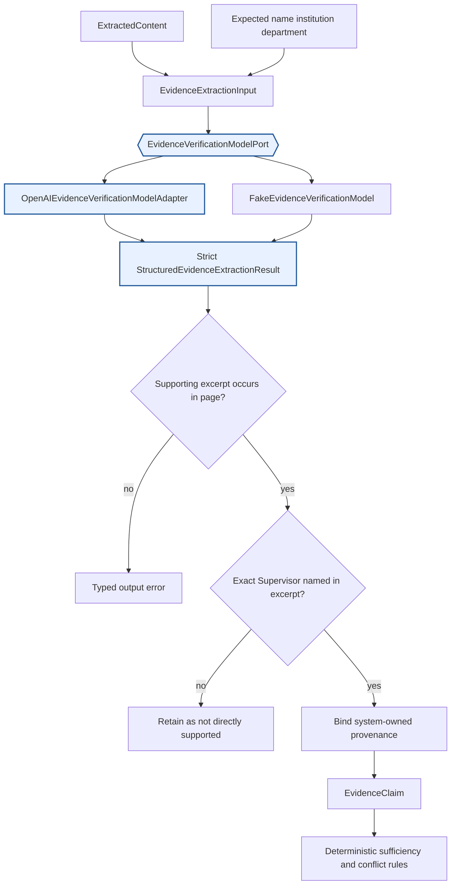

The versioned `evidence-verification-v1` prompt tells the model to use only the
retrieved page. Expected profile values are comparison hints, not evidence. The model
may classify identity, current affiliation, research interests, methodology,
publication, project, and explicit availability, but every structured claim must carry
a short supporting excerpt. Every claim proposed as directly supported must also carry
the asserted person name, and its excerpt must explicitly name that Supervisor.

The OpenAI adapter uses native strict JSON-schema output with `include_raw=False` and
`max_retries=0`. It does not manually parse JSON. The structured model returns no
authoritative evidence ID, retrieval timestamp, or source provenance. The application
binds those fields from trusted inputs after validating the response.

| Field | Authority |
|---|---|
| Claim type, concise claim, asserted values, confidence | Structured model output |
| Supporting excerpt | Structured model output, then checked against the page |
| `supervisor_id` | Prospective Supervisor record |
| Source URL and source kind | Extracted page and selected source reference |
| Retrieval timestamp | Content-extraction boundary |
| Evidence ID | Versioned deterministic hash of every persisted semantic claim field except retrieval time |
| Availability result, conflicts, sufficiency, lifecycle status | Deterministic Python rules |

The extracted full page is transient: it is sent to the evidence model but is not
stored in `ScholarPathState`. State retains concise claims and supporting excerpts.

## Deterministic grounding and verification rules

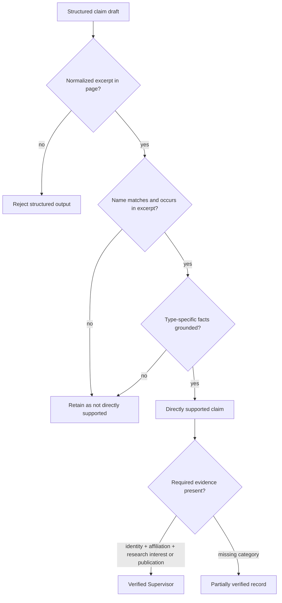

Important deterministic rules are:

1. Every directly supported claim must assert the matching Supervisor name and include
   that exact normalized name in its supporting excerpt. Page-level identity alone
   cannot attach another person's research, publication, project, or availability.
2. Current affiliation must directly state both institution and department. A value
   that differs from discovery remains evidence but is surfaced as a concern and never
   silently overwrites the profile fields.
3. At least one directly supported research-interest or publication claim is required.
   Project evidence is preserved but does not independently satisfy this exact gate.
4. Discovery fields and search snippets are never promoted into verification evidence.
5. A missing fact stays missing. Model knowledge cannot fill it.
6. Availability polarity is checked deterministically against the quoted statement;
   model output cannot invert accepting and not-accepting evidence.
7. Evidence IDs include all grounded semantic fields. Identical claims merge without
   randomness; a same-ID/different-payload collision is rejected rather than dropped.

Availability is derived separately:

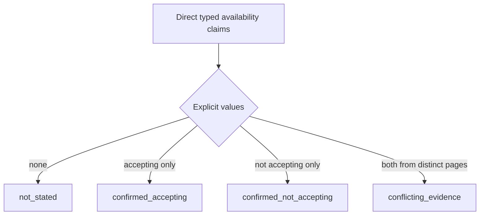

Only an explicit statement that a Supervisor is accepting or not accepting doctoral
Candidates may create an availability claim. General supervision history, student
lists, invitations to collaborate, and contact details are not availability.
`not_stated` never blocks verification. A confirmed not-accepting statement is retained
as a concern; it is not silently discarded.

For current-affiliation conflicts, the agent retains both claims and links their
evidence IDs through `conflicting_evidence_ids`. It does not choose one institution on
the model's authority. The completed record becomes `verified_with_concerns` when all
required categories still exist, and the conflict is surfaced explicitly.

## Partial verification is not a lifecycle shortcut

`SupervisorVerificationRecord` is deliberately separate from
`VerifiedSupervisor`:

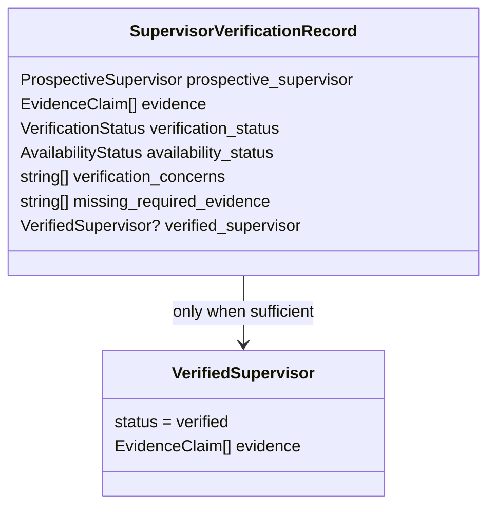

A `partially_verified` result retains available evidence, provenance, concerns, and
the exact missing categories, but its `verified_supervisor` field is absent. It cannot
enter the Supervisor lifecycle as Verified, be scored downstream, or be shortlisted.
This preserves partial work without weakening the lifecycle contract.

## One alternate official-source retry

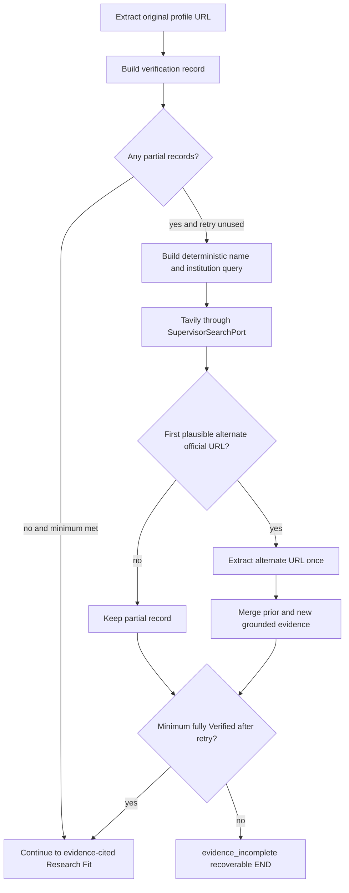

The pure `route_after_evidence_sufficiency()` function receives a frozen
`VerificationPolicy`, immutable verification records, and the alternate retry count.
It performs no provider or model call. The policy retries every partial record once
before applying the configured minimum of five fully Verified Supervisors.

`retry_alternate_evidence_source` searches for one stronger official page per partial
record. Selection is deterministic: it excludes the original URL and requires HTTPS,
the full normalized person-name sequence, institution correlation, and a
DNS-label-aware academic suffix such as `.edu`, `.edu.au`, or `.ac.za`. Institution
words on a commercial hostname and embedded suffixes such as `.edu.evil.com` are
rejected. The search result's title and description help select a URL only. A snippet
never becomes an
`EvidenceClaim`; the selected URL must pass through Tavily Extract and the structured
grounding boundary.

On the second extraction pass, already Verified records are retained unchanged. Only
partial records with a selected alternate source are processed, and new claims merge
with prior evidence. The retry budget is limited to one, so the loop cannot continue
indefinitely. If five records are fully Verified after the retry, the graph may proceed
while preserving other partial records for audit. Otherwise it ends with the clear,
recoverable `evidence_incomplete` status.

## Walking-skeleton orchestration

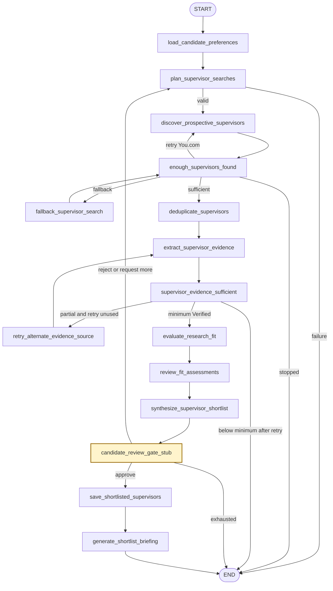

The graph-derived M2 diagram remains the topology baseline in
[`m2-walking-skeleton.mmd`](m2-walking-skeleton.mmd). M3 adds planning failure routing,
M4 replaces discovery, M5 activates resilient search fallback, and M6 replaces the
evidence path. M7 replaces Research Fit evaluation and shortlist proposal synthesis
without introducing additional operational nodes.

## Typed state and reducers

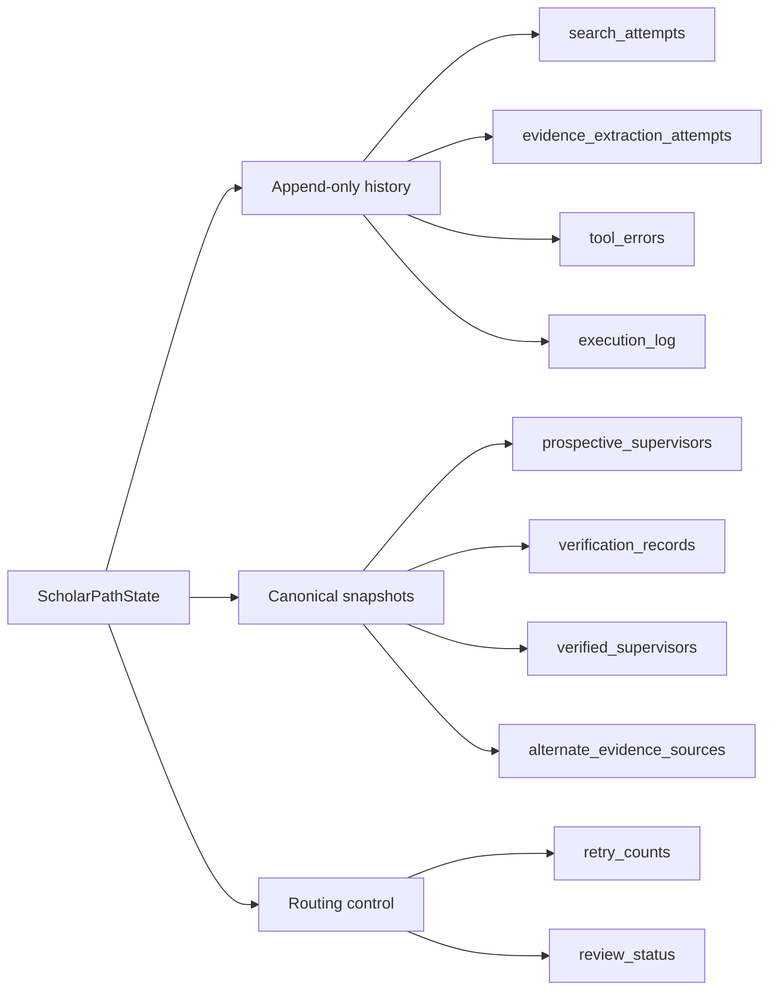

| State category | M7 channels | Merge behavior |
|---|---|---|
| Immutable Candidate input | `candidate_profile` | Preserved |
| Append-only history | preferences, raw search results, feedback, errors, search attempts, evidence extraction attempts, execution log | Reducers append events |
| Verification snapshots | `verification_records`, `verified_supervisors` | Node returns the complete current ordered snapshot |
| Alternate-source selection | `alternate_evidence_sources` | Deterministic dictionary replacement keyed by `supervisor_id` |
| Other entity snapshots | Prospective Supervisors, Research Fit assessments, the typed proposal, and Shortlisted Supervisors | Latest node output replaces prior snapshot |
| Unique terminal history | Rejected Supervisors | Reducer merges by `supervisor_id` |
| Routing control | discovery round, retry counts, review status, fallback flags | Deterministic replacement |

Each `EvidenceExtractionAttempt` preserves Supervisor ID, exact source URL, source
kind, attempt number, discovery round, whether it was alternate, success, and a typed
error category. It does not store a full page or provider exception text. Planning a
new discovery round clears verification snapshots and the alternate-source map while
retaining append-only attempt history.

## Optional M7 LangSmith observability

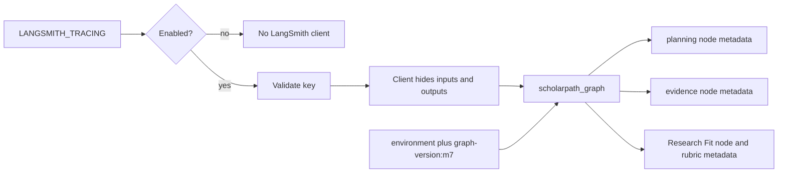

The graph version is `m7`. Root tags are
`environment:<SCHOLARPATH_ENVIRONMENT>` and `graph-version:m7`. Planning, evidence,
and Research Fit nodes add only safe component and version metadata. The fixed
metadata allowlist is:

- `application`
- `environment`
- `graph_version`
- `component`
- `prompt_version`
- `rubric_version`

The evidence node records `component=evidence_verification_agent` and
`prompt_version=evidence-verification-v1`. Source URLs, full page content, Candidate
identifiers, names, email addresses, research statements, and API keys are not allowed
in trace metadata. The LangSmith client also uses `hide_inputs=True`,
`hide_outputs=True`, and omits runtime information, which is especially important
because the model input necessarily contains the retrieved page.

The Research Fit node records `component=research_fit_evaluation_agent`,
`prompt_version=research-fit-evaluation-v1`, and the active
`ResearchFitRubric.version` as `rubric_version` (the default is
`research-fit-rubric-v1`). Neither evidence text nor Candidate or Supervisor identity
is trace metadata.

Tracing remains optional. When disabled, ScholarPath uses an explicitly disabled
tracing context and constructs no LangSmith client.

## Configuration and deferred provider activation

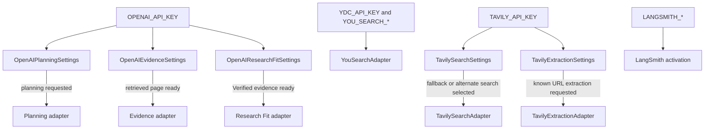

Provider-specific settings may load without credentials. Compiling the graph or
importing ScholarPath does not validate OpenAI, You.com, Tavily, or LangSmith keys.
OpenAI evidence settings are validated only when a retrieved page reaches the lazy
evidence adapter. OpenAI Research Fit settings are validated only when Verified
evidence reaches the evaluation node. Tavily Extract settings are validated only when
content extraction is requested. Tavily search remains lazy until discovery fallback
or alternate official-source search requires it.

M7 environment variables are:

| Boundary | Variables |
|---|---|
| OpenAI planning | `OPENAI_API_KEY`, `OPENAI_PLANNING_MODEL`, `OPENAI_PLANNING_TIMEOUT_SECONDS` |
| OpenAI evidence | `OPENAI_API_KEY`, `OPENAI_EVIDENCE_MODEL`, `OPENAI_EVIDENCE_TIMEOUT_SECONDS` |
| OpenAI Research Fit | `OPENAI_API_KEY`, `OPENAI_RESEARCH_FIT_MODEL`, `OPENAI_RESEARCH_FIT_TIMEOUT_SECONDS` |
| You.com search | `YDC_API_KEY`, `YOU_SEARCH_ENDPOINT`, `YOU_SEARCH_TIMEOUT_SECONDS`, `YOU_SEARCH_RESULT_COUNT` |
| Tavily search | `TAVILY_API_KEY`, `TAVILY_SEARCH_TIMEOUT_SECONDS`, `TAVILY_SEARCH_RESULT_COUNT` |
| Tavily Extract | `TAVILY_API_KEY`, `TAVILY_EXTRACT_PROVIDER_TIMEOUT_SECONDS`, `TAVILY_EXTRACT_REQUEST_TIMEOUT_SECONDS`, `TAVILY_EXTRACT_DEPTH`, `TAVILY_EXTRACT_MAX_CONTENT_CHARACTERS` |
| LangSmith | `LANGSMITH_TRACING`, `LANGSMITH_API_KEY`, `LANGSMITH_PROJECT` |

The Tavily Extract application request timeout must be greater than its provider
timeout. API keys use `SecretStr`, remain in environment variables, and are never
written into repository files or graph error records.

## Dependency direction

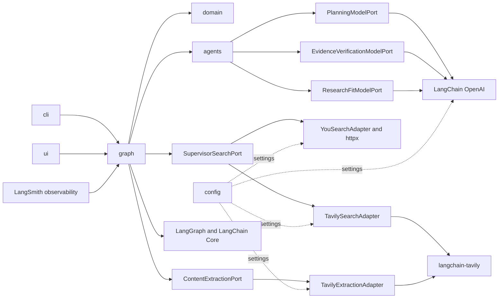

Domain contracts remain independent of LangGraph and provider SDKs. Transport adapters
depend on provider libraries and return provider-neutral typed values. Agents depend
on typed ports and domain schemas. The graph composes those boundaries and owns finite
routing.

## Physical package layout

The flattened physical `src/` tree remains mapped directly to the `scholarpath` import
namespace:

```text
src/
├── __init__.py
├── cli.py
├── config.py
├── domain/
│   ├── enums.py
│   ├── lifecycle.py
│   └── models.py
├── agents/
│   ├── evidence_verification.py
│   ├── openai_evidence.py
│   ├── openai_planning.py
│   ├── openai_research_fit.py
│   ├── prompts.py
│   ├── research_fit.py
│   ├── research_planning.py
│   ├── shortlist_synthesis.py
│   └── supervisor_discovery.py
├── graph/
│   ├── discovery.py
│   ├── state.py
│   ├── verification.py
│   └── workflow.py
├── observability/
│   └── tracing.py
└── tools/
    ├── content_extraction.py
    ├── supervisor_search.py
    ├── tavily_extraction.py
    ├── tavily_search.py
    └── you_search.py
```

Setuptools maps these physical paths onto `scholarpath.*`; no additional physical
`src/scholarpath/` directory is required.

## Operational trade-offs and NFRs

| Concern | M7 control | Trade-off or remaining risk |
|---|---|---|
| Evidence integrity | Every direct claim has a source URL, retrieval time, conservative source kind, matching asserted name, and checked excerpt; IDs hash all semantic fields | Textual grounding proves presence and subject binding, not that a page itself is truthful |
| Availability safety | Only explicit typed accepting or not-accepting statements are retained; absence stays `not_stated` | Institutional pages may be stale, so freshness policy remains limited |
| Conflict safety | Conflicting affiliations remain linked and visible | ScholarPath surfaces conflicts but does not adjudicate them |
| Reliability | Typed errors, application deadlines, one alternate retry, partial-result preservation, recoverable terminal status | A two-source cap may miss a valid third official source |
| Security | Deferred secrets, public-URL checks, sanitized errors, bounded content, hidden trace inputs/outputs | Institution pages and model inputs still leave the application boundary and require governance review |
| Privacy | Full page content is transient and excluded from state and trace metadata | Concise evidence excerpts remain persisted because they are required provenance |
| Latency | Sequential known-URL extraction with explicit deadlines | Worst-case latency grows with the number of Prospective Supervisors and one alternate pass |
| Cost | Extraction, evidence, and Research Fit model calls are bounded per processed Supervisor | M7 has no cross-run cache, batching, or provider budget accounting |
| Scalability | Provider ports support fakes and later alternative adapters | Current synchronous orchestration and sequential calls defer concurrency and backpressure |
| Determinism | IDs, grounding, sufficiency, routing, arithmetic, score bounds, confidence caps, and shortlist ranking use Python | Evidence wording and semantic alignment remain model-variable |
| Research Fit integrity | Every positive component cites suitable direct evidence; availability is excluded; Python owns the total | Rubric calibration and model consistency still need empirical evaluation |
| Observability | M7 graph, prompt, and rubric versions are traceable with safe metadata | Evaluation datasets, quality dashboards, and alerts remain deferred |
| Termination | Search, evidence, and review loops use validated finite budgets | LangGraph recursion limit remains defense-in-depth, not the primary termination rule |

The synchronous Tavily adapters currently bridge the provider's async invocation with
`asyncio.run()`. An async port is deferred before embedding ScholarPath inside an
already-running event-loop runtime.

## M7 quality boundaries

| Concern | Control |
|---|---|
| Packaging | Flattened physical `src/` mapped to the `scholarpath` namespace |
| Planning | Versioned strict structured output; no search tools; one visible format retry |
| Discovery | You.com primary, official Tavily fallback, deterministic quality policy and provenance merge |
| Extraction | One-URL `ContentExtractionPort`, official Tavily Extract, public-URL checks, dual timeouts and content cap |
| Evidence model | Injected typed port, versioned prompt, strict native schema, no prose parsing |
| Grounding | Every direct excerpt occurs in retrieved content, explicitly names the expected Supervisor, and passes type-specific deterministic checks |
| Verification | Identity, current institution and department, plus research interest or publication are mandatory |
| Partial work | Separate `SupervisorVerificationRecord`; partial records never masquerade as Verified Supervisors |
| Availability | Explicit name-bound evidence with deterministically matched polarity only; absence remains `not_stated` |
| Conflicts | Both affiliation claims and cross-referenced evidence IDs are preserved |
| Retry | One deterministic alternate official-source search and extraction pass |
| Network isolation | Default tests use fixed pages and fakes; `live` is excluded by default |
| Observability | `graph-version:m7`, prompt and rubric versions, allowlisted metadata, hidden inputs and outputs |
| Human authority | Candidate approval remains mandatory before Shortlisted status |
| Research Fit | Injected typed model port proposes evidence-cited components; Python validates, totals, and bounds them |
| Proposal synthesis | Verified-only, deterministic score/confidence/name ordering, maximum five, and no lifecycle promotion before approval |

## Runtime and verification commands

From `projects/scholar-path`:

```bash
python3 -m venv venv
source venv/bin/activate
python -m pip install --upgrade pip
python -m pip install -e ".[dev]" --config-settings editable_mode=strict
cp .env.example .env

ruff format --check .
ruff check .
mypy src tests
pytest -m "not live"
```

The production CLI path now requires the planning and discovery credentials and, when
evidence processing begins, the evidence boundaries:

```bash
# Set OPENAI_API_KEY, YDC_API_KEY, and TAVILY_API_KEY in ignored .env first.
python -m scholarpath.cli
```

Optional provider smoke tests require both their credential and explicit opt-in:

```bash
SCHOLARPATH_RUN_LIVE_TESTS=true \
pytest -o addopts='' -q -m live tests/integration/test_openai_planning_live.py

SCHOLARPATH_RUN_LIVE_TESTS=true \
pytest -o addopts='' -q -m live tests/integration/test_openai_research_fit_live.py

SCHOLARPATH_RUN_LIVE_TESTS=true \
pytest -o addopts='' -q -m live tests/integration/test_you_search_live.py

SCHOLARPATH_RUN_LIVE_TESTS=true \
pytest -o addopts='' -q -m live tests/integration/test_tavily_search_live.py

SCHOLARPATH_RUN_LIVE_TESTS=true \
pytest -o addopts='' -q -m live tests/integration/test_tavily_extraction_live.py
```

The Research Fit smoke test evaluates one fixed Verified Supervisor and locally
validates structured citations, component arithmetic, bounds, and evidence ownership.
The Tavily extraction smoke test retrieves one bounded public documentation page and
asserts normalized non-empty content, HTTPS provenance, the content cap, and an aware
retrieval timestamp. Default test runs skip every live test and make no network call.

## Deferred beyond M7

- Empirical Research Fit rubric calibration and model-consistency evaluation
- Independent evidence and fit review through Nebius
- Multi-source freshness and source-authority weighting beyond one alternate page
- Deterministic conflict adjudication with an explicit policy and Candidate visibility
- Concurrent or batched extraction, caching, quotas, rate limiting, and circuit breakers
- Per-Supervisor durable checkpoints inside a long extraction node
- An async provider-port variant for already-running event loops
- Real Candidate interruption, rejection feedback, and workflow resumption
- Streamlit user experience
- Mem0 preference learning
- LangSmith evaluation datasets, scoring, dashboards, and alerting
