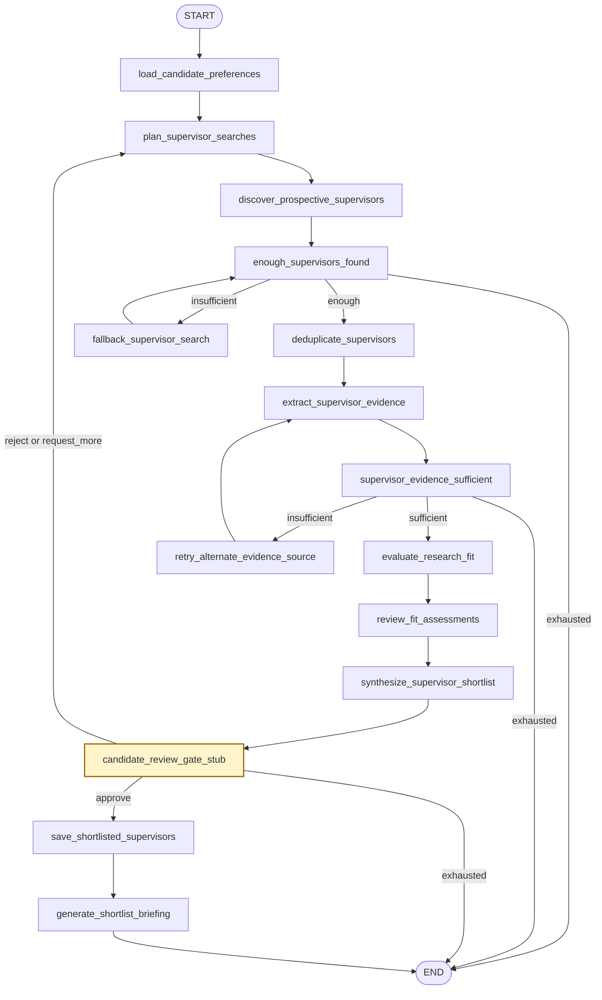
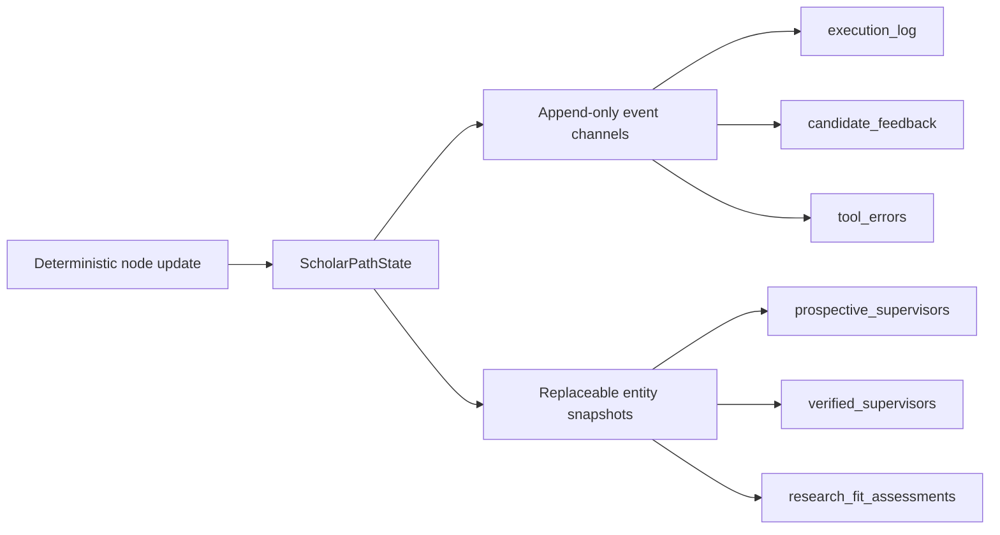
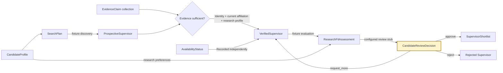
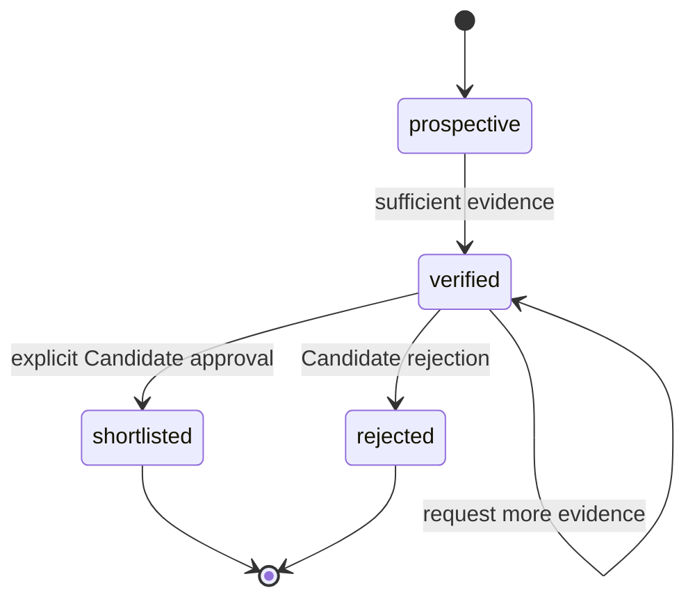
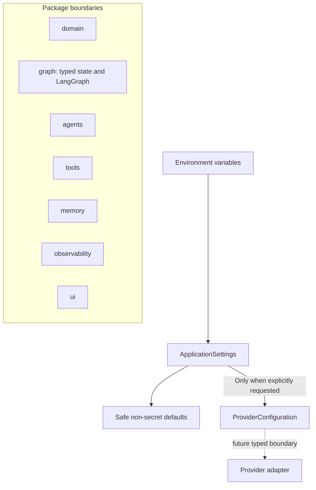
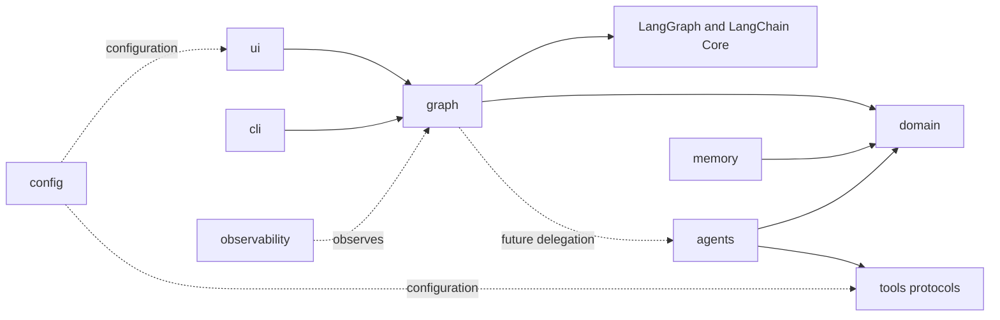
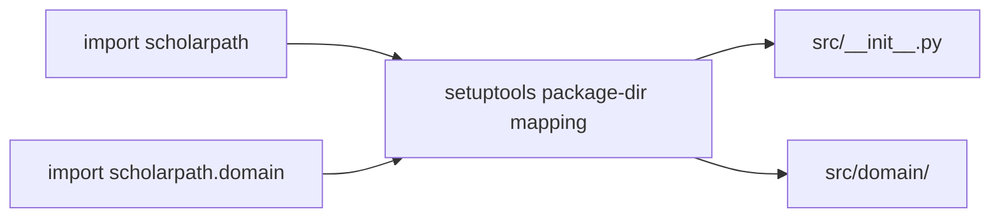

# ScholarPath M2 Architecture

M2 connects the M1 domain contracts through a deterministic LangGraph walking
skeleton. All 15 nodes use local fixtures, conditional routing is ordinary Python,
and explicit counters terminate every retry loop. There is still no model, search
provider, memory service, live API, LangSmith tracing configuration, or web interface.

## Walking-skeleton orchestration



The graph-derived Mermaid source is preserved in
[`docs/m2-walking-skeleton.mmd`](m2-walking-skeleton.mmd). A contract test compares the
complete normalized artifact with `compiled_graph.get_graph().draw_mermaid()` so
documentation drift is detected offline.

## Typed state and reducer policy



| State category | Channels | Merge behavior |
|---|---|---|
| Immutable input | `candidate_profile` | Preserved |
| Append-only history | preferences, raw results, feedback, errors, execution log | Typed reducers append new events |
| Canonical snapshots | Prospective, Verified, Research Fit, proposed and shortlisted records | Latest node output replaces the prior snapshot |
| Unique terminal history | rejected Supervisors | Reducer merges by `supervisor_id` |
| Routing control | retry counts and review status | Deterministic replacement |
| Validated output | authoritative `supervisor_shortlist`, projected list, and briefing | Created only after Candidate approval; contract-tested for consistency |

This distinction prevents a planning loop from duplicating canonical Supervisor
collections while retaining an auditable history of searches, decisions, errors, and
node execution.

## Bounded routing

```text
Failed sufficiency check
        ↓
retry count below configured maximum? ── no ──> record sanitized error ──> END
        │
       yes
        ↓
execute fallback or alternate node
        ↓
increment explicit counter
        ↓
repeat sufficiency check
```

The LangGraph recursion limit remains defense-in-depth. It is not the workflow's
termination mechanism. Fixture configuration caps each retry budget at five and derives
a recursion guard above the maximum valid configured path.

## Domain contract flow



M1 defines the payloads on these boundaries. M2 exercises them with deterministic
fixture data but still does not calculate scores, perform live discovery, or present a
review interface.

## Verification boundary

A Prospective Supervisor becomes a Verified Supervisor only when directly supported,
same-Supervisor evidence establishes all three required categories:

1. identity;
2. current affiliation; and
3. a research interest or publication.

Availability is a separate fact. `not_stated` never blocks verification. Any stronger
availability status must match a typed, directly supported availability claim;
`conflicting_evidence` requires both accepting and not-accepting claims. This prevents
research activity from being mistaken for current doctoral availability.

The verification helper derives this status from the typed claims. With no direct
availability claim it deterministically selects `not_stated`, so availability cannot
become a verification prerequisite.



The self-loop represents an unchanged lifecycle status, not a persisted state
transition. Shortlisted and rejected states are terminal in M1. Each terminal record
retains the matching Candidate review decision, so deserialization cannot create a
terminal status from a bare status flag.

## Foundation structure



Importing `scholarpath` does not instantiate settings or validate credentials.
`ApplicationSettings` loads non-secret defaults and optional secrets. A future provider
adapter must call `for_provider()` during its own construction, which activates
provider-specific credential validation at that boundary.

## Dependency direction



Solid arrows include implemented M2 dependencies; dashed arrows remain future-facing.
Domain rules stay independent of LangGraph, provider SDKs, and user-interface code.

## Physical package layout

The repository avoids an additional physical package-name directory beneath `src/`.
Setuptools maps the `scholarpath` import namespace directly onto the physical source
root.



```text
src/
├── __init__.py
├── cli.py
├── config.py
├── py.typed
├── domain/
├── agents/
├── graph/
├── memory/
├── observability/
├── tools/
└── ui/
```

Strict editable installation materializes this logical mapping for runtime and static
analysis while source files remain in the flattened structure.

## M2 quality boundaries

| Concern | M2 control |
|---|---|
| Packaging | Flattened physical `src/` mapped to the `scholarpath` namespace |
| Configuration | Pydantic settings with deferred secret validation |
| Data contracts | Frozen Pydantic models reject unknown fields and invalid values |
| Provenance | Each evidence claim carries source URL, kind, retrieval time, and confidence |
| Determinism | Validation, deduplication, sorting, routing, retry arithmetic, and transitions use ordinary Python logic |
| Human authority | Terminal records retain the matching Candidate review decision |
| Network isolation | Default pytest selection excludes tests marked `live` |
| Orchestration | LangGraph coordinates typed fixture-backed nodes without a model or live tool |
| Termination | Discovery, evidence, and review loops have explicit maximum retry counts |
| Quality | Ruff formatting/linting, strict mypy, pytest, and branch coverage |
| Automation | Path-scoped GitHub Actions workflow on Python 3.12 |
| Secrets | Environment variables, `SecretStr`, ignored `.env`, and sanitized errors |

## Deferred beyond M2

- Agent implementations or model SDKs
- Search clients and evidence retrieval
- Research Fit calculation policy and ranking
- Source authority, freshness, and conflict-resolution policy
- Real Candidate interaction and graph interruption/resumption
- Preference-only `request_more` refinement currently replays the same synthetic cohort
- Streamlit user experience
- Preference-memory services
- LangSmith runtime tracing
