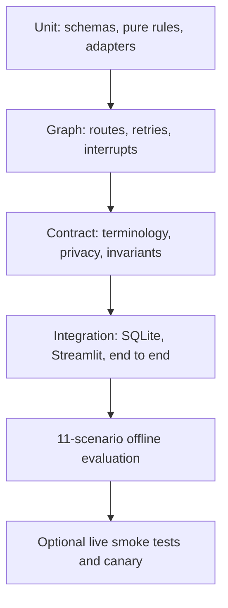

# ScholarPath Project Submission

- **Project:** ScholarPath — Multi-Agent Postgraduate Supervisor Discovery and Research-Fit System
- **Delivery surface:** Streamlit web application
- **Agent pattern:** Stateful multi-agent workflow with deterministic orchestration and a durable
  human-review interrupt
- **Repository:** [github.com/shanly-rajan/ai-builder](https://github.com/shanly-rajan/ai-builder/tree/scholar-path/projects/scholar-path)

This document is structured so it can be copied into the required submission document. It
separates measured engineering results from product targets and keeps deterministic offline proof
distinct from optional provider-backed execution.

## Canonical one-liner

ScholarPath helps a Candidate pursuing postgraduate research discover, verify, evaluate, and
shortlist research-aligned Supervisors in a Streamlit web application, replacing hours of
fragmented searching across university profiles and academic publications. It plans, searches,
verifies evidence, assesses Research Fit, independently reviews recommendations, and learns from
explicit feedback using six operational integrations; it pauses before any shortlist write, with
a product target of five evidence-backed recommendations in under 15 minutes and at least four
rated relevant by the Candidate.

The final latency and relevance clause is the product target. The current release proves the
workflow and safety controls but does not yet claim calibrated live-user achievement of that
target.

## Agent-design framework

Each field below follows the requested one-to-two-sentence limit.

| Field | ScholarPath answer |
|---|---|
| **Agent goal** | Help a Candidate complete an evidence-backed Supervisor search from research profile to explicitly approved shortlist. |
| **Where do people use it?** | Candidates use a Streamlit web application. Developers use privacy-safe LangSmith traces and evaluations to inspect routes and regressions. |
| **What steps does it take, in order?** | Capture the research profile and preferences; plan and execute source-diverse searches; deduplicate and verify evidence; evaluate and independently review Research Fit; propose a shortlist; then pause for Candidate approval, rejection, or revised preferences. |
| **What can it actually do?** | It creates typed search plans, searches You.com with bounded Tavily fallback, extracts known pages, verifies source-backed claims, evaluates and reviews Research Fit, learns from explicit Candidate feedback, and persists only an approved shortlist. Reads, computation, telemetry writes, memory writes, and shortlist writes are classified explicitly below. |
| **What does it need to remember?** | LangGraph stores the current run in a thread-isolated checkpointer. Mem0 stores only durable Candidate preferences across sessions, while Streamlit Session State keeps interface controls and the opaque thread ID rather than the complete graph state. |
| **What should it never do?** | Never invent evidence, infer supervision availability, calculate admission probability, expose secrets or personal data in traces, or use Candidate memory as factual authority about a Supervisor. Never persist a shortlist or generate outreach before explicit Candidate approval. |
| **Human-in-the-loop** | LangGraph interrupts after producing a proposed shortlist. The Candidate approves exact Supervisor IDs, rejects Supervisors with a reason, or requests more research with revised preferences. |
| **What happens when something breaks?** | Typed provider errors use explicit timeouts, bounded retries, partial-result preservation, and safe terminal states; a retryable You.com failure can route to Tavily, while an authentication failure stops immediately. The UI shows recoverable guidance without raw exceptions or stack traces. |
| **How do you know it worked?** | The product target is five evidence-backed recommendations in under 15 minutes, with at least four rated relevant by the Candidate. Deterministic regression measures additionally require valid schemas and evidence IDs, source URLs, score consistency, correct fallback, zero post-deduplication duplicates, safe availability, and approval enforcement. |

## Project overview

Finding a suitable postgraduate Supervisor is a multi-stage research problem. A Candidate must
translate a research direction into search concepts, inspect fragmented institutional pages,
separate a person from an organisation or publication result, verify current claims, compare
research alignment, and retain enough provenance to make a defensible decision.

ScholarPath turns that manual workflow into an agentic system. It does not ask one model to return
a list of names. Instead, specialised agents operate over typed state, external tools are isolated
behind ports, Python owns deterministic control decisions, and the workflow stops at a human gate
before any lifecycle-changing write.

## Why this is an agentic system

```mermaid
flowchart LR
    Intake[Candidate profile] --> Memory[Load preferences]
    Memory --> Plan[Plan searches]
    Plan --> You[You.com search]
    You -->|retryable failure or insufficient results| Tavily[Tavily fallback]
    You --> Dedupe[Deterministic deduplication]
    Tavily --> Dedupe
    Dedupe --> Evidence[Extract and verify evidence]
    Evidence -->|insufficient, retry unused| Alternate[Alternate official source]
    Alternate --> Evidence
    Evidence --> Fit[Research Fit evaluation]
    Fit --> Review[Nebius independent review]
    Review --> Gate{{Candidate review interrupt}}
    Gate -->|valid explicit action| Learn[Learn explicit preferences]
    Learn -->|reject or request more| Plan
    Learn -->|approve exact IDs| Save[Persist shortlist]
    Save --> Brief[Generate briefing]

    classDef human fill:#fff4cc,stroke:#9a6b00,stroke-width:2px;
    class Gate human;
```

The graph holds state across calls, selects conditional routes, preserves useful partial work,
enforces finite loops, and resumes the same checkpoint after human input. Routing, validation,
deduplication, arithmetic, lifecycle transitions, reconciliation, and ranking remain
deterministic; models cannot silently change these controls.

## Multi-agent responsibilities

| Agent | Responsibility and boundary |
|---|---|
| **Candidate Intake Agent** | Structures the Candidate's research direction, preferences, and exclusions. |
| **Research Planning Agent** | Uses typed OpenAI output to produce four to eight source-diverse queries; it does not search. |
| **Supervisor Discovery Agent** | Converts normalized search results into Prospective Supervisors without scoring Research Fit or inferring availability. |
| **Evidence Verification Agent** | Extracts and classifies claims from retrieved pages while retaining URLs, timestamps, confidence, direct support, and conflicts. |
| **Research Fit Evaluation Agent** | Produces evidence-cited rubric components; Python validates bounds and totals. |
| **Independent Review Agent** | Uses Nebius to audit the initial assessment without searching or adding evidence; deterministic reconciliation owns the final application of a review. |
| **Shortlist Synthesis Agent** | Ranks only eligible Verified Supervisors with stable deterministic tie-breakers and proposes at most five. |
| **Preference Learning Agent** | Writes Candidate-scoped durable preferences only after an explicit action. |
| **Orchestrator Agent** | Uses LangGraph to coordinate state, fallbacks, retries, interrupts, resume, and finite loops. |

## Actions, tools, and write boundaries

| Capability | Integration | Action class | Boundary |
|---|---|---|---|
| Typed search planning, evidence extraction, and initial Research Fit | OpenAI | Compute | Structured output only; no autonomous browsing or routing |
| Primary web discovery | You.com | Read | One query at a time with timeout, result limit, and typed errors |
| Fallback search and known-page extraction | Tavily | Read | Bounded calls; search snippets do not become verified facts |
| Independent Research Fit audit | Nebius | Compute | No browsing, new evidence, availability inference, or shortlist mutation |
| Candidate preference retrieval and learning | Mem0 | Read/write | Candidate-scoped; writes occur only after explicit actions and never store Supervisor facts |
| Tracing and evaluation | LangSmith | Telemetry write | Optional, redacted, low-cardinality metadata; never a factual source |
| Current-run checkpoint | LangGraph with in-memory or SQLite saver | State write | Isolated by opaque thread ID; resume is idempotent |
| Shortlist persistence | ScholarPath graph node | Business write | Runs only after validated approval of exact IDs from the current proposal |

These are the six operational integrations referenced in the one-liner: OpenAI, You.com,
Tavily, Nebius, Mem0, and LangSmith. LangGraph, SQLite, Pydantic, and Streamlit form the
application platform around them.

## State, memory, and human authority

ScholarPath separates three state lifetimes:

| Lifetime | Store | Examples | Not stored there |
|---|---|---|---|
| Interface session | Streamlit Session State | Widget values and current thread ID | Complete LangGraph state, provider secrets, or evidence pages |
| Current research run | LangGraph checkpointer | Plans, attempts, Prospective and Verified Supervisors, assessments, feedback, lifecycle state | Cross-Candidate global state |
| Cross-run durable preference | Mem0 | Preferred themes, regions, modes, methods, exclusions, rejection reasons, useful concepts | Affiliation, publications, availability, URLs, scores, or graph position |

Reads and deterministic computation may run autonomously. A Candidate action is mandatory before
preference writes and before a Verified Supervisor becomes a Shortlisted Supervisor. Outreach is
not implemented in this release and remains reserved for a future, separately approved write
boundary.

## Failure recovery

ScholarPath treats failure as an expected route rather than an unhandled exception:

- OpenAI planning and Research Fit have one bounded structured-output repair attempt.
- You.com has a finite retry policy; retryable failure, low yield, or duplicate-heavy results can
  route to a bounded Tavily fallback.
- Successful results survive a later query failure instead of being discarded.
- Evidence retrieval can try one alternate official source while retaining partial claims.
- Nebius failure preserves the original assessment with reduced confidence rather than crashing.
- Invalid Candidate responses and repeated `request_more` actions have finite iteration limits.
- Authentication failures stop immediately; exhausted recoverable routes end with a safe UI
  status and retained audit state.

## Technology stack and decisions

| Technology | Use | Why it was selected |
|---|---|---|
| Python 3.12+ | Application and deterministic domain logic | Mature typing, validation, testing, and agent ecosystem |
| LangGraph | Stateful orchestration, routing, interrupt, resume | Makes control flow and human handoff explicit and durable |
| Pydantic | Domain and model-output contracts | Rejects malformed or ambiguous data before it enters the graph |
| Streamlit | Candidate-facing web interface | Fast, focused delivery while business logic stays outside the UI |
| SQLite / InMemorySaver | Local durable / test checkpoints | Restart-safe local development and isolated deterministic tests |
| OpenAI | Structured planning, evidence extraction, Research Fit | Native JSON-schema output behind typed adapters |
| You.com and Tavily | Primary search, fallback, page extraction | Provider diversity and bounded degradation paths |
| Nebius | Independent Research Fit review | Separate provider/model perspective without tool access |
| Mem0 | Candidate preference memory | Candidate-scoped cross-run learning, isolated from Supervisor facts |
| LangSmith | Optional tracing and evaluation | Route inspection and regression experiments without replacing pytest |
| pytest, Ruff, mypy, GitHub Actions | Quality gates | Offline repeatability, strict typing, coverage, and CI enforcement |

## Datasets and sources used

ScholarPath was not trained on a bespoke dataset. Development and evaluation use:

- fixture factories for eight Prospective Supervisors, six Verified Supervisors, and five
  Research Fit assessments;
- fixed HTML and Markdown pages covering complete profiles, missing affiliation or research,
  explicit and absent availability, conflicts, and extraction failure;
- an eleven-scenario synthetic evaluation dataset covering strong fit, superficial overlap,
  missing availability, conflicting affiliation, duplicate discovery, You.com timeout and
  Tavily fallback, extraction failure, reviewer disagreement, rejection, approval enforcement,
  and source-diverse planning; and
- fake provider ports and an in-memory checkpointer for the default end-to-end journey.

Provider-backed runs retrieve public university profiles, department and research-group pages,
publication or project pages, and explicit supervision statements at runtime. Full page content
is transient; retained claims preserve concise text, exact source URL, source kind, retrieval
time, confidence, direct-support status, and conflicts. Search snippets may support discovery but
do not verify factual claims when a stronger page source is required.

No real Candidate session, checkpoint database, Mem0 record, credential, full page, or production
trace is copied into the checked-in evaluation dataset or trace metadata.

## AI-assisted engineering approach

Codex was used as a senior pair engineer under the checked-in
[ScholarPath Engineering Contract](../AGENTS.md). The human supplied one bounded milestone at a
time, Codex inspected the repository before changing it, and each milestone stopped after its own
formatting, linting, strict typing, and deterministic tests passed.

Every milestone prompt is archived in [`docs/prompts/`](prompts/), and every outcome—including
files, tests, assumptions, lessons, and remaining debt—is recorded in the append-only
[`docs/build-journal.md`](build-journal.md). This made the AI-assisted process auditable and
reproducible rather than an undocumented sequence of code-generation requests. The linked hint
implementation from the challenge guideline was not copied.

## Prompts used during AI-assisted coding

Two prompt layers were versioned separately:

### Engineering milestone prompts

| Phase | Representative prompts | Result |
|---|---|---|
| Foundation | M0 repository contract; M1 domain contracts; M2 deterministic walking skeleton | Typed package, canonical terminology, fixtures, and full graph before providers |
| Provider integration | M3 OpenAI planning; M4 You.com; M5 Tavily; M6 evidence; M7 Research Fit; M8 Nebius | One fixture-backed node replaced at a time behind typed ports |
| Human control and memory | M9 durable interrupt; M10 Mem0; M11 Streamlit | Thread-safe pause/resume, explicit approval, preference learning, and UI |
| Evaluation and reliability | M12 LangSmith regression suite; M13 hardening and canary | Curated scenarios, privacy-safe observability, finite controls, and fake end-to-end proof |
| Measured repairs | M11.1 through M13.14 repair prompts | Diagnostics and observed failures drove narrowly bounded tuning without hidden gate relaxation |

The exact text is retained in the [prompt archive](prompts/); the
[build journal](build-journal.md) links each prompt to its implementation result.

### Runtime model prompts

| Prompt | Current version | Typed output and control boundary |
|---|---|---|
| Research Planning | `research-planning-v4` | Structured source-diverse SearchPlan; Python validates count, uniqueness, and source coverage |
| Evidence Verification | `evidence-verification-v4` | Structured claims grounded against retrieved page context; Python decides sufficiency |
| Research Fit Evaluation | `research-fit-evaluation-v1` | Evidence-cited components; Python validates bounds, arithmetic, and evidence ownership |
| Independent Review | `independent-review-v4` | Accept/revise result with deterministic removable and overlooked evidence allowlists |

Important model output is never parsed from free-form prose.

## Major iterations and tuning

| Iteration | Observation | Repair | Boundary preserved |
|---|---|---|---|
| Walking skeleton first | Provider integration would obscure control-flow defects | Built every graph node and conditional route with deterministic fixtures | No network in default tests |
| Resilient discovery | Primary search could time out, fail, return too few profiles, or repeat results | Added one bounded retry, Tavily fallback, partial-result preservation, and typed attempt records | Provider adapters contain no domain reasoning |
| Discovery quality | Many raw results failed conservative person/institution checks | Added privacy-safe exclusion counts and narrowly tuned exact academic context | Non-person results remain excluded |
| Verification diagnostics | Page retrieval succeeded while mandatory evidence remained absent | Separated retrieval from verification and reported retained versus directly grounded evidence | Missing claims are never fabricated |
| Alternate sources | Original profiles could be unavailable or weak | Added one bounded alternate official-source search and extraction retry | Search snippets select a URL but do not verify facts |
| Structured planning resilience | Live plans occasionally violated query-shape constraints | Added native schema bounds, semantics-preserving quote normalization, typed transient errors, and one retry | Routing and validation remain deterministic |
| End-to-end MVP visibility | Strict live evidence gates sometimes prevented later-stage demonstration | Added an explicitly labelled `identity_only_mvp` mode and a two-Supervisor continuation floor | Strict remains default; missing Research Fit is shown as not established |
| Independent review | Nebius succeeded structurally but four revisions cited ineligible evidence IDs | Added deterministic evidence-reference allowlists and independent-review prompt v4 | Reconciliation still fails closed and preserves the original assessment |
| Reviewer interface | Long pages and light-theme contrast obscured the decision | Added collapsed outcome cards, academic styling, postgraduate scope, demo profile, and tested theme contrast | UI controls do not change graph state or evidence rules |

## Testing, evaluation, and observed results

| Evidence | Recorded result |
|---|---|
| Complete non-live pytest suite | **1,579 passed**, nine live tests deselected, 71 subtests passed |
| Coverage | **91.09%**, above the required 90% gate |
| Formatting and lint | Ruff passed |
| Static typing | Strict mypy passed across 205 source files |
| Offline evaluation | **11/11 scenarios passed** every applicable deterministic evaluator |
| End-to-end failure journey | You.com failure → Tavily fallback → verification → fit → review → rejection → preference learning → replanning → approval → shortlist → briefing |
| Human approval | Zero Shortlisted Supervisors before approval; only exact IDs from the active proposal can persist |

Deterministic evaluators own facts that code can check exactly: schema validity, terminology,
evidence ownership, URLs, score range and totals, unsupported availability, admission-probability
prohibition, fallback route, duplicate rate, and human approval. Qualitative LLM judges and live
provider experiments are optional and remain separate from the accepted offline baseline.

## Success metrics

| Metric | Type | Current status |
|---|---|---|
| Five evidence-backed recommendations | Product outcome | Demonstrated with deterministic fixtures; live yield varies by provider and evidence quality |
| Complete run under 15 minutes | Product target | Not yet calibrated over a representative provider-backed sample |
| At least four of five rated relevant | Product target | Requires real Candidate ratings; not yet claimed as achieved |
| Valid schemas, evidence IDs, URLs, arithmetic, availability, fallback, deduplication, approval | Deterministic safety and regression gates | All applicable checks passed in the eleven-scenario offline baseline |
| Complete workflow trace | Observability target | Supported through optional LangSmith tracing with redacted metadata; deterministic tests do not require the network |

## Lessons learned and workflow observations

1. **Control flow was harder than prompt wording.** State ownership, finite loops, fallback routes,
   interrupt resume, and approval authority determined whether the system was genuinely agentic.
2. **Retrieval is not verification.** A provider returning page content does not establish a
   current affiliation, research claim, or supervision status.
3. **Structured output still needs semantic validation.** A response can satisfy JSON Schema and
   still reference evidence that is wrong for the requested decision.
4. **Diagnostics should precede relaxed gates.** Privacy-safe counts revealed whether recall was
   lost at person recognition, institution extraction, source selection, retrieval, grounding, or
   cohort routing.
5. **Fallback must retain partial success.** A later provider failure should not erase earlier
   useful profiles or verified evidence.
6. **Offline and live quality need separate layers.** Fakes make CI deterministic; opt-in live
   tests measure integration drift without making ordinary development dependent on credentials.
7. **Availability is not Research Fit.** Missing availability remains `not_stated`, and neither
   availability nor fit is converted into admission probability.
8. **Human approval is an architectural control.** It must be enforced in graph routing and
   persistence, not expressed only as UI text or a prompt instruction.

## Known limitations

- The current release is for trusted local use; authenticated Candidate identity and
  principal-to-thread authorization are not implemented.
- SQLite is suitable for local restart-safe persistence, not multi-process production use.
- Provider calls and per-Supervisor work are synchronous, so live latency grows with cohort size.
- Evidence proves what a retrieved source stated at retrieval time; it does not guarantee that the
  source is complete, correct, or current.
- Conservative discovery and alternate-source rules can reduce recall.
- The identity-only MVP mode intentionally defers affiliation and research-evidence gates and must
  not be presented as strict evidence-backed verification.
- Real Candidate relevance ratings and representative end-to-end latency measurements are still
  required to validate the primary product target.
- Mem0 consent, retention, deletion, and data-residency governance remain production work.

## Future roadmap

1. Add authenticated Candidate identity, thread authorization, consent, and retention controls.
2. Move checkpoints to an encrypted multi-process store with explicit lifecycle policies.
3. Add rate-aware asynchronous provider execution and a whole-run latency budget.
4. Calibrate discovery, verification, Research Fit, and independent review on labelled examples
   and real Candidate relevance ratings.
5. Add source freshness and authority weighting without weakening provenance.
6. Add outreach drafting only behind a new explicit approval and audit boundary.

## Submission and demonstration links

- [ScholarPath README](../README.md)
- [Five-minute recording script](five-minute-demo.md)
- [Architecture](architecture.md)
- [Reliability review](reliability-review.md)
- [Evaluation plan](evaluation-plan.md) and [recorded baseline](evaluation-baseline.md)
- [Prompt archive](prompts/) and [build journal](build-journal.md)
- [Release checklist](release-checklist.md)

The final video recording should be attached through the submission form and kept to five minutes
or less, as required by the supplied guideline.
