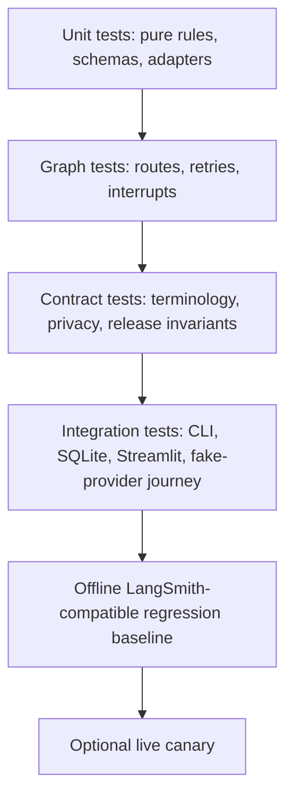

# ScholarPath M13 Architecture and Reliability Review

**Review date:** 2026-08-30
**Proposed release:** `v0.1.0`
**Release scope:** submission-ready local application and bounded, opt-in live integrations

ScholarPath turns a Candidate's doctoral research preferences into evidence-backed
Supervisor recommendations while retaining deterministic routing, provenance, and an
explicit Candidate approval boundary.

The release architecture is shown in
[`m13-release-architecture.mmd`](m13-release-architecture.mmd), and the exact orchestration
topology is shown in [`m13-langgraph-node-edge.mmd`](m13-langgraph-node-edge.mmd).

## Executive decision

M13 is suitable for a `v0.1.0` local-development release when every item in
[`release-checklist.md`](release-checklist.md) is complete. The architecture has clear typed
ports, deterministic lifecycle rules, bounded provider routes, durable human review, and an
offline regression suite. It is not yet a production multi-tenant service: authenticated
Candidate identity, thread authorization, production persistence, and data-retention controls
remain explicit roadmap work.

## Reliability controls

| # | Control | Release implementation | Verification and residual risk |
|---:|---|---|---|
| 1 | Explicit external-service timeouts | OpenAI planning, evidence, and Research Fit; Nebius review; You.com; Tavily search and extraction; Mem0; LangSmith tracing and evaluation all use validated finite request deadlines. Tavily Extract has separate provider and application deadlines. | Unit tests assert configured values reach adapters. A complete graph run has finite calls but no global wall-clock cancellation, so the live canary uses the smallest supported cohort. |
| 2 | Bounded retries | Provider SDK retries are disabled where the graph owns retry behavior. Planning and Research Fit each allow one structured-output repair; You.com permits one configured timeout retry; Tavily fallback, alternate evidence retrieval, review refinement, and invalid review input all have finite limits. LangSmith retries use a finite retry policy. | Route tests assert exact attempt sequences and exhaustion. Retry budgets may reduce recall during transient multi-provider outages. |
| 3 | Typed provider errors | Search, extraction, planning, evidence, Research Fit, independent review, memory, and application boundaries map failures into typed or sanitized categories. | State and UI receive safe categories rather than raw response bodies. Provider SDK changes still require adapter contract tests. |
| 4 | Partial-result preservation | Successful discovery results survive a later query failure. Evidence retries retain earlier claims and partially verified records rather than fabricating missing facts. | Graph tests cover later-query failure and alternate-source exhaustion. Partial records never enter Research Fit scoring. |
| 5 | Graph recursion and loop limits | Discovery, evidence, Candidate refinement, and invalid-input loops have validated finite budgets. The runtime calculates a finite LangGraph recursion limit from those budgets. | Recursion is defense-in-depth, not the normal stopping mechanism. Any new loop must extend both the explicit policy and recursion calculation. |
| 6 | Idempotent resume behavior | Checkpoint IDs reject stale review submissions, thread IDs select one persisted run, reducers merge replay-safe records, and a processed-feedback cursor prevents duplicate memory learning. | In-memory and close/reopen SQLite tests cover resume. Mem0 still has an at-least-once acknowledgement window mitigated by deterministic record IDs and pre-write lookup. |
| 7 | Approval before shortlist persistence | The interrupt accepts only exact IDs from the active proposal. Only `approved` routes to `save_shortlisted_supervisors`; viewing, rejection, and `request_more` retain zero Shortlisted Supervisors. | Graph, SQLite, UI-service, and deterministic evaluation assertions cover the invariant. |
| 8 | Approval before outreach | Outreach drafting is not implemented in `v0.1.0`, and contract tests preserve that absence. | When outreach is added, it must be downstream of a fresh explicit approval and have a separate audit trail. |
| 9 | Secret redaction in logs and traces | Trace metadata is scalar-allowlisted; graph and evaluation clients hide inputs and outputs; provider errors are sanitized; UI failures use generic messages. Privacy-safe local graph logs project only channel presence, counts, enum outcomes, retry values, updated channel names, and typed error codes. Candidate and thread identifiers, queries, identities, URLs, page or evidence content, prompts, credentials, and raw exceptions are excluded. | The CLI deliberately prints the Candidate review payload and opaque local thread ID as user-facing output, not through the structured logger. Operators must treat console output as local workflow data and must not redirect it to an unrestricted log sink. |
| 10 | Candidate isolation | LangGraph checkpoints are separated by opaque thread ID. Mem0 reads and writes require the stable Candidate user ID. Streamlit Session State keeps only widget state and the active thread ID. | Mechanical isolation is tested. Authentication and principal-to-thread authorization are not part of this release, so deployment is limited to trusted local use. |
| 11 | Maximum queries and Supervisors | A SearchPlan contains four to eight distinct queries. Provider result counts, primary retries, fallback calls, retained Prospective Supervisors, evidence retries, and proposed shortlist size are capped. The retained cohort is stable after deterministic deduplication; the proposal contains at most five records. | Tests must prove that the cohort cap does not turn valid unique results into duplicate-heavy routing and that truncation is deterministic. |
| 12 | Clear UI failure messages | Typed recoverable failures are rendered as actionable warnings; terminal states say the run stopped safely; raw exceptions and stack traces are not rendered. | AppTest covers recoverable provider failure, safe terminal status, grouped repeated errors, and absent secrets. |
| 13 | Reproducible dependency installation | `requirements.lock` is the exact-version constraints snapshot. Local setup and CI install pinned `pip==26.1.2` and `setuptools==84.0.0`, then install the project with `--constraint requirements.lock`. | This reproduces resolved versions but is not a hash-locked supply-chain guarantee. Regenerate and review the snapshot whenever dependencies change. |
| 14 | CI quality gates | GitHub Actions checks formatting, Ruff lint, strict mypy across `src`, `tests`, and `scripts`, deterministic non-live pytest, branch coverage, and dependency consistency on Python 3.12. Default non-live tests also block socket entry points. | CI validates the supported minimum Python version. Additional supported-version and dependency-vulnerability jobs are roadmap items. |
| 15 | Demonstration failure injection | Typed modes inject one You.com timeout, a retryable You.com failure, or retryable failures for both discovery providers. The default is off, and production configuration rejects an enabled mode. | Unit and end-to-end tests prove the fallback route. Failure injection must never be used as a production incident simulator. |

## Architecture decisions

| Decision | Reason | Trade-off |
|---|---|---|
| LangGraph owns workflow state and routing | Durable interrupts, typed state, conditional edges, and checkpoint resume match the human-controlled process. | Current graph execution is synchronous and sequential. |
| Pydantic schemas cross every model boundary | Important model output is validated before use and can be replaced by fakes. | Schema evolution requires coordinated prompt, adapter, test, and evaluation versioning. |
| Python owns deterministic operations | Routing, deduplication, evidence sufficiency, lifecycle changes, arithmetic, reconciliation, and ranking remain explainable and repeatable. | Conservative rules can reduce recall and require curated regression examples. |
| You.com primary with Tavily fallback | Separates primary discovery from a bounded resilience path while retaining partial success. | Provider quality varies, and fallback calls add latency and cost. |
| Tavily Extract retrieves known pages | Evidence retrieval remains separate from evidence interpretation and preserves exact source provenance. | A two-source extraction policy may miss a usable third source. |
| OpenAI extracts and evaluates structured content | Native structured output supports typed planning, evidence drafts, and Research Fit components without prose parsing. | Model variability remains and is constrained by deterministic validation and bounded retry. |
| Nebius independently reviews Research Fit | A separate model/provider can identify unsupported claims and inflated scores without searching or changing evidence. | Independent review adds latency and cost; failure degrades confidence rather than stopping the graph. |
| Mem0 stores only durable Candidate preferences | Cross-run personalization is isolated from Supervisor facts and graph position. | Consent, residency, retention, and deletion governance remain production work. |
| SQLite is the local durable checkpointer | It supports restart-safe local demonstration with minimal infrastructure. | It is not the selected multi-process production database. |
| LangSmith tracing and evaluation are optional | Traces and curated experiments supplement offline tests without making them network-dependent. | Live observability requires correct endpoint, workspace, credentials, and explicit opt-in. |
| Privacy-safe local graph logging is always available | Standard-library structured events make node execution, routing, interrupts, and actual Nebius adapter use diagnosable even when LangSmith is disabled. | Summaries deliberately omit raw inputs and outputs, so detailed content debugging still requires a controlled local reproduction rather than expanding production logs. |
| Streamlit is a delivery adapter | It enables a focused Candidate workflow while keeping graph construction and business rules outside the UI. | Authenticated multi-user delivery and browser hardening remain deferred. |

## Dataset and source boundaries

ScholarPath uses three distinct data categories:

| Category | Included | Excluded or constrained |
|---|---|---|
| Discovery results | URL, title, bounded description/snippets, optional publication date, provider, and exact originating query | Search snippets may create a Prospective Supervisor but cannot verify a factual claim or imply availability. |
| Verification sources | Retrieved official person profiles, department or research-group pages, publication or project pages, and explicit doctoral-supervision pages | Full page content is transient. State retains concise grounded claims, source URL, source kind, retrieval time, confidence, and conflicts. |
| Evaluation dataset | Eleven fictional, deterministic scenarios covering strong and weak fit, missing availability, conflicts, duplicates, fallback, extraction failure, reviewer disagreement, rejection, approval, and source-diverse planning | No real Candidate session, production trace, checkpoint, Mem0 record, credential, or full provider page is copied into the dataset. |

Supervisor facts remain authoritative only when grounded in a retrieved source. Mem0 is never
the source of truth for affiliation, publications, availability, evidence URLs, Research Fit
Scores, or graph position.

## Test strategy

- Unit tests own exact deterministic facts and mocked transport contracts.
- Graph tests own conditional routes, partial work, loop exhaustion, lifecycle state, and
  idempotent resume.
- Contract tests own canonical terminology, prompt/document presence, privacy boundaries,
  dependency/CI policy, and absence of premature outreach.
- Integration tests own SQLite restart, application-thread resume, Streamlit behavior, and the
  complete fake-provider reject/refine/approve journey.
- The offline evaluation baseline supplements pytest with curated scenarios and deterministic
  evaluators. LLM judges remain optional and advisory.
- Every live test is marked `live`, requires `SCHOLARPATH_RUN_LIVE_TESTS=true`, checks its own
  credential and stronger feature gate, and is excluded from default pytest and CI.

## LangSmith evaluation summary

The checked-in M12 regression dataset has eleven synthetic scenarios and ten deterministic
metrics covering schemas, terminology, evidence IDs, source URLs, score arithmetic,
availability, admission-probability prohibition, fallback routing, deduplication, and human
approval. The M13 release baseline uses the M13 graph-version identifier and must pass all
eleven scenarios. The accepted offline replay passed `11/11` scenarios and every applicable
deterministic evaluator. Live experiments and the four qualitative LLM judges remain separate,
explicit operations.

See [`evaluation-plan.md`](evaluation-plan.md) and
[`evaluation-baseline.md`](evaluation-baseline.md) for metric definitions and the exact
recorded outcome.

## Known limitations

- The Streamlit application has no authenticated Candidate identity or authorization binding a
  principal to a thread. `v0.1.0` is therefore a trusted local-use release.
- SQLite checkpointing is local and single-process oriented; encryption, automated retention,
  and a production database are not selected.
- Provider calls and per-Supervisor processing are synchronous, so worst-case latency grows with
  the retained cohort despite finite limits.
- Evidence proves that text appeared on a retrieved source; it does not prove the source itself
  is current or correct.
- Alternate evidence retrieval is deliberately conservative and may miss a valid third source.
- Availability can be stale. Absence always remains `not_stated`, and ScholarPath never
  calculates an admission probability.
- Mem0 consent, deletion, residency, and retention controls require a production governance
  decision.
- Exact-version constraints improve reproducibility but do not provide artifact hashes or a
  software-bill-of-materials attestation.
- LLM judge thresholds are not yet calibrated against a labelled set of Candidate ratings.

## Roadmap after `v0.1.0`

1. Add authenticated Candidate identity, thread authorization, and auditable consent controls.
2. Move checkpoints to an encrypted, multi-process production store with retention policies.
3. Add async provider execution with rate-aware concurrency and a whole-run latency budget.
4. Calibrate discovery, evidence, Research Fit, and reviewer behavior on labelled multilingual
   examples and Candidate relevance ratings.
5. Add source freshness and authority weighting without weakening provenance.
6. Add dependency hashes, an SBOM, vulnerability scanning, and signed release provenance.
7. Add outreach drafting only behind a new explicit Candidate approval and audit boundary.

## Release recommendation

Use the Git tag **`v0.1.0`** only after the complete non-live gates, offline evaluation replay,
package installation check, fake-provider end-to-end journey, documentation contracts, and
clean-worktree checks in [`release-checklist.md`](release-checklist.md) pass. The optional live
canary informs release confidence but is never allowed to replace the deterministic gate.
