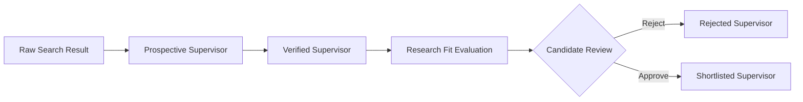

# ScholarPath Terminology

Canonical terminology is part of the domain contract. Consistent role names prevent
workflow-state ambiguity and keep human approval boundaries explicit.

## Canonical roles and concepts

| Term | Meaning |
|---|---|
| **Candidate** | The person pursuing a doctorate and using ScholarPath. |
| **Supervisor** | The academic or researcher being researched. |
| **Prospective Supervisor** | A discovered Supervisor whose relevant information has not yet been fully verified. |
| **Verified Supervisor** | A Prospective Supervisor whose relevant information has been checked against supporting sources. |
| **Shortlisted Supervisor** | A Verified Supervisor explicitly approved by the Candidate. |
| **Rejected Supervisor** | A Supervisor excluded by the Candidate. |
| **Research Fit Score** | The assessed alignment between the Candidate's doctoral interests and a Supervisor's verified research profile. |

The word **Candidate** always refers to the ScholarPath user. A Supervisor must always
be described with the appropriate Supervisor lifecycle term. Ambiguous compound labels
are prohibited by the engineering contract.

## Supervisor lifecycle

Only explicit Candidate approval can create a Shortlisted Supervisor.

## Availability vocabulary

Availability is a sourced fact, never an inference from research activity or profile
content.

| Status | Meaning |
|---|---|
| `confirmed_accepting` | A current authoritative source explicitly states that the Supervisor is accepting doctoral Candidates. |
| `confirmed_not_accepting` | A current authoritative source explicitly states that the Supervisor is not accepting doctoral Candidates. |
| `not_stated` | No authoritative availability statement was found. |
| `conflicting_evidence` | Current sources disagree about availability. |

ScholarPath never calculates an admission probability and never treats a Research Fit
Score as proof of availability or admission likelihood.
