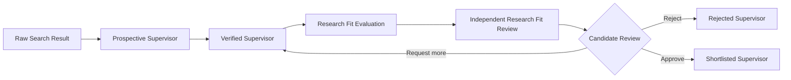

# ScholarPath Terminology

Canonical terminology is part of the domain contract. Consistent role names prevent
workflow-state ambiguity and keep human approval boundaries explicit.

## Canonical roles and concepts

| Term | Meaning |
|---|---|
| **Candidate** | A person pursuing postgraduate research. |
| **Supervisor** | The academic or researcher being researched. |
| **Prospective Supervisor** | A discovered Supervisor whose relevant information has not yet been fully verified. |
| **Verified Supervisor** | A Prospective Supervisor whose relevant information has been checked against supporting sources. |
| **Shortlisted Supervisor** | A Verified Supervisor explicitly approved by the Candidate. |
| **Rejected Supervisor** | A Supervisor excluded by the Candidate. |
| **Research Fit Score** | The assessed alignment between the Candidate's research-degree interests and a Supervisor's verified research profile. |
| **Proposed Supervisor recommendation** | A ranked, evidence-backed Verified Supervisor presented for Candidate review; it is not yet a Shortlisted Supervisor. |

The word **Candidate** always refers to the ScholarPath user. A Supervisor must always
be described with the appropriate Supervisor lifecycle term. Ambiguous compound labels
are prohibited by the engineering contract.

## Postgraduate research product scope

The active ScholarPath interface supports evidence-backed Supervisor discovery for postgraduate
research. `1. Your Research Degree Profile` accepts a typed research statement, topics, regions,
study modes, orientation, methods, and exclusions; it adds no degree-type field and infers no
programme eligibility.

This broader presentation does not broaden evidence. A source-backed fact retains its exact
meaning and postgraduate-degree context. A statement scoped to one postgraduate degree does not
establish availability for another, and the absence of a relevant statement remains
`not_stated`. The Candidate must confirm degree- and programme-specific eligibility with the
institution.

## Supervisor lifecycle

Only explicit Candidate approval can create a Shortlisted Supervisor. A request for
more information keeps the record verified while additional evidence is sought.
The M9 interrupted proposal also keeps every included record verified; the word
"shortlisted" describes only the post-approval lifecycle state.

## Candidate review vocabulary

| Term | Meaning |
|---|---|
| **Proposed Supervisor shortlist** | At most five ranked Verified Supervisors presented for review; no lifecycle promotion has occurred. |
| **Candidate review interrupt** | A persisted pause that hands control to the Candidate with evidence-backed proposal details. |
| **Approval response** | An explicit ordered list of proposal Supervisor IDs the Candidate chooses to shortlist. |
| **Rejection response** | One or more proposal Supervisor IDs, each paired with the Candidate's reason. |
| **Request-more response** | Revised research interests, regions, study modes, orientation, methods, constraints, or exclusions used for another bounded search. |
| **Thread ID** | An opaque run identifier that isolates one Candidate research workflow's checkpoints. |

Viewing or receiving an interrupt payload is never approval. Rejection and
`request_more` preserve feedback in graph state and can trigger another review only
within configured limits. A thread ID identifies workflow state; it is not a Candidate
name, email address, or authorization credential.

## Typed lifecycle values

| Value | Domain meaning |
|---|---|
| `prospective` | Discovered but not yet supported by sufficient verification evidence. |
| `verified` | The Supervisor passed the explicitly persisted verification evidence standard. Strict records directly support identity, current affiliation, and research-profile evidence; MVP identity-only records directly support identity and are visibly marked with concerns. |
| `shortlisted` | A Verified Supervisor explicitly approved by the Candidate. |
| `rejected` | A Verified Supervisor excluded by the Candidate. |

Research evidence records factual interests and publications about a Supervisor.
Candidate-specific alignment is expressed separately in a Research Fit assessment.
In M6, a claim is directly supported only when its retrieved-page excerpt explicitly
names the same Supervisor. Affiliation values and availability polarity must also match
that exact excerpt; page-level identity alone does not bind nearby facts to the person.

`partially_verified` is a verification outcome, not a Supervisor lifecycle value and
not a synonym for Verified Supervisor. It means retrieved evidence remains incomplete;
the record stays a Prospective Supervisor and retains its evidence, concerns, and
missing categories for a bounded alternate-source attempt.

## Verification evidence standards

| Standard | Blocking evidence gates | Minimum verified cohort | Required presentation |
|---|---|---:|---|
| `strict` | Directly grounded identity, current affiliation, and research interest or publication | 5 | Normal Verified Supervisor presentation |
| `identity_only_mvp` | Directly grounded identity | 3 | `verified_with_concerns`; discovered affiliation is labelled unverified; deferred affiliation and research gaps stay visible |

The MVP standard is an explicit workflow-validation mode, not permission to fabricate stronger
evidence. Identity evidence cannot support Research Fit components. When no fit-eligible evidence
exists, Research Fit is **not established**: every component receives zero points, low confidence,
and an explicit evidence gap. Availability still requires a direct statement, and Candidate
approval remains mandatory before shortlist persistence. The cohort value is a routing minimum,
not a quality score or required shortlist length. The synthesis stage may propose at most five
Verified Supervisors and never fills missing positions with partially verified records.
Implicit graph composition uses the same numeric floor at discovery and verification: five for
`strict` and three for `identity_only_mvp`. Passing the discovery floor only permits evidence
verification to begin; it does not change a Prospective Supervisor's lifecycle status.

## Availability vocabulary

Availability is a sourced fact, never an inference from research activity or profile
content.

| Status | Meaning |
|---|---|
| `confirmed_accepting` | A retrieved source explicitly names the Supervisor and states that they are accepting Candidates for postgraduate research in the source's stated degree context. |
| `confirmed_not_accepting` | A retrieved source explicitly names the Supervisor and states that they are not accepting Candidates for postgraduate research in the source's stated degree context. |
| `not_stated` | No directly supported availability statement was found. |
| `conflicting_evidence` | Current sources disagree about availability. |

An individual availability claim can assert only `confirmed_accepting` or
`confirmed_not_accepting`. `conflicting_evidence` is derived only when directly
supported claims establish both outcomes; `not_stated` requires neither. These values preserve
the postgraduate-degree context of the supporting source and must not be generalized from one
degree to another.

ScholarPath never calculates an admission probability and never treats a Research Fit
Score as proof of availability or admission likelihood.

## Research Fit vocabulary

The default M7 rubric is a 100-point decision-support contract: topic alignment 40,
methodological or disciplinary alignment 20, research orientation 15, recent research
activity 15, and practical constraints 10. Each positive component cites suitable,
directly supported evidence IDs. A missing-evidence component receives zero points,
low confidence, and an explicit evidence gap.

"Recent research activity" requires a typed publication or project `activity_year`
that is explicit in the supporting excerpt and inside the configured window; the M7
default is five years from evidence retrieval. Component confidence cannot exceed the
weakest cited evidence claim, and overall evidence confidence is derived
deterministically across the weighted rubric. M7 does not yet have typed region or
study-mode evidence, so current-affiliation prose cannot earn practical-constraint
points and that component remains zero with a stated gap.

Availability is reported next to a proposed recommendation but is not a scoring
component. The Research Fit model proposes component values; deterministic application
code validates citations and bounds, calculates the total, and ranks recommendations.

## Independent-review vocabulary

| Term | Meaning |
|---|---|
| **Initial assessment** | The immutable M7 component assessment whose score is the deterministic component sum. |
| **Independent review** | A closed-record Nebius audit of one initial assessment; it cannot browse or create evidence. |
| **Reconciled assessment** | The deterministic overlay containing the effective score, explanation, evidence IDs, confidence, and review outcome. |
| `accepted` | The reviewer accepted the assessment; the initial score, rationale, citations, and confidence are preserved. |
| `revised` | A valid review proposed a new effective score and explanation using only evidence IDs in the same Verified Supervisor record. |
| `unavailable` | The provider failed or the output was invalid; the initial score is preserved, confidence is lowered, and Candidate attention is required. |

An unsupported claim ID is removed only from the reconciled evidence view; the initial
assessment remains immutable for audit. An overlooked evidence ID must already be a
directly supported, grounded, non-availability claim for that Verified Supervisor.
Independent review never changes availability, Candidate preferences, lifecycle status,
or shortlist membership. Its effective score remains a Research Fit decision-support
signal and never represents admission probability.
