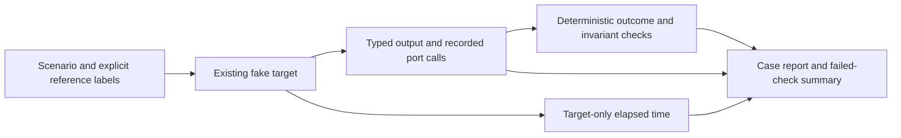

# Week 4 step 2: Expected outcomes and runtime measurements

Date: **2026-09-06**. Status: implemented and tested offline. This is evaluation
instrumentation for the existing eleven-case cohort, not a completed Week 4 submission.

**Measurement one-liner:** evaluate whether ScholarPath produces the declared evidence,
Research Fit, fallback, and Candidate-review outcomes without violating provenance or
approval rules; report execution time and application-call usage alongside correctness.

## Five headline metrics and numeric bars

| Metric | Definition / denominator | Initial pass bar |
|---|---|---|
| Expected outcome rate | Cases passing `expected_behavior` / selected cases. Invalid output, missing labels, missing expected records, and wrong IDs/statuses fail. A target error fails the case, not a successful empty result. | **100%**, no failed case |
| Evidence and availability integrity | Passed applicable `evidence_id_validity`, `source_url_presence`, and `no_unsupported_availability_claim` checks / all applicable checks in this group. | **100%**; no unsupported availability claim |
| Candidate approval enforcement | Graph cases passing `human_approval_enforcement` / applicable graph cases. `expected_behavior` also checks explicit empty shortlists and rejected-ID exclusion. | **100%** |
| Target latency | Target-only wall time, grouped by target family; report sample count, median and nearest-rank p95. Include failed target attempts. | Provisional fake-cohort **p95 ≤5 seconds** in every family |
| Application port usage | Calls recorded by the injected fake model, search, extraction and memory ports, including failed attempts and bounded retries. Report per-case total and family maximum. | Provisional **≤2/component case; ≤40/graph case** |

The eleven deterministic evaluators remain active; grouping headline metrics does not remove
schema, terminology, score arithmetic, admission-prediction, fallback, or deduplication checks.
Non-applicable checks are excluded from that check's denominator. A target error always fails
the overall case, even when it prevented invariant checks from producing observations.
The optional qualitative judges remain opt-in and have not been run or calibrated here.

Correctness is a hard gate. Runtime budgets are advisory by default because fake execution
speed varies with the machine. `--enforce-runtime-budgets` makes exceeded **or unknown**
runtime decisions fail the command. The report preserves the configured budget values.
Do not increase a budget silently to obtain a pass: record any revised budget and rationale
before baseline/comparison runs on the frozen dataset.

**Scope clarification (step 3ah):** a graph case includes all scripted Candidate
resumes, not just its first research pass. The [request-more attribution](week4-request-more-budget.md)
measures 38 calls for an initial-review case and 76 for its two-pass counterpart.
The unchanged 40-call whole-case bar fails for the latter. These fake application
calls cannot be divided by rounds and reported as satisfying the original budget.

## What changed

- `expected_behavior` now consumes the previously unused `expected_supervisor_ids` labels.
  It checks actual IDs rather than treating a valid output schema as task success.
- Typed verification labels require the declared completed/partial state, retained evidence,
  missing gates, and directly supported claim types. Conflicting affiliations must retain
  reciprocal claim links from distinct sources and surface verification concerns.
- The extraction-failure case must retain its partial record and the seven successful records;
  it cannot fabricate evidence for the failed profile or drop the successful work.
- Independent-review labels check the revised score, confidence, Candidate-attention flag,
  and expected reordered proposal. The planning case checks all declared source categories.
- Explicit empty ID lists mean “none expected”; `None` means “not scoped by this label.”
  Missing/malformed reference labels never pass the expected-outcome check.
- Each local case records target duration, evaluator duration, and measured port invocations.
  Uploaded experiments read SDK target timestamps and explicit counters from returned outputs;
  absent SDK fields stay unknown. Case identity is matched by example UUID, not row order.
  Duplicate rows cannot replace missing examples: missing cases and duplicate/unmatched
  SDK entries are failures. Anomalous extra entries also appear in the result denominator.
- Historical dataset `scholarpath-m12-regression-v1` is protected against new-label overwrite.
  The new provisional cohort is `scholarpath-week4-regression-v1`, schema version
  `week4-scenarios-v1`. The historical baseline document and release identity are retained.



Graph nodes, provider policies, UI, and human approval behavior are unchanged.

## Measurement limits

- Nearest-rank p95 uses sorted observation `ceil(0.95 × n)`. With fewer than twenty samples,
  it is the maximum; the current graph family has only six cases. This is not a statistically
  stable live latency estimate. Display rounding can show sub-millisecond durations as `0.000s`.
- Local monotonic timing excludes evaluator work. Fake graph runs pause/resume using scripted
  decisions, so they do not measure a person's review time. Uploaded SDK timestamps cover the
  target run, not judge execution; separate SDK evaluator time is unmeasured.
- Fake counters observe application-level port invocations, not HTTP requests or billed units.
  Internal SDK retries, token counts, and cost cannot be inferred from these counters.
- Component targets accepting an uninstrumented custom adapter report unknown usage. A failed
  target with no returned counter also reports unknown, not zero. Missing rows/timestamps stay
  visible in sample coverage and cannot satisfy an enforced budget.
- **Live token usage and monetary cost: unmeasured.** The live 900-second product objective
  is not established by fake timings. Fake-cohort budgets do not apply to `graph_live`.
- The existing real-provider experiment contains fixture-specific expected IDs. It needs
  separately reviewed live references before its expected-outcome scores mean live quality.
- No raw Candidate data, queries, evidence content, secrets, or exception text is copied into
  runtime summaries. Target labels are restricted to the five supported evaluation families.

## Recorded offline observation

Run: **`scholarpath-week4-fake-2026-09-06-1e27825a`**.
Environment: macOS, Python 3.14.6. Dataset: `scholarpath-week4-regression-v1`.
Graph version: `m13`. No LangSmith upload, live model/search/memory service, or judge run.

| Observation | Result |
|---|---|
| Overall case result | **11/11 passed**, zero failed cases |
| Expected outcomes | **11/11** |
| Evidence/availability group | **28/28 applicable checks**: IDs 8/8, URLs 10/10, availability 10/10 |
| Human approval enforcement | **6/6 graph cases** |
| Verification target | n=2; median **0.004s**, p95 **0.005s**; maximum **2** calls |
| Fake graph target | n=6; median **0.045s**, p95 **0.060s**; maximum **39** calls |
| Research Fit target | n=2; median **0.003s**, p95 **0.003s**; maximum **1** call |
| Planning target | n=1; median/p95 **<0.001s**; **1** call |
| Runtime budgets | All four families passed with complete measurement coverage |
| Live latency, tokens, monetary cost | **Not measured** |

This run establishes an instrumentation check on eleven synthetic cases. It is not evidence
of improved live Supervisor relevance, a human-reviewed golden dataset, or a before/after gain.
The stronger labels and new version prevent direct comparison to the older 11/11 baseline.

## Reproduce and inspect

From `projects/scholar-path`:

```bash
SCHOLARPATH_LOG_LEVEL=WARNING LANGSMITH_TRACING=false \
venv/bin/python scripts/run_evals.py --target all --enforce-runtime-budgets

venv/bin/pytest -o addopts='' -q \
  tests/unit/evaluation/test_expected_behavior.py \
  tests/unit/evaluation/test_measurements.py \
  tests/unit/evaluation/test_target_measurements.py \
  tests/unit/evaluation/test_runtime_reporting.py
```

To inspect the numeric per-case report without a network call:

```bash
SCHOLARPATH_LOG_LEVEL=WARNING LANGSMITH_TRACING=false venv/bin/python -c \
'from scholarpath.evaluation import run_local_baseline; print(run_local_baseline().model_dump_json(indent=2))'
```

Report names include the current UTC date and a unique suffix. Python callers can provide
`recorded_on` explicitly for reproducible tests; the default never reuses the Aug 30 date.

## Next bounded step

Verify one privacy-safe synthetic LangSmith trace, then curate and human-review a separately
versioned 30-case dataset. After freezing labels/budgets, run the measured baseline and choose
three to four small agent improvements from its actual failures. See [ordered triage](week4-triage.md).
