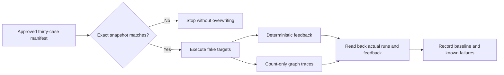

# Week 4: reviewed LangSmith baseline

This step connects the [frozen local baseline](week4-reviewed-baseline.md) to
LangSmith. It runs the same thirty synthetic scenarios and eleven deterministic
evaluators. Only LangSmith is live: models, search, extraction, and memory use
fakes. There are no LLM judges or paid provider targets.

This page records the historical **29/30** uploaded baseline. The subsequent
[step 3ag grounding repair](week4-heading-grounding-repair.md) measures **30/30
locally** against the same manifest; that after-run has not been uploaded here.



## Reproduce

From `projects/scholar-path`:

```bash
venv/bin/python -m pip install --no-index --no-deps --no-build-isolation -e . --config-settings editable_mode=strict
venv/bin/python scripts/upload_reviewed_evals.py --format json
```

Preview requires no credentials and makes no network calls. To explicitly upload
one experiment to your configured LangSmith endpoint/workspace:

```bash
SCHOLARPATH_RUN_LANGSMITH_EVALS=true LANGSMITH_TRACING=true SCHOLARPATH_LOG_LEVEL=WARNING \
venv/bin/python scripts/upload_reviewed_evals.py --upload --format json
```

The existing `LANGSMITH_API_KEY`, `LANGSMITH_ENDPOINT`, and optional workspace ID
are loaded by project settings; never paste them into documentation or reports.
Each upload invocation creates one experiment. Repeating it is not a read-only
inspection and is unnecessary just because the expected known failure remains.

Inspect the already-created experiment without executing targets or writing anything:

```bash
SCHOLARPATH_RUN_LANGSMITH_EVALS=true LANGSMITH_TRACING=false SCHOLARPATH_LOG_LEVEL=WARNING \
venv/bin/python scripts/upload_reviewed_evals.py \
  --inspect scholarpath-week4-reviewed-upload-m13-5c37c1c1 --format json
```

Inspection reconstructs observations from persisted feedback and numeric trace
telemetry. It never evaluates the sanitized count-only outputs as if they were
complete target responses. Missing telemetry stays unknown.

Exit **0** means all deterministic checks pass with complete readback; **1** means
the experiment completed with a measured correctness failure; **2** means a
configuration, snapshot, execution, or persistence/readback problem. Provisional
runtime budget results are reported separately, not silently waived.

## Reproducibility and privacy boundaries

- Fixed reviewed dataset: `scholarpath-week4-30case-reviewed-v1`.
- Reviewed digest: `732ad206d79f30e2f9a3c0efd89c07daf4680216754fa21ce8e4d8f7bda911d5`.
- Create only if absent. An existing dataset must contain exactly the thirty
  stable example IDs, frozen inputs/reference outputs, and reviewed metadata.
- Snapshot retrieval is limited to 31 examples to detect extras. Read-back server
  timestamps are retained when invoking the SDK so its dataset version is meaningful.
- A partial prior upload fails closed; the tool never deletes or repairs external
  data automatically. Inspect the dataset rather than repeatedly invoking upload.
- One repetition, sequential fake targets, bounded SDK request timeout/retries,
  bounded flush and at most three readback attempts. No experiment retry loop.
- Feedback readback uses groups of at most eight roots (up to 89 records including
  a duplicate sentinel), below the SDK's 100-record pagination boundary. Duplicate
  feedback remains an error rather than being silently dropped.
- Traces expose canonical node names, public synthetic scenario IDs, closed status
  values, and bounded counts. Names, statements, queries, page text, evidence URLs,
  raw errors, credentials, and automatic Git author metadata are not traced.
- The dataset itself contains the approved synthetic fixture recipes and expected
  outcomes, including synthetic evidence. It contains no private capture/replay data.
- Actual links remain workspace-authenticated. No public sharing operation occurs.
- Duplicate rate is lower-is-better: **0.0 means no duplicates**, not zero accuracy.
  The combined gate also checks merged provenance. Explicit `not_applicable`
  values distinguish irrelevant metrics from evaluator errors.
- Target payloads remain intact locally for deterministic evaluation; sanitization
  applies at the LangSmith transport boundary, not before correctness checks.

The implementation follows the pinned SDK's
[evaluation mechanism](https://reference.langchain.com/python/langsmith/client/Client/evaluate)
and uses a dedicated
[payload masking boundary](https://docs.langchain.com/langsmith/mask-inputs-outputs).
The old eleven-case and one-case synthetic tracing commands remain unchanged.

## Recorded experiment

One experiment was created: `scholarpath-week4-reviewed-upload-m13-5c37c1c1`.
The initial CLI stopped during feedback readback after successfully saving thirty
root runs and 330 metric records. Multi-page feedback retrieval returned duplicates;
the bounded below-100 batching repair avoids this. No experiment was rerun and no
dataset or feedback record was overwritten.

The service also omitted `Feedback.extra` on retrieval. For this existing
experiment, graph duplicate/provenance interpretation is recovered only when the
saved `expected_behavior` score is true and the observed numeric rate meets the
frozen threshold. This follows the pinned `_graph_behavior_matches` function,
which requires that combined subgate before returning true. The report labels
this source `graph_expected_behavior`, not persisted interpretation metadata.
Zero alone is never enough; missing/false expected behavior with missing semantic
metadata leaves the interpretation unavailable. Future uploads additionally send
closed interpretation fields through the SDK's `evaluator_info` channel.

**29/30 cases pass; readback is complete.** The one known heading-grounding failure
and separate request-more **76/40** fake-port budget overrun remain unresolved.

| Record | Actual value |
| --- | --- |
| Experiment | [scholarpath-week4-reviewed-upload-m13-5c37c1c1](https://smith.langchain.com/o/8cf85d4c-234a-42f3-9611-a3f19687db75/projects/p/9a11e789-7ed9-43e3-b6fd-54f968eb8cac) |
| Dataset | [Thirty reviewed synthetic cases](https://smith.langchain.com/o/8cf85d4c-234a-42f3-9611-a3f19687db75/datasets/327ce17a-9808-42b1-ad5f-590c38fe0258) |
| Snapshot | `2026-09-06T15:55:54.898948Z` |
| Date / graph | 2026-09-06 UTC / `m13` |
| Saved roots / feedback | 30 / 330 |
| Graph cases with a matching graph child | 12 / 12 |
| Target errors | 0 |
| Report source | Read-only recovery; no second experiment |
| Correctness / runtime | 29/30; provisional graph-call budget exceeded |

The [machine-readable observed report](evaluation/week4-reviewed-langsmith-baseline-2026-09-06.json)
contains all metric records, actual run IDs/URLs, timestamps, and explicit numeric
telemetry. Twelve rate interpretations carry the recovery provenance described
above; eighteen are explicitly not applicable. There is no claim that the service
retained the omitted interpretation metadata. Production/fixture/evaluator code
remained unchanged from checkpoint `4a414b6`; only additive evaluation plumbing
and documentation were uncommitted during execution.

| Deterministic check | Passed / applicable |
| --- | --- |
| `canonical_terminology` | 30 / 30 |
| `correct_fallback_route` | 1 / 1 |
| `duplicate_supervisor_rate` | 12 / 12 |
| `evidence_id_validity` | 14 / 14 |
| `expected_behavior` | 29 / 30 |
| `human_approval_enforcement` | 12 / 12 |
| `no_admission_probability` | 30 / 30 |
| `no_unsupported_availability_claim` | 29 / 29 |
| `schema_validity` | 30 / 30 |
| `score_range_and_component_totals` | 14 / 14 |
| `source_url_presence` | 29 / 29 |

Authenticated traces to inspect:

- [draft-graph-reject-then-approve](https://smith.langchain.com/o/8cf85d4c-234a-42f3-9611-a3f19687db75/projects/p/9a11e789-7ed9-43e3-b6fd-54f968eb8cac/r/01a0776e-fccd-7163-9a4f-88e3ce92ebb7?trace_id=01a0776e-fccd-7163-9a4f-88e3ce92ebb7&start_time=2026-09-06T15:55:57.517542)
- [draft-graph-request-more](https://smith.langchain.com/o/8cf85d4c-234a-42f3-9611-a3f19687db75/projects/p/9a11e789-7ed9-43e3-b6fd-54f968eb8cac/r/01a0776e-fc3a-71e3-b37e-b810aea7880c?trace_id=01a0776e-fc3a-71e3-b37e-b810aea7880c&start_time=2026-09-06T15:55:57.370552)
- [draft-evidence-heading-bound-research](https://smith.langchain.com/o/8cf85d4c-234a-42f3-9611-a3f19687db75/projects/p/9a11e789-7ed9-43e3-b6fd-54f968eb8cac/r/01a0776e-fb47-7720-ab9f-f0e1143c1895?trace_id=01a0776e-fb47-7720-ab9f-f0e1143c1895&start_time=2026-09-06T15:55:57.127719)
- [you-timeout-tavily-fallback](https://smith.langchain.com/o/8cf85d4c-234a-42f3-9611-a3f19687db75/projects/p/9a11e789-7ed9-43e3-b6fd-54f968eb8cac/r/01a0776e-f961-7c43-94bc-464ff26bf7be?trace_id=01a0776e-f961-7c43-94bc-464ff26bf7be&start_time=2026-09-06T15:55:56.641410)

Graph-child readback proves that graph tracing is present, not that every possible
branch was exercised. Open the linked trace and its saved canonical execution log
to inspect the particular route. Privacy-safe traces intentionally exclude exact
source excerpts; use the approved synthetic fixtures for detailed claim reproduction.

Final verification: `ruff format --check .` (362 files), `ruff check .`, and
`mypy src tests scripts` (259 source files) pass.
`venv/bin/pytest -q --tb=short --show-capture=no`: **2,910 passed, 9 deselected,
108 subtests in 48.14s**, **92.53% coverage**. This tests the harness; it does not
erase the experiment's known correctness failure. No OpenAI, Nebius, You.com,
Tavily, Mem0, or judge calls occurred. No commit or push was made.


## Next bounded work

Preserve the approved heading-bound research expectation, reproduce its rejection,
and implement one narrow grounding repair. Compare before/after against this exact
reviewed cohort. Separately resolve the request-more runtime budget scope before
claiming a performance improvement. No production change is included here.
