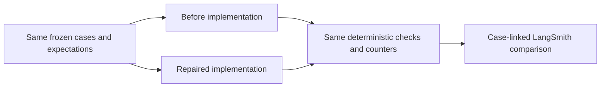

# ScholarPath — Week 4 evaluation report

**Shanly Rajan | AI Builder · 6 September 2026**

Evidence-backed supervisor discovery for postgraduate research.

**Result:** expected behavior improved from **29/30 to 30/30** on the unchanged
reviewed synthetic dataset. The original **76/40** graph-call budget still fails.
This report and the [five-minute script](week4-recording-script.md) are prepared;
**recording not yet provided; submission not yet completed**. The
[scorecard](week4-submission-readiness.md) identifies the remaining rubric gaps.

## Evaluation framework

**Evaluation one-liner:** I measure ScholarPath's expected outcomes, evidence and
availability integrity, Candidate approval, target latency and application-port
effort on 30 reviewed synthetic happy, edge, known-failure and adversarial cases,
using deterministic checks against human-approved expectations, with 100% applicable
correctness, fake-target p95 ≤5 seconds and ≤2/component or ≤40/whole-graph-case
calls, comparing the same frozen dataset in LangSmith before and after repair.

| Field | Decision |
| --- | --- |
| Agent under test | My existing Week 3 ScholarPath agent, using the own-agent LangSmith track of the supplied Week 4 handout. This is an evaluation of the existing system, not another agent build. |
| User outcome | A Candidate needs research-aligned Supervisors with traceable evidence and control over the final shortlist. The product target is five recommendations within 15 minutes, at least four rated relevant; that live target is not established here. |
| Metrics | Five headline measures pair expected outcomes and evidence/approval safety with latency and effort. Eleven deterministic checks remain active beneath those groups. |
| Judge method | Typed reference comparisons, evidence/score checks and graph-trajectory checks run in code; the project owner approved expected behaviors. Optional LLM judges were not used or calibrated, and these approvals are not live relevance ratings. |
| Golden dataset | 30 fixed synthetic cases: 15 happy, 9 edge, 4 known failure, 2 adversarial. Five expected behaviors received individual approval and 25 received explicit batch approval. |
| Pass bar | 100% expected outcomes and applicable safety checks; fake-target p95 ≤5 seconds per family; ≤2 calls per component case and ≤40 per whole graph case. The separately approved 40/80 first-review/interaction policy supplements rather than replaces those original bars. |
| Instrumentation | One root per case, graph-child traces, stable case IDs, versions, safe expected/predicted summaries, metric feedback, timing and port counters. Fake-provider runs have no actual LLM tokens or billed usage; private research, page text and credentials are excluded. |
| Baseline run | The saved LangSmith before experiment passes 29/30 with one heading-context failure and a separate 76/40 effort finding. The dataset and case links below connect these results to recorded traces. |
| Failure analysis | Two baseline clusters were observed: a grounded-claim false rejection and a multi-round call overrun. A third frozen-baseline cluster is not invented; historical live failures are reported separately. |
| Improvement hypotheses | Four bounded grounding repairs and their measured cohorts appear below. The first three are earlier focused reproductions, not three further gains on the later frozen benchmark. |
| Post-improvement run | The uploaded after experiment passes 30/30 on the same version, snapshot and expectations; exactly one case/metric outcome changed. Call counts are unchanged and the original effort bar still fails. |
| What is next | Record the walkthrough, verify reviewer access and submit with the comparability gap disclosed. Further engineering should target reproducible live affiliation grounding, Candidate-rated usefulness and measured live usage rather than unrelated features. |

## Approach and technology

The application separates model interpretation from deterministic validation and
Candidate authority. Python and Pydantic define contracts; LangChain integrates
structured model outputs; LangGraph owns routing, retries, state and review
interrupts; LangSmith records and compares execution. Streamlit is the interface,
SQLite supports local checkpoints, and pytest/Ruff/mypy protect regressions.

Production integrations include OpenAI planning/extraction/Research Fit, You.com
search, Tavily fallback/extraction, Nebius independent review and Mem0 preference
memory. **These services are replaced by fakes in the compared experiments.**
LangSmith itself was live during upload. See [architecture](architecture.md) and
[reliability boundaries](reliability-review.md); no new architecture is introduced here.



## Dataset, labels and reproducibility

- Dataset: **`scholarpath-week4-30case-reviewed-v1`**; version **`week4-30case-reviewed-v1`**.
- Saved [manifest](evaluation/week4-30case-reviewed-v1.json), [case inventory](week4-evaluation-draft.md)
  and [human approval ledger](week4-label-review.md).
- Reviewed SHA-256: `732ad206d79f30e2f9a3c0efd89c07daf4680216754fa21ce8e4d8f7bda911d5`.
- LangSmith snapshot: **`2026-09-06T15:55:54.898948Z`**; graph version **`m13`**.
- Targets: 15 evidence-verification, 12 fake-graph, 2 Research Fit and 1 planning case.

These are code-authored fictional fixtures with reserved `.example` sources,
informed by reported failure patterns. They are not 30 real Candidate journeys,
independent expert annotations or verbatim private source reproductions. The
AI-assisted [prompt archive](prompts/) and [iteration journal](build-journal.md)
document construction; human approval covers expected behavior, not every field.
Dataset/label review does not establish live model accuracy or Candidate usefulness.

Examples include missing identity, explicitly unstated availability, conflicting
affiliation, fallback after timeout, off-page excerpts and rejection before approval.
Scenario categories describe inputs, not whether the implementation passed.
Recipes, fixtures and evaluator definitions stayed unchanged across the frozen
comparison; historical draft and before reports remain preserved.

## Comparable results

These are the **saved hosted observations**, not a mixture of local and hosted timing.
Both experiments ran on 6 September 2026, with one repetition per revision.

| Metric | Definition and bar | Before | After | Delta / interpretation |
| --- | --- | --- | --- | --- |
| Expected outcomes | Passing `expected_behavior` cases / 30; bar 100% | 29/30 | 30/30 | +1 case; +3.33 pp |
| Evidence / availability integrity | Applicable ID, URL and availability checks; bar 100% | 72/72 | 72/72 | Unchanged: IDs 14/14, URLs 29/29, availability 29/29 |
| Candidate approval | Applicable graph cases enforcing approval; bar 100% | 12/12 | 12/12 | Unchanged |
| Target latency | Per-family target-only nearest-rank p95; bar ≤5 s | All 4 families pass | All 4 families pass | Graph p95 increased; see table below |
| Application-port effort | Per-case fake invocations; component max ≤2, whole graph max ≤40 | Graph 76/40; component max 2 | Graph 76/40; component max 2 | Zero calls saved; graph budget fails |

| Target family | Cases | Before p95 seconds | After p95 seconds | Delta seconds | Max calls before → after |
| --- | --- | --- | --- | --- | --- |
| evidence_verification | 15 | 0.007711 | 0.008364 | +0.000653 | 2 → 2 |
| graph_fake | 12 | 0.131363 | 0.142125 | +0.010762 | 76 → 76 |
| research_fit | 2 | 0.015155 | 0.014570 | -0.000585 | 1 → 1 |
| search_planning | 1 | 0.001191 | 0.001145 | -0.000046 | 1 → 1 |

Other applicable checks, including schemas, terminology, score arithmetic,
fallback, deduplication and prohibited admission predictions, remain passing.
Non-applicable checks are excluded from their denominator, not counted as observations.
With fewer than 20 cases per family, nearest-rank p95 is the maximum: these two
single runs are not a stable latency benchmark. Fake calls are not HTTP requests,
tokens or money. **Live quality and monetary cost remain unmeasured.**

## Trace evidence and failure analysis

The [recorded comparison guide](week4-reviewed-langsmith-after.md) contains every
experiment and representative case link. Saved [before](evaluation/week4-reviewed-langsmith-baseline-2026-09-06.json)
and [after](evaluation/week4-reviewed-langsmith-after-2026-09-06.json) reports preserve
all case references and metrics. Each upload has 30 persisted roots, 330 metric
records and 12 matching graph-child traces, confirmed by authenticated readback.

- Before: **`scholarpath-week4-reviewed-upload-m13-5c37c1c1`**.
- After: **`scholarpath-week4-reviewed-upload-m13-b804f2f2`**.
- [Open the comparison](https://smith.langchain.com/o/8cf85d4c-234a-42f3-9611-a3f19687db75/datasets/327ce17a-9808-42b1-ad5f-590c38fe0258/compare?selectedSessions=ab08118f-afbb-47e0-bbdd-6d6726b83e20)
  and select the before experiment alongside the after experiment.

| Failure cluster | Frequency / rough effort | Evidence and outcome |
| --- | --- | --- |
| Heading-context false rejection | 1/30 total, 1/15 evidence cases; one fake port invocation | `draft-evidence-heading-bound-research`: the owner role sentence was mistaken for a different person heading. [Before failure](https://smith.langchain.com/o/8cf85d4c-234a-42f3-9611-a3f19687db75/projects/p/9a11e789-7ed9-43e3-b6fd-54f968eb8cac/r/01a0776e-fb47-7720-ab9f-f0e1143c1895?trace_id=01a0776e-fb47-7720-ab9f-f0e1143c1895&start_time=2026-09-06T15:55:57.127719) → [after pass](https://smith.langchain.com/o/8cf85d4c-234a-42f3-9611-a3f19687db75/projects/p/ab08118f-afbb-47e0-bbdd-6d6726b83e20/r/01a07809-2779-7862-bd98-5162521a4ad8?trace_id=01a07809-2779-7862-bd98-5162521a4ad8&start_time=2026-09-06T18:44:20.985223). |
| Whole-case call overrun | 1/12 graph cases; 38 calls to first review, 76 across two research passes | `draft-graph-request-more`: [after trace](https://smith.langchain.com/o/8cf85d4c-234a-42f3-9611-a3f19687db75/projects/p/ab08118f-afbb-47e0-bbdd-6d6726b83e20/r/01a07809-2866-7a21-a288-7dec86926b61?trace_id=01a07809-2866-7a21-a288-7dec86926b61&start_time=2026-09-06T18:44:21.222641) still exceeds the original 40-call bar. Scope was clarified, not optimized. |

There was **no third observed frozen-baseline cluster**. Outside this cohort,
the [instrumented live canary](week4-live-canary.md#step-3w-instrumented-live-observation-stopped-at-affiliation)
stopped at affiliation after four logical calls. An
[isolated Nebius check](week4-live-canary.md#step-3y-isolated-live-nebius-review-passed)
passed once; these are not comparable live before/after success measurements.

## Improvements, tuning and lessons

| Repair / lever | Hypothesis and narrow change | Measured result |
| --- | --- | --- |
| Formatting context / deterministic grounding | Match case/whitespace consistently and map back to original offsets to recover legitimate context without changing source text. | Focused 0/5 → 5/5; +100.00 pp |
| Subject binding / deterministic grounding | Treat three known section labels and bounded academic-role phrases as non-person text, retaining barriers for other people. | Focused 17/30 → 30/30; +43.33 pp |
| Named specialisation / deterministic grounding | Recognize explicit academic specialisation with grounded identity, exact excerpts and official-source checks; reject unsupported or generic statements. | Focused 42/56 → 56/56; +25.00 pp |
| Heading-bound research / deterministic grounding | Let recognized same-owner role prose preserve profile-heading context while keeping other-person/ambiguity checks intact. | Frozen benchmark 29/30 → 30/30; +3.33 pp |

See the [improvement ledger](week4-improvement-ledger.md) for exact files, commits,
test selectors and historical red/green evidence. The first three hypotheses are
retrospective summaries of recorded intent, not preregistered numeric forecasts;
their red observations are journal records, not rerun isolated historical commits.
**Do not sum cohorts or call these four frozen-benchmark improvements.** The first
three repairs already existed in the frozen baseline; the requirement for 3–4
separately measured improvements on that benchmark remains incomplete.

What did not improve: per-case effort. The approved 40/80 first-review/interaction
policy changes the measurement allowance, not execution. Its saved report has
12 first-review passes, 3 completed interactions and **9 paused within budget so far**;
the request-more case has not completed a final approval. No eventual cost is inferred.

The key lesson was to test the required claim, not just aggregate verification:
publication evidence could allow verification while a valid research-interest
claim was silently discarded. Another lesson was to measure first result and
full interaction separately while retaining the original result. Evidence-led
repairs were more defensible than weakening expectations to obtain a green demo.

## Limits, next hypotheses and monitoring

The synthetic suite supplements pytest; it does not prove live relevance, safe
multi-user hosting or production readiness. The 30-case comparison uses strict
verification and is not evidence for every MVP/UI configuration. The mentor's
failed-case-summary request was implemented; the window-related failure remains
unidentified, with no Windows runner evidence. An exact failing command/log is
needed before claiming it fixed.

If another week were available:

1. Capture one explicitly approved, minimal live affiliation failure and reproduce
   it offline before changing grounding. Hypothesis: source-bound context repair
   reduces false rejections while negative controls still reject unsupported facts.
2. Run a separately bounded live cohort with Candidate relevance ratings and actual
   token/cost measurements. Test the four-of-five relevance and 15-minute product
   targets; do not substitute fake execution speed for either.
3. Use the existing two-pass attribution to test a narrowly scoped reduction of
   unnecessary work only if it preserves revised-preference behavior. Report call
   delta on unchanged cases rather than raising the original budget.

Proposed monitoring, **not deployed**: rerun the frozen suite on changes and flag
any expected-outcome/safety regression; retain original and supplemental effort
bars separately. Once live baselines are calibrated, track per-provider errors,
target p95, usage and Candidate-rated usefulness by safe case ID, environment and
version in LangSmith; investigate drift through case-linked traces. Live alert
thresholds must be agreed from live measurements, not copied from fake budgets.

## Submission package and handoff

| Deliverable | Location / status |
| --- | --- |
| Solution report | This document, prepared |
| Reviewed dataset and label provenance | [Manifest](evaluation/week4-30case-reviewed-v1.json), [approval ledger](week4-label-review.md), [hosted dataset/experiments](week4-reviewed-langsmith-after.md) |
| Metrics, prompts and iterations | [Metric definitions](week4-metrics.md), [repair ledger](week4-improvement-ledger.md), [prompts](prompts/), [journal](build-journal.md) |
| Trace evidence | Recorded before/after and case links above; authenticated workspace access required |
| Five-minute walkthrough | [Ready-to-read script](week4-recording-script.md); **recording not yet provided** |
| Reviewer access and submission | **Not yet confirmed; not yet submitted** |

Before submitting, record the script and attach its actual video URL; check playback
and reviewer access. If workspace access is unavailable, include redacted screenshots
showing the dataset version, case IDs, expected/predicted summaries, feedback and
graph-child route. Do not expose API keys, private inputs or unrelated workspace
details, or make private traces public automatically. Then submit the report,
dataset/evidence and recording via the supplied Week 4 submission form. No upload,
sharing change or submission is performed by preparing these files.

For a quick offline check from `projects/scholar-path`:

```bash
SCHOLARPATH_LOG_LEVEL=WARNING LANGSMITH_TRACING=false venv/bin/python scripts/run_reviewed_evals.py --check
SCHOLARPATH_LOG_LEVEL=WARNING LANGSMITH_TRACING=false venv/bin/python scripts/check_interaction_policy.py
```

The first command currently reports 30/30 and exits 0 for correctness; it still
prints the runtime failure. The second deliberately exits 1 for the retained
legacy 76/40 finding. Neither command creates an experiment or changes saved reports.
